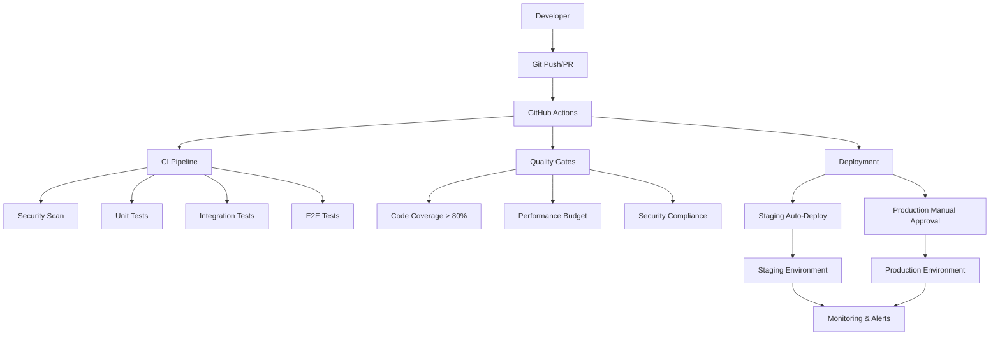

# Pitchey CI/CD Pipeline Documentation

## 🚀 Overview

This document provides comprehensive guidance for the Pitchey platform's CI/CD pipeline, covering automated testing, deployment processes, monitoring, and best practices.

## 📋 Table of Contents

- [Architecture Overview](#architecture-overview)
- [Pipeline Workflows](#pipeline-workflows)
- [Environment Management](#environment-management)
- [Security & Quality Gates](#security--quality-gates)
- [Monitoring & Alerting](#monitoring--alerting)
- [Local Development](#local-development)
- [Deployment Procedures](#deployment-procedures)
- [Rollback Procedures](#rollback-procedures)
- [Troubleshooting](#troubleshooting)
- [Best Practices](#best-practices)

---

## Architecture Overview

### Technology Stack

**Frontend:**
- React 19 with TypeScript
- Vite build system
- Cloudflare Pages for hosting
- Real-time features with WebSockets

**Backend:**
- Deno 2.x runtime
- TypeScript for Worker scripts
- Cloudflare Workers for serverless compute
- Hyperdrive for database connection pooling

**Infrastructure:**
- **Database:** Neon PostgreSQL (edge-optimized)
- **Cache:** Upstash Redis (global distributed)
- **Storage:** Cloudflare R2 (S3-compatible)
- **CDN:** Cloudflare (global edge network)
- **DNS:** Cloudflare DNS management

### CI/CD Architecture



---

## Pipeline Workflows

### 1. CI Workflow (`ci.yml`)

**Trigger:** Pull requests to main branch
**Purpose:** Validate code quality, security, and functionality

#### Workflow Steps:

1. **Security Scanning** (Parallel)
   - Trivy vulnerability scan
   - NPM audit for dependencies
   - Deno dependency audit
   - SARIF report upload

2. **Frontend CI** (Matrix: Node 18, 20)
   - Checkout and cache dependencies
   - Type checking with TypeScript
   - ESLint code quality checks
   - Unit tests with coverage reports
   - Build optimization and bundle analysis
   - Artifact upload for deployment

3. **Backend CI**
   - Deno setup and dependency caching
   - Code linting and formatting
   - Type checking for Worker code
   - Wrangler configuration validation
   - Security scanning for Deno modules

4. **End-to-End Testing**
   - Playwright browser automation
   - Multi-environment testing
   - Visual regression testing
   - Accessibility compliance testing

5. **Performance Testing**
   - Lighthouse CI integration
   - Bundle size validation
   - Performance budget enforcement
   - Core Web Vitals monitoring

#### Quality Gates:
- ✅ All tests pass (unit, integration, E2E)
- ✅ Code coverage ≥ 80%
- ✅ No critical security vulnerabilities
- ✅ Performance budget within limits
- ✅ Bundle size < 2MB total, main bundle < 500KB

### 2. Staging Deployment (`cd-staging.yml`)

**Trigger:** Push to main branch (auto-deployment)
**Purpose:** Continuous deployment to staging environment

#### Workflow Steps:

1. **Pre-deployment Validation**
   - Version generation (`commit-sha-timestamp`)
   - Deployment decision logic
   - Slack notification (start)

2. **Build & Test**
   - Full test suite execution
   - Production build generation
   - Artifact packaging

3. **Staging Deployment**
   - Worker deployment to staging
   - Pages deployment to staging
   - Environment variable configuration
   - Deployment status tracking

4. **Post-deployment Testing**
   - Health check validation
   - API smoke tests
   - Frontend availability checks
   - Performance monitoring

5. **Notification & Cleanup**
   - Deployment status notifications
   - Artifact cleanup
   - Monitoring setup

#### Environment URLs:
- **Frontend:** https://pitchey-staging.pages.dev
- **API:** https://pitchey-staging.ndlovucavelle.workers.dev

### 3. Production Deployment (`cd-production.yml`)

**Trigger:** Manual workflow dispatch only
**Purpose:** Controlled production deployment with approval gates

#### Workflow Steps:

1. **Production Approval Gate**
   - Manual approval requirement (2 reviewers)
   - Deployment request validation
   - Impact assessment review
   - Emergency approval notice

2. **Pre-production Validation**
   - Security scanning (unless skipped for hotfix)
   - Production build verification
   - Database migration preparation

3. **Database Migration** (if applicable)
   - Automated backup creation
   - Migration execution
   - Verification procedures

4. **Maintenance Mode** (optional)
   - Traffic redirection
   - User notification
   - Service graceful shutdown

5. **Production Deployment**
   - Blue-green deployment strategy
   - Zero-downtime deployment
   - Health check verification
   - Rollback preparation

6. **Post-deployment Validation**
   - Comprehensive health checks
   - Critical path testing
   - Performance validation
   - Security verification

7. **Maintenance Mode Disable**
   - Traffic restoration
   - Service announcement
   - Monitoring activation

#### Approval Requirements:
- **Required Reviewers:** 2 (production environment)
- **Code Owner Review:** Required
- **Manual Approval:** Always required
- **Emergency Override:** Available for critical hotfixes

### 4. Database Migration (`db-migration.yml`)

**Trigger:** Manual or schema changes detection
**Purpose:** Safe database schema management

#### Workflow Steps:

1. **Migration Planning**
   - Change detection and analysis
   - Migration plan generation
   - Backup naming and preparation

2. **Database Backup**
   - Point-in-time backup creation
   - Backup verification
   - Retention policy application

3. **Migration Execution**
   - Dry-run validation (optional)
   - Forward/rollback execution
   - Transaction safety

4. **Post-migration Testing**
   - Schema integrity validation
   - Data consistency checks
   - Performance impact assessment

### 5. Emergency Rollback (`rollback.yml`)

**Trigger:** Manual emergency procedure
**Purpose:** Rapid rollback to previous stable version

#### Rollback Types:
- **Full Rollback:** Application + Database
- **Application Only:** Code rollback only
- **Database Only:** Schema/data rollback only

#### Safety Features:
- Pre-rollback emergency backup
- Rollback validation
- Health check verification
- Incident reporting

---

## Environment Management

### Development Environment

**Purpose:** Local development and testing
**Infrastructure:** Docker Compose stack
**Access:** Local developers

#### Services:
- PostgreSQL 15 (local)
- Redis 7 (local)
- MinIO (S3 simulation)
- MailHog (email testing)
- Prometheus + Grafana (monitoring)

#### Configuration:
```yaml
Environment: development
Database: PostgreSQL (local Docker)
Cache: Redis (local Docker)
Storage: MinIO (local Docker)
Email: MailHog (local testing)
Monitoring: Prometheus + Grafana
```

#### Setup Commands:
```bash
# Initial setup
./docker/scripts/dev-setup.sh setup

# Daily usage
./docker/scripts/dev-setup.sh start
./docker/scripts/dev-setup.sh stop
./docker/scripts/dev-setup.sh logs
```

### Staging Environment

**Purpose:** Integration testing and client demos
**Infrastructure:** Cloudflare edge network
**Access:** Development team + stakeholders

#### Configuration:
```yaml
Environment: staging
Frontend: https://pitchey-staging.pages.dev
API: https://pitchey-staging.ndlovucavelle.workers.dev
Database: Neon PostgreSQL (staging instance)
Cache: Upstash Redis (staging)
Storage: Cloudflare R2 (staging bucket)
```

#### Deployment:
- **Automatic:** On push to main branch
- **Testing:** Full E2E test suite
- **Monitoring:** Basic uptime + performance
- **Retention:** 30 days for artifacts

### Production Environment

**Purpose:** Live user-facing application
**Infrastructure:** Cloudflare global network
**Access:** Production team only

#### Configuration:
```yaml
Environment: production
Frontend: https://pitchey-5o8.pages.dev
API: https://pitchey-api-prod.ndlovucavelle.workers.dev
Database: Neon PostgreSQL (production)
Cache: Upstash Redis (production cluster)
Storage: Cloudflare R2 (production bucket)
CDN: Cloudflare global edge
```

#### Deployment:
- **Manual:** Approval-gated workflow
- **Monitoring:** Comprehensive (Sentry, Uptime, Performance)
- **Backup:** Hourly database, 90-day retention
- **SLA:** 99.9% uptime target

---

## Security & Quality Gates

### Security Scanning

#### Automated Security Checks:
1. **Dependency Scanning**
   - NPM audit (frontend dependencies)
   - Deno security audit (backend)
   - Snyk vulnerability database
   - OWASP dependency check

2. **Code Security Analysis**
   - ESLint security rules
   - Semgrep static analysis
   - CodeQL semantic analysis
   - Custom security patterns

3. **Infrastructure Security**
   - Checkov configuration scanning
   - Trivy infrastructure analysis
   - Docker security best practices
   - Cloudflare security headers

4. **Secret Detection**
   - TruffleHog secret scanning
   - GitLeaks historical analysis
   - Custom pattern matching
   - Credential leak prevention

#### Security Thresholds:
- **Critical Vulnerabilities:** Block deployment
- **High Severity:** Require review
- **Medium/Low:** Warning only
- **Secrets:** Immediate block

### Quality Gates

#### Code Quality Requirements:
- **Test Coverage:** ≥ 80% overall
- **Type Safety:** 100% TypeScript coverage
- **Linting:** Zero ESLint errors
- **Performance:** Lighthouse score > 70 (staging), > 80 (production)

#### Performance Budget:
- **Bundle Size:** < 2MB total, < 500KB main bundle
- **First Contentful Paint:** < 2s
- **Largest Contentful Paint:** < 4s
- **Cumulative Layout Shift:** < 0.1
- **Total Blocking Time:** < 300ms

---

## Monitoring & Alerting

### Monitoring Stack

#### Application Monitoring:
- **Sentry:** Error tracking and performance monitoring
- **Cloudflare Analytics:** Traffic and performance metrics
- **Uptime Robot:** Availability monitoring
- **Lighthouse CI:** Performance budgets

#### Infrastructure Monitoring:
- **Neon:** Database performance and availability
- **Upstash:** Redis performance metrics
- **Cloudflare:** CDN and edge metrics
- **GitHub Actions:** Pipeline health

### Alert Configuration

#### Production Alerts:
- **High Error Rate:** > 2% for 5 minutes
- **Slow Response:** > 2s P95 for 10 minutes
- **Service Down:** > 1 minute downtime
- **Database Issues:** Connection failures
- **Security Events:** Critical vulnerabilities

#### Alert Channels:
- **Slack:** Real-time team notifications
- **Email:** Detailed alert information
- **PagerDuty:** Production escalation (24/7)
- **SMS:** Critical production alerts

#### Alert Severity Levels:
- **Critical:** Immediate response required (< 15 minutes)
- **Warning:** Response within 1 hour
- **Info:** Awareness, response within 24 hours

---

## Local Development

### Docker Development Environment

#### Quick Start:
```bash
# Clone repository
git clone https://github.com/your-org/pitchey.git
cd pitchey

# Start development environment
./docker/scripts/dev-setup.sh setup

# Verify all services are running
./docker/scripts/dev-setup.sh status
```

#### Development URLs:
- **Frontend:** http://localhost:5173
- **Backend API:** http://localhost:8001
- **Database Admin:** http://localhost:8080 (pgAdmin)
- **Email Testing:** http://localhost:8025 (MailHog)
- **Monitoring:** http://localhost:3000 (Grafana)

#### Hot Reloading:
- Frontend: Automatic via Vite
- Backend: Automatic via Deno watch mode
- Database: Schema changes require restart

### Native Development Setup

#### Prerequisites:
- Node.js 20+ (for frontend)
- Deno 2.x (for backend)
- PostgreSQL 15+ (for database)
- Redis 7+ (for caching)

#### Setup Commands:
```bash
# Backend setup
PORT=8001 deno run --allow-all working-server.ts

# Frontend setup
cd frontend
npm install
npm run dev

# Environment variables
cp .env.example .env.development
# Edit .env.development with local settings
```

### Testing in Development

#### Unit Testing:
```bash
# Frontend tests
cd frontend
npm run test
npm run test:watch
npm run test:coverage

# Backend tests
deno test --allow-all
```

#### Integration Testing:
```bash
# Start test environment
docker-compose -f docker-compose.test.yml up --abort-on-container-exit

# Run specific test suites
npm run test:integration
npm run test:e2e
```

---

## Deployment Procedures

### Staging Deployment

#### Automated Process:
1. **Trigger:** Push to main branch
2. **Validation:** All CI checks pass
3. **Build:** Production-ready artifacts
4. **Deploy:** Automatic deployment
5. **Test:** Post-deployment validation
6. **Notify:** Team notification

#### Manual Staging Deploy:
```bash
# Trigger staging deployment manually
gh workflow run "CD - Staging Deployment" \
  --field environment=staging \
  --field force_deploy=false
```

### Production Deployment

#### Standard Production Deploy:
```bash
# Trigger production deployment
gh workflow run "CD - Production Deployment" \
  --field version_tag="v1.2.3" \
  --field deployment_type="standard" \
  --field maintenance_mode=false
```

#### Hotfix Production Deploy:
```bash
# Emergency hotfix deployment
gh workflow run "CD - Production Deployment" \
  --field version_tag="hotfix-v1.2.4" \
  --field deployment_type="hotfix" \
  --field skip_tests=true \
  --field maintenance_mode=true
```

#### Production Deployment Checklist:

**Pre-deployment:**
- [ ] All tests passing in staging
- [ ] Performance benchmarks validated
- [ ] Security scan completed
- [ ] Database migration prepared
- [ ] Rollback plan documented
- [ ] Team notification sent

**During Deployment:**
- [ ] Monitor deployment progress
- [ ] Watch for error rate spikes
- [ ] Verify health check status
- [ ] Confirm database migration success

**Post-deployment:**
- [ ] Run smoke tests
- [ ] Monitor performance metrics
- [ ] Verify new features
- [ ] Update documentation
- [ ] Send completion notification

---

## Rollback Procedures

### Emergency Rollback

#### When to Rollback:
- Critical bugs in production
- Severe performance degradation
- Security vulnerabilities
- Database corruption
- Service unavailability

#### Rollback Types:

**Full Rollback (Application + Database):**
```bash
gh workflow run "Emergency Rollback" \
  --field environment="production" \
  --field rollback_target="full" \
  --field target_version="v1.2.2" \
  --field reason="Critical bug in user authentication"
```

**Application Only:**
```bash
gh workflow run "Emergency Rollback" \
  --field environment="production" \
  --field rollback_target="application" \
  --field target_version="v1.2.2" \
  --field reason="Performance regression"
```

**Database Only:**
```bash
gh workflow run "Emergency Rollback" \
  --field environment="production" \
  --field rollback_target="database" \
  --field target_version="v1.2.2" \
  --field reason="Schema migration issues"
```

#### Rollback Process:
1. **Assessment:** Evaluate rollback scope
2. **Approval:** Emergency approval (1 reviewer)
3. **Backup:** Create emergency backup
4. **Execute:** Perform rollback
5. **Validate:** Verify system stability
6. **Monitor:** Watch for issues
7. **Document:** Incident report

#### Rollback Safety:
- Automatic backup before rollback
- Health check validation
- Performance monitoring
- Rollback verification
- Incident documentation

---

## Troubleshooting

### Common Issues

#### CI Pipeline Failures

**Build Failures:**
```bash
# Check build logs
gh run view --log

# Re-run failed jobs
gh run rerun --failed

# Debug locally
docker-compose -f docker-compose.test.yml up --abort-on-container-exit
```

**Test Failures:**
```bash
# Run tests locally
npm run test:ci
npm run test:e2e

# Debug specific test
npm run test -- --grep "specific test"
```

**Deployment Failures:**
```bash
# Check deployment status
wrangler deployments list

# View deployment logs
wrangler tail

# Manual deployment
wrangler deploy --env production
```

#### Performance Issues

**Slow Build Times:**
- Check cache hit rates
- Optimize dependency installation
- Parallelize build steps
- Use build artifacts

**Failed Performance Tests:**
```bash
# Run Lighthouse locally
npx lighthouse http://localhost:5173 --output json

# Debug bundle size
npm run build:analyze
```

#### Database Issues

**Migration Failures:**
```bash
# Check migration status
drizzle-kit push:pg --dry

# Manual migration
drizzle-kit push:pg

# Rollback migration
gh workflow run "Database Migration" \
  --field migration_type="rollback" \
  --field rollback_steps=1
```

**Connection Issues:**
- Verify database URL
- Check Hyperdrive configuration
- Monitor connection pool
- Review security settings

### Debug Commands

#### Local Debugging:
```bash
# Backend debugging
PORT=8001 deno run --allow-all --inspect=0.0.0.0:9229 working-server.ts

# Frontend debugging
npm run dev -- --debug

# Database debugging
psql $DATABASE_URL
```

#### Production Debugging:
```bash
# View production logs
wrangler tail pitchey-production

# Check deployment status
gh deployment view --env production

# Monitor real-time metrics
curl https://pitchey-api-prod.ndlovucavelle.workers.dev/health
```

### Log Analysis

#### Application Logs:
- **Sentry:** Error tracking and performance
- **Cloudflare:** Edge logs and analytics
- **GitHub Actions:** Pipeline execution logs
- **Wrangler:** Worker deployment logs

#### Log Retention:
- **Development:** 7 days
- **Staging:** 30 days
- **Production:** 90 days
- **Audit Logs:** 1 year

---

## Best Practices

### Development Workflow

#### Git Workflow:
1. **Feature Branches:** Always work in feature branches
2. **Small Commits:** Make atomic, focused commits
3. **Clear Messages:** Write descriptive commit messages
4. **Regular Pulls:** Keep branches updated with main
5. **Clean History:** Squash commits before merging

#### Code Quality:
- **Type Safety:** Use TypeScript everywhere
- **Testing:** Write tests for all new features
- **Documentation:** Update docs with changes
- **Performance:** Monitor bundle size and metrics
- **Security:** Review security implications

### Deployment Best Practices

#### Pre-deployment:
- Run full test suite locally
- Test in staging environment
- Review performance impact
- Plan rollback strategy
- Communicate with team

#### During Deployment:
- Monitor deployment progress
- Watch error rates and metrics
- Be ready to rollback quickly
- Communicate status updates
- Document any issues

#### Post-deployment:
- Verify all functionality
- Monitor for 30 minutes minimum
- Update documentation
- Send completion notification
- Schedule follow-up review

### Security Best Practices

#### Development Security:
- Never commit secrets
- Use environment variables
- Regular dependency updates
- Security-focused code reviews
- Threat model considerations

#### Production Security:
- Minimal access permissions
- Regular security scans
- Incident response plan
- Security monitoring
- Compliance requirements

### Monitoring Best Practices

#### Proactive Monitoring:
- Set up alerting before issues occur
- Monitor business metrics, not just technical
- Use dashboards for visibility
- Regular monitoring review
- Incident post-mortems

#### Performance Monitoring:
- Track Core Web Vitals
- Monitor API response times
- Database performance metrics
- Error rate tracking
- User experience metrics

---

## Appendix

### Required GitHub Secrets

#### Cloudflare Configuration:
- `CLOUDFLARE_API_TOKEN` - API access token
- `CLOUDFLARE_ACCOUNT_ID` - Account identifier

#### Environment-Specific Secrets:
- `STAGING_JWT_SECRET` - JWT signing key (staging)
- `PRODUCTION_JWT_SECRET` - JWT signing key (production)
- `STAGING_DATABASE_URL` - Database connection (staging)
- `PRODUCTION_DATABASE_URL` - Database connection (production)

#### Third-Party Integrations:
- `SENTRY_AUTH_TOKEN` - Sentry deployment integration
- `SLACK_WEBHOOK_URL` - Team notifications
- `PAGERDUTY_ROUTING_KEY` - Production alerts
- `CODECOV_TOKEN` - Code coverage reporting

#### Monitoring & Security:
- `SNYK_TOKEN` - Security vulnerability scanning
- `UPTIMEROBOT_API_KEY` - Uptime monitoring
- `ADMIN_API_TOKEN` - Administrative operations

### Performance Benchmarks

#### Target Metrics:
- **First Contentful Paint:** < 1.5s (production), < 2s (staging)
- **Largest Contentful Paint:** < 2.5s (production), < 4s (staging)
- **Cumulative Layout Shift:** < 0.1
- **Time to Interactive:** < 3.5s (production), < 5s (staging)
- **Bundle Size:** < 500KB (main), < 2MB (total)

#### Database Performance:
- **Query Response Time:** < 100ms (P95)
- **Connection Pool:** < 80% utilization
- **Cache Hit Rate:** > 95%
- **Replication Lag:** < 1s

### Support Resources

#### Documentation:
- [Cloudflare Workers Docs](https://developers.cloudflare.com/workers/)
- [Neon Database Docs](https://neon.tech/docs)
- [Upstash Redis Docs](https://docs.upstash.com/redis)
- [GitHub Actions Docs](https://docs.github.com/en/actions)

#### Team Contacts:
- **Lead Developer:** cavelltheleaddev@gmail.com
- **DevOps:** (configured via GitHub teams)
- **Security:** (security alerts via configured channels)
- **On-call:** (PagerDuty escalation for production)

---

*This documentation is maintained by the Pitchey development team and updated with each release. For questions or suggestions, please create an issue in the repository.*

**Last Updated:** December 2024
**Version:** 1.0.0
**Maintainer:** Pitchey Development Team