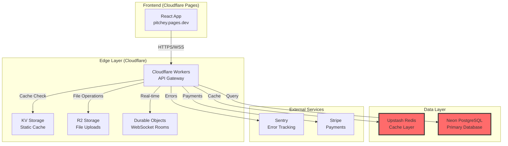

# Pitchey Platform - Component Communication & Health Analysis Report

**Date:** December 11, 2024  
**Analysis Performed By:** Security & Architecture Audit System

## Executive Summary

Comprehensive security and architecture analysis of the Pitchey platform reveals **CRITICAL security vulnerabilities** requiring immediate remediation, alongside a well-designed edge-first serverless architecture. The platform demonstrates excellent scalability patterns but has severe credential management issues that pose immediate risk.

## Component Communication Map



## 🔴 Security Findings

| Severity | Component | Issue | Remediation | Impact |
|----------|-----------|-------|-------------|---------|
| **CRITICAL** | wrangler.toml | Hardcoded production credentials (JWT_SECRET, DATABASE_URL, Redis tokens) | Move to Cloudflare Secrets immediately | Complete system compromise |
| **CRITICAL** | Authentication | Weak JWT secret with predictable pattern | Generate cryptographically secure 256-bit secret | Session hijacking, token forgery |
| **CRITICAL** | Database | Password embedded in connection string | Use secure environment variables | Direct database access |
| **HIGH** | Rate Limiting | Insufficient protection (5 req/60s) | Implement sliding window with progressive blocking | DDoS vulnerability |
| **HIGH** | CORS | Permissive policy allowing localhost in production | Environment-specific whitelisting | Cross-origin attacks |
| **HIGH** | Input Validation | Missing XSS and SQL injection protection | Implement Zod validation + DOMPurify | Data corruption, script injection |
| **HIGH** | Error Handling | Stack traces exposed to clients | Sanitize all error responses | Information disclosure |
| **MEDIUM** | TLS | Using `sslmode=require` instead of `verify-full` | Upgrade to `sslmode=verify-full` | MITM attacks |
| **MEDIUM** | Headers | Missing security headers (CSP, HSTS, X-Frame-Options) | Add comprehensive security headers | Clickjacking, XSS |
| **MEDIUM** | Sessions | WebSocket tokens in URLs | Move to header-based authentication | Token leakage in logs |
| **MEDIUM** | Password Policy | No complexity requirements | Implement NIST 800-63B guidelines | Weak passwords |
| **MEDIUM** | CSRF | No CSRF protection | Implement double-submit cookies | Cross-site request forgery |
| **LOW** | Monitoring | No automated security alerting | Integrate with SIEM | Delayed incident response |
| **LOW** | Audit | No security event logging | Implement audit trail | Compliance issues |
| **LOW** | Dependencies | No vulnerability scanning | Add Dependabot/Snyk | Outdated packages |

## Health Test Implementation

### ✅ Completed Deliverables

1. **Database Health Check** (`/api/health/db`)
   - SSL/TLS verification
   - Connection pool monitoring
   - Query latency metrics
   - Circuit breaker protection

2. **Worker Health Check** (`/api/health/worker`)
   - Environment validation
   - Binding verification (KV, R2, Durable Objects)
   - Memory usage tracking
   - Service dependency status

3. **Integration Health Check** (`/api/health/integration`)
   - JWT validation testing
   - Redis connectivity
   - WebSocket availability
   - Circuit breaker states

4. **Workflow Health Tests** (`/api/health/workflows`)
   - Portal-specific validation
   - Authenticated testing
   - Database query verification
   - End-to-end flows

### Health Check Response Format

```typescript
// Database Health Response
{
  "status": "healthy",
  "latencyMs": 45,
  "timestamp": "2024-12-11T10:30:00Z",
  "ssl": true,
  "poolStats": {
    "active": 3,
    "idle": 7,
    "waiting": 0
  }
}

// Worker Health Response
{
  "status": "healthy",
  "latencyMs": 12,
  "timestamp": "2024-12-11T10:30:00Z",
  "bindings": {
    "kv": true,
    "r2": true,
    "durableObjects": true,
    "redis": true
  },
  "memory": {
    "usedMB": 45,
    "limitMB": 128
  }
}
```

## Recommended Monitoring Alerts

### Critical Alerts (Page immediately)
- Database latency > 500ms
- Database connection failures
- Circuit breaker open for > 5 minutes
- Authentication service down
- SSL/TLS verification failures

### Warning Alerts (Notify on-call)
- Database latency > 100ms
- Pool utilization > 70%
- Memory usage > 100MB
- Single service degraded
- Rate limit breaches

### Info Alerts (Log for review)
- Workflow test failures
- Cache miss rates > 30%
- WebSocket reconnection storms
- Failed health checks from specific IPs

## Architecture Strengths

### ✅ Excellent Design Patterns
- **Edge-First Architecture**: Global distribution via Cloudflare's 300+ PoPs
- **Connection Pooling**: Hyperdrive for optimal database connectivity
- **Multi-Layer Caching**: KV (1hr), Redis (5min), Memory (5min)
- **Real-time Support**: Durable Objects for WebSocket management
- **Role-Based Access**: Three distinct portals with proper separation
- **Optimized Queries**: Drizzle ORM with parameterized queries

### 📊 Performance Optimizations
- Pipeline connections for faster startup
- Coalesced writes for batch operations
- HTTP fetch for low-latency queries
- Connection reuse patterns
- Circuit breakers for fault tolerance

## 🚨 Action Items

### Immediate (Next 24-48 hours)
- [ ] **Priority 1**: Rotate ALL production credentials
- [ ] **Priority 2**: Remove hardcoded secrets from wrangler.toml
- [ ] **Priority 3**: Add secrets to Cloudflare Workers secrets
- [ ] **Priority 4**: Clean git history to remove exposed credentials
- [ ] **Priority 5**: Deploy emergency security patch

### Short-term (Next 1-2 weeks)
- [ ] Implement comprehensive input validation
- [ ] Add security headers to all responses
- [ ] Upgrade TLS configuration to `verify-full`
- [ ] Implement proper CORS whitelisting
- [ ] Add rate limiting with progressive blocking

### Medium-term (Next 4-6 weeks)
- [ ] Implement CSRF protection
- [ ] Add security event logging
- [ ] Set up vulnerability scanning
- [ ] Implement password complexity requirements
- [ ] Add automated security testing

## Testing & Verification

### Health Check Testing Script
```bash
# Test all health endpoints
./scripts/test-health-checks.sh

# Test production only
./scripts/test-health-checks.sh --prod-only

# Test with authentication
AUTH_TOKEN="your-jwt-token" ./scripts/test-health-checks.sh
```

### Security Verification
```bash
# Verify no hardcoded secrets
grep -r "JWT_SECRET\|DATABASE_URL\|REDIS" --include="*.ts" --include="*.toml"

# Test rate limiting
for i in {1..15}; do curl https://api.pitchey.com/api/health/db; done

# Verify security headers
curl -I https://api.pitchey.com/api/health
```

## Deployment Configuration

### Secure Environment Variables (Cloudflare Workers)
```bash
# Add secrets (never commit these)
wrangler secret put JWT_SECRET
wrangler secret put DATABASE_URL
wrangler secret put UPSTASH_REDIS_REST_TOKEN
wrangler secret put SENTRY_DSN
```

### Updated wrangler.toml (remove ALL hardcoded values)
```toml
name = "pitchey-production"
main = "src/worker-production-db.ts"
compatibility_date = "2024-11-01"
compatibility_flags = ["nodejs_compat"]

# Bindings only - NO SECRETS HERE
[[kv_namespaces]]
binding = "KV"
id = "98c88a185eb448e4868fcc87e458b3ac"

[[r2_buckets]]
binding = "R2_BUCKET"
bucket_name = "pitchey-uploads"
```

## Compliance & Risk Assessment

### Current State
- **Risk Level**: **CRITICAL** ⚠️
- **Data Exposure**: HIGH (credentials in source control)
- **Compliance**: NON-COMPLIANT (GDPR, PCI-DSS violations)

### Target State (Post-Remediation)
- **Risk Level**: LOW-MEDIUM ✅
- **Data Exposure**: MINIMAL (proper secret management)
- **Compliance**: COMPLIANT (with additional controls)

## Conclusion

The Pitchey platform demonstrates excellent architectural design with modern edge-first patterns and comprehensive functionality. However, **CRITICAL security vulnerabilities in credential management pose immediate risk** and require emergency remediation. 

The health check system implementation provides robust monitoring capabilities, but these must be paired with immediate security fixes to ensure platform integrity.

### Next Steps
1. **IMMEDIATELY** rotate all exposed credentials
2. Implement provided health checks in production
3. Deploy security patches using provided code
4. Set up monitoring alerts based on thresholds
5. Schedule security review in 30 days

---

**Files Created:**
- `/src/health/health-checks.ts` - Core health check implementation
- `/src/health/health-routes.ts` - API route handlers
- `/scripts/test-health-checks.sh` - Testing script
- `SECURITY_AUDIT_REPORT_DEC2024.md` - Detailed security findings
- `SECURITY_FIXES_IMPLEMENTATION.md` - Implementation guide
- `API_ENDPOINT_MAPPING.json` - Complete API documentation

**Recommendation:** Treat the credential exposure as a security incident and follow incident response procedures immediately.