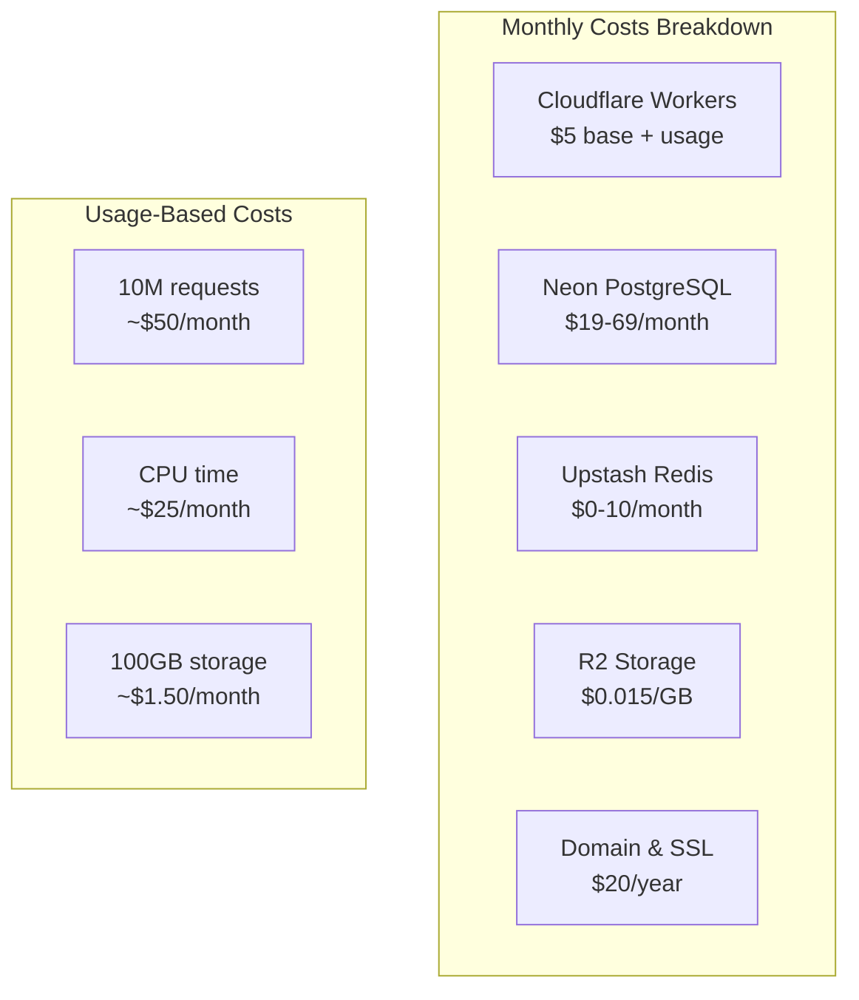

# Cost Optimization & Auto-Scaling Strategies

**Maximizing Efficiency on Cloudflare Workers & Neon PostgreSQL**  
**Date:** December 11, 2024

## 💰 Current Cost Analysis



## 1. Cost Optimization Framework

### Request Optimization
```typescript
// src/optimization/request-optimizer.ts
export class RequestOptimizer {
  private readonly CACHE_STRATEGIES = {
    // Cache static content aggressively
    static: {
      'public, max-age=31536000, immutable': [
        /\.(js|css|woff2?|png|jpg|jpeg|gif|svg|ico)$/
      ]
    },
    // Cache API responses appropriately
    api: {
      'public, max-age=300, s-maxage=600': [ // 5 min client, 10 min CDN
        /^\/api\/public\//,
        /^\/api\/browse\//
      ],
      'private, max-age=0, must-revalidate': [ // No cache for user data
        /^\/api\/user\//,
        /^\/api\/auth\//
      ],
      'public, max-age=60, stale-while-revalidate=300': [ // 1 min cache, 5 min stale
        /^\/api\/pitches\//,
        /^\/api\/search\//
      ]
    }
  };
  
  async optimizeRequest(request: Request): Promise<Response> {
    const url = new URL(request.url);
    
    // 1. Serve from edge cache when possible
    const cached = await this.checkEdgeCache(request);
    if (cached) {
      return cached;
    }
    
    // 2. Implement request coalescing
    if (this.isCoalesceable(url.pathname)) {
      return this.coalesceRequest(request);
    }
    
    // 3. Optimize database queries
    if (url.pathname.startsWith('/api/')) {
      return this.optimizeAPIRequest(request);
    }
    
    return fetch(request);
  }
  
  private async checkEdgeCache(request: Request): Promise<Response | null> {
    const cache = caches.default;
    const cached = await cache.match(request);
    
    if (cached) {
      // Add cache hit header for monitoring
      const headers = new Headers(cached.headers);
      headers.set('X-Cache-Status', 'HIT');
      headers.set('Age', this.calculateAge(cached));
      
      return new Response(cached.body, {
        status: cached.status,
        statusText: cached.statusText,
        headers
      });
    }
    
    return null;
  }
  
  private isCoalesceable(path: string): boolean {
    // Requests that can be coalesced
    const coalesceable = [
      /^\/api\/trending/,
      /^\/api\/popular/,
      /^\/api\/stats/
    ];
    
    return coalesceable.some(pattern => pattern.test(path));
  }
  
  private async optimizeAPIRequest(request: Request): Promise<Response> {
    const url = new URL(request.url);
    
    // Add query hints for database optimization
    const optimizedUrl = new URL(url);
    optimizedUrl.searchParams.set('_optimize', 'true');
    optimizedUrl.searchParams.set('_limit', '100'); // Prevent unbounded queries
    
    const response = await fetch(optimizedUrl, request);
    
    // Apply appropriate caching headers
    const cacheControl = this.determineCacheControl(url.pathname);
    const headers = new Headers(response.headers);
    headers.set('Cache-Control', cacheControl);
    
    return new Response(response.body, {
      status: response.status,
      statusText: response.statusText,
      headers
    });
  }
  
  private determineCacheControl(path: string): string {
    for (const [control, patterns] of Object.entries(this.CACHE_STRATEGIES.api)) {
      if (patterns.some(pattern => pattern.test(path))) {
        return control;
      }
    }
    return 'no-cache';
  }
}
```

### Database Cost Optimization
```typescript
// src/optimization/database-optimizer.ts
export class DatabaseOptimizer {
  constructor(
    private pool: Pool,
    private cache: MultiLayerCache
  ) {}
  
  // Implement read replicas for scale
  async executeQuery<T>(
    query: string,
    params: any[],
    options: {
      cache?: boolean;
      cacheKey?: string;
      cacheTTL?: number;
      readReplica?: boolean;
    } = {}
  ): Promise<T> {
    // Use cache for read queries
    if (options.cache && options.cacheKey) {
      const cached = await this.cache.get(options.cacheKey, 'pitch');
      if (cached) {
        return cached as T;
      }
    }
    
    // Route to read replica for non-critical reads
    const targetPool = options.readReplica 
      ? this.getReadReplicaPool() 
      : this.pool;
    
    // Execute with statement timeout
    const result = await targetPool.query(
      `SET statement_timeout = 5000; ${query}`,
      params
    );
    
    // Cache the result
    if (options.cache && options.cacheKey) {
      await this.cache.set(
        options.cacheKey,
        result.rows,
        'pitch'
      );
    }
    
    return result.rows as T;
  }
  
  // Batch operations to reduce round trips
  async batchInsert<T>(
    table: string,
    records: T[],
    chunkSize = 1000
  ): Promise<void> {
    const chunks = this.chunkArray(records, chunkSize);
    
    for (const chunk of chunks) {
      const columns = Object.keys(chunk[0]);
      const values = chunk.map(record => 
        columns.map(col => record[col])
      );
      
      // Build bulk insert query
      const placeholders = values.map((_, i) => 
        `(${columns.map((_, j) => `$${i * columns.length + j + 1}`).join(', ')})`
      ).join(', ');
      
      const query = `
        INSERT INTO ${table} (${columns.join(', ')})
        VALUES ${placeholders}
        ON CONFLICT DO NOTHING
      `;
      
      await this.pool.query(query, values.flat());
    }
  }
  
  // Implement query result pagination
  async paginatedQuery<T>(
    baseQuery: string,
    params: any[],
    page: number,
    limit: number = 50
  ): Promise<PaginatedResult<T>> {
    const offset = (page - 1) * limit;
    
    // Get total count
    const countQuery = `SELECT COUNT(*) FROM (${baseQuery}) as subquery`;
    const countResult = await this.pool.query(countQuery, params);
    const total = parseInt(countResult.rows[0].count);
    
    // Get paginated results
    const paginatedQuery = `${baseQuery} LIMIT ${limit} OFFSET ${offset}`;
    const result = await this.pool.query(paginatedQuery, params);
    
    return {
      data: result.rows as T,
      page,
      limit,
      total,
      pages: Math.ceil(total / limit)
    };
  }
  
  // Archive old data to reduce active dataset size
  async archiveOldData(): Promise<void> {
    // Move old analytics to archive table
    await this.pool.query(`
      INSERT INTO analytics_events_archive
      SELECT * FROM analytics_events
      WHERE created_at < NOW() - INTERVAL '90 days'
    `);
    
    // Delete from main table
    await this.pool.query(`
      DELETE FROM analytics_events
      WHERE created_at < NOW() - INTERVAL '90 days'
    `);
    
    // Vacuum to reclaim space
    await this.pool.query('VACUUM ANALYZE analytics_events');
  }
}
```

## 2. Auto-Scaling Strategies

### Cloudflare Workers Auto-Scaling
```typescript
// src/scaling/auto-scaler.ts
export class AutoScaler {
  private metrics = {
    requestRate: 0,
    cpuUsage: 0,
    memoryUsage: 0,
    errorRate: 0
  };
  
  async evaluateScaling(): Promise<ScalingDecision> {
    // Collect metrics
    await this.collectMetrics();
    
    // Cloudflare Workers auto-scale by default, but we can:
    // 1. Adjust rate limits dynamically
    // 2. Enable/disable features based on load
    // 3. Route to different workers based on load
    
    if (this.metrics.requestRate > 1000) { // requests per second
      return {
        action: 'scale-up',
        adjustments: [
          { type: 'increase-cache-ttl', value: 2 },
          { type: 'enable-aggressive-caching', value: true },
          { type: 'reduce-features', value: ['analytics', 'recommendations'] }
        ]
      };
    }
    
    if (this.metrics.errorRate > 0.05) { // 5% error rate
      return {
        action: 'degrade-gracefully',
        adjustments: [
          { type: 'enable-circuit-breaker', value: true },
          { type: 'serve-from-cache', value: true },
          { type: 'disable-non-critical', value: ['search', 'filters'] }
        ]
      };
    }
    
    return { action: 'maintain', adjustments: [] };
  }
  
  private async collectMetrics(): Promise<void> {
    // Query Analytics Engine
    const response = await fetch('/api/metrics/current');
    const data = await response.json();
    
    this.metrics = {
      requestRate: data.requestsPerSecond,
      cpuUsage: data.cpuMilliseconds / 1000,
      memoryUsage: data.memoryMB,
      errorRate: data.errors / data.total
    };
  }
  
  async applyScalingDecision(decision: ScalingDecision): Promise<void> {
    for (const adjustment of decision.adjustments) {
      switch (adjustment.type) {
        case 'increase-cache-ttl':
          await this.adjustCacheTTL(adjustment.value);
          break;
        case 'enable-aggressive-caching':
          await this.enableAggressiveCaching();
          break;
        case 'reduce-features':
          await this.disableFeatures(adjustment.value);
          break;
        case 'enable-circuit-breaker':
          await this.enableCircuitBreakers();
          break;
      }
    }
  }
  
  private async adjustCacheTTL(multiplier: number): Promise<void> {
    // Increase all cache TTLs by multiplier
    await this.kv.put('cache_ttl_multiplier', multiplier.toString(), {
      expirationTtl: 300 // Re-evaluate in 5 minutes
    });
  }
  
  private async enableAggressiveCaching(): Promise<void> {
    // Cache everything possible
    await this.kv.put('aggressive_caching', 'true', {
      expirationTtl: 300
    });
  }
  
  private async disableFeatures(features: string[]): Promise<void> {
    // Temporarily disable non-critical features
    await this.kv.put('disabled_features', JSON.stringify(features), {
      expirationTtl: 300
    });
  }
}
```

### Database Connection Scaling
```typescript
// src/scaling/connection-scaler.ts
export class ConnectionScaler {
  private pools: Map<string, Pool> = new Map();
  private poolStats: Map<string, PoolStats> = new Map();
  
  async getOptimalPool(): Promise<Pool> {
    const stats = await this.collectPoolStats();
    
    // Find pool with lowest utilization
    let optimalPool: Pool | null = null;
    let lowestUtilization = 1.0;
    
    for (const [poolId, pool] of this.pools) {
      const utilization = stats.get(poolId)?.utilization || 0;
      if (utilization < lowestUtilization) {
        lowestUtilization = utilization;
        optimalPool = pool;
      }
    }
    
    // Create new pool if all are over 70% utilized
    if (lowestUtilization > 0.7) {
      optimalPool = await this.createAdditionalPool();
    }
    
    return optimalPool || this.pools.values().next().value;
  }
  
  private async createAdditionalPool(): Promise<Pool> {
    const poolId = `pool_${Date.now()}`;
    
    const pool = new Pool({
      connectionString: process.env.DATABASE_URL,
      max: 5, // Start small
      idleTimeoutMillis: 30000,
      connectionTimeoutMillis: 5000
    });
    
    this.pools.set(poolId, pool);
    
    // Schedule cleanup if unused
    setTimeout(() => {
      this.cleanupUnusedPool(poolId);
    }, 300000); // 5 minutes
    
    return pool;
  }
  
  private async cleanupUnusedPool(poolId: string): Promise<void> {
    const stats = this.poolStats.get(poolId);
    
    if (stats && stats.activeConnections === 0 && stats.idleConnections > 0) {
      const pool = this.pools.get(poolId);
      await pool?.end();
      this.pools.delete(poolId);
      this.poolStats.delete(poolId);
    }
  }
  
  private async collectPoolStats(): Promise<Map<string, PoolStats>> {
    const stats = new Map<string, PoolStats>();
    
    for (const [poolId, pool] of this.pools) {
      const poolStats = {
        activeConnections: pool.totalCount,
        idleConnections: pool.idleCount,
        waitingRequests: pool.waitingCount,
        utilization: pool.totalCount / pool.options.max
      };
      
      stats.set(poolId, poolStats);
    }
    
    return stats;
  }
}
```

## 3. Cost Monitoring & Alerting

### Real-time Cost Tracking
```typescript
// src/monitoring/cost-tracker.ts
export class CostTracker {
  private readonly COST_RATES = {
    workers: {
      requests: 0.50 / 1_000_000,     // $0.50 per million
      cpuMs: 0.0000128,                // $12.80 per million CPU ms
      duration: 0.0000128 / 1000       // Convert to seconds
    },
    database: {
      compute: 0.0255,                 // per compute hour
      storage: 0.000164,                // per GB-hour
      dataTransfer: 0.09                // per GB
    },
    storage: {
      r2Storage: 0.015 / 1024,          // per GB-month
      r2Operations: 0.36 / 1_000_000    // per million requests
    },
    redis: {
      commands: 0.20 / 1_000_000,       // per million commands
      bandwidth: 0.08                    // per GB
    }
  };
  
  async calculateCurrentCosts(): Promise<CostBreakdown> {
    const usage = await this.collectUsageMetrics();
    
    return {
      workers: this.calculateWorkersCost(usage.workers),
      database: this.calculateDatabaseCost(usage.database),
      storage: this.calculateStorageCost(usage.storage),
      redis: this.calculateRedisCost(usage.redis),
      total: 0, // Will be calculated
      projectedMonthly: 0,
      recommendations: this.generateRecommendations(usage)
    };
  }
  
  private calculateWorkersCost(usage: WorkersUsage): number {
    const requestCost = usage.requests * this.COST_RATES.workers.requests;
    const cpuCost = usage.cpuMs * this.COST_RATES.workers.cpuMs;
    const durationCost = usage.durationSeconds * this.COST_RATES.workers.duration;
    
    return requestCost + cpuCost + durationCost;
  }
  
  private generateRecommendations(usage: any): CostRecommendation[] {
    const recommendations = [];
    
    // Check for optimization opportunities
    if (usage.database.idleConnections > 5) {
      recommendations.push({
        category: 'database',
        priority: 'medium',
        potential_savings: '$10-20/month',
        action: 'Reduce connection pool size',
        implementation: 'Set max connections to ' + Math.ceil(usage.database.activeConnections * 1.5)
      });
    }
    
    if (usage.redis.cacheHitRate < 0.7) {
      recommendations.push({
        category: 'caching',
        priority: 'high',
        potential_savings: '$30-50/month',
        action: 'Improve cache hit rate',
        implementation: 'Increase TTL for frequently accessed data'
      });
    }
    
    if (usage.workers.cpuMs / usage.workers.requests > 50) {
      recommendations.push({
        category: 'performance',
        priority: 'high',
        potential_savings: '$20-40/month',
        action: 'Optimize CPU-intensive operations',
        implementation: 'Profile and optimize hot paths in code'
      });
    }
    
    return recommendations;
  }
  
  async setupCostAlerts(): Promise<void> {
    const thresholds = {
      daily: 10,        // $10/day
      weekly: 50,       // $50/week
      monthly: 150      // $150/month
    };
    
    // Check current spending
    const costs = await this.calculateCurrentCosts();
    const dailyRate = costs.total;
    const projectedMonthly = dailyRate * 30;
    
    if (dailyRate > thresholds.daily) {
      await this.sendCostAlert('daily', dailyRate, thresholds.daily);
    }
    
    if (projectedMonthly > thresholds.monthly) {
      await this.sendCostAlert('monthly_projection', projectedMonthly, thresholds.monthly);
    }
  }
  
  private async sendCostAlert(
    type: string,
    current: number,
    threshold: number
  ): Promise<void> {
    const alert = {
      type: 'cost_alert',
      severity: current > threshold * 1.5 ? 'critical' : 'warning',
      message: `Cost threshold exceeded: $${current.toFixed(2)} (threshold: $${threshold})`,
      breakdown: await this.calculateCurrentCosts(),
      recommendations: this.generateRecommendations(await this.collectUsageMetrics())
    };
    
    // Send to monitoring service
    await fetch('/api/alerts/cost', {
      method: 'POST',
      headers: { 'Content-Type': 'application/json' },
      body: JSON.stringify(alert)
    });
  }
}
```

## 4. Resource Usage Optimization

### Smart Resource Allocation
```typescript
// src/optimization/resource-manager.ts
export class ResourceManager {
  private readonly RESOURCE_LIMITS = {
    memory: {
      warning: 100,  // MB
      critical: 120  // MB
    },
    cpu: {
      warning: 50,   // ms per request
      critical: 100  // ms per request
    },
    connections: {
      warning: 8,    // concurrent DB connections
      critical: 10   // max connections
    }
  };
  
  async optimizeResources(): Promise<void> {
    const usage = await this.getCurrentUsage();
    
    // Memory optimization
    if (usage.memory > this.RESOURCE_LIMITS.memory.warning) {
      await this.optimizeMemory();
    }
    
    // CPU optimization
    if (usage.cpuPerRequest > this.RESOURCE_LIMITS.cpu.warning) {
      await this.optimizeCPU();
    }
    
    // Connection optimization
    if (usage.connections > this.RESOURCE_LIMITS.connections.warning) {
      await this.optimizeConnections();
    }
  }
  
  private async optimizeMemory(): Promise<void> {
    // Clear unnecessary caches
    this.clearMemoryCache();
    
    // Reduce in-memory buffers
    this.reduceBufferSizes();
    
    // Force garbage collection if available
    if (global.gc) {
      global.gc();
    }
  }
  
  private async optimizeCPU(): Promise<void> {
    // Implement request throttling
    await this.enableRequestThrottling();
    
    // Defer non-critical operations
    await this.deferNonCriticalOps();
    
    // Use more efficient algorithms
    await this.switchToEfficientMode();
  }
  
  private async optimizeConnections(): Promise<void> {
    // Close idle connections
    await this.closeIdleConnections();
    
    // Implement connection pooling
    await this.enableConnectionPooling();
    
    // Use connection multiplexing
    await this.enableMultiplexing();
  }
}
```

## 5. Cost-Effective Architecture Patterns

### Edge Caching Strategy
```typescript
// src/patterns/edge-caching.ts
export class EdgeCachingStrategy {
  // Tiered caching approach
  async getTieredData(key: string): Promise<any> {
    // L1: Browser cache (0 cost)
    // Handled by Cache-Control headers
    
    // L2: Cloudflare edge cache (minimal cost)
    const edgeCache = await caches.default.match(key);
    if (edgeCache) {
      return edgeCache;
    }
    
    // L3: KV storage (low cost, globally distributed)
    const kvData = await env.KV.get(key, 'json');
    if (kvData) {
      // Populate edge cache
      await this.populateEdgeCache(key, kvData);
      return kvData;
    }
    
    // L4: Redis (moderate cost, regional)
    const redisData = await this.redis.get(key);
    if (redisData) {
      // Populate higher caches
      await this.populateUpperCaches(key, redisData);
      return redisData;
    }
    
    // L5: Database (highest cost)
    const dbData = await this.queryDatabase(key);
    
    // Populate all cache layers
    await this.populateAllCaches(key, dbData);
    
    return dbData;
  }
  
  private getCacheDuration(key: string): number {
    // Longer cache for less frequently changing data
    const patterns = {
      3600: [/^user:profile:/],       // 1 hour
      300: [/^pitch:list:/],           // 5 minutes
      60: [/^trending:/],              // 1 minute
      0: [/^auth:/, /^payment:/]       // No cache
    };
    
    for (const [duration, patterns] of Object.entries(patterns)) {
      if (patterns.some(p => p.test(key))) {
        return parseInt(duration);
      }
    }
    
    return 300; // Default 5 minutes
  }
}
```

### Query Optimization Patterns
```sql
-- Cost-effective query patterns
-- src/optimization/query-patterns.sql

-- Use covering indexes to avoid table lookups
CREATE INDEX idx_users_covering 
ON users(email, role) 
INCLUDE (id, name, created_at)
WHERE deleted_at IS NULL;

-- Materialized views for expensive aggregations
CREATE MATERIALIZED VIEW mv_daily_stats AS
SELECT 
  DATE(created_at) as date,
  COUNT(DISTINCT user_id) as unique_users,
  COUNT(*) as total_requests,
  AVG(response_time) as avg_response_time,
  PERCENTILE_CONT(0.95) WITHIN GROUP (ORDER BY response_time) as p95_response_time
FROM analytics_events
WHERE created_at >= CURRENT_DATE - INTERVAL '30 days'
GROUP BY DATE(created_at);

-- Refresh daily at 2 AM
CREATE EXTENSION IF NOT EXISTS pg_cron;
SELECT cron.schedule('refresh-daily-stats', '0 2 * * *', 
  'REFRESH MATERIALIZED VIEW CONCURRENTLY mv_daily_stats');

-- Partition large tables to improve query performance
CREATE TABLE analytics_events_2024_01 PARTITION OF analytics_events
FOR VALUES FROM ('2024-01-01') TO ('2024-02-01');

-- Use EXPLAIN to optimize queries
EXPLAIN (ANALYZE, BUFFERS) 
SELECT * FROM pitches 
WHERE status = 'published' 
ORDER BY created_at DESC 
LIMIT 10;
```

## 6. Budget Management

### Monthly Budget Allocation
```typescript
// src/budget/budget-manager.ts
export class BudgetManager {
  private readonly MONTHLY_BUDGET = {
    total: 200,  // $200/month total budget
    breakdown: {
      infrastructure: 100,  // 50% - Workers, Database
      storage: 30,         // 15% - R2, backups
      monitoring: 20,      // 10% - Sentry, analytics
      buffer: 50          // 25% - Spike protection
    }
  };
  
  async enforcebudget(): Promise<void> {
    const currentSpend = await this.getCurrentMonthSpend();
    const daysInMonth = new Date(
      new Date().getFullYear(),
      new Date().getMonth() + 1,
      0
    ).getDate();
    const dayOfMonth = new Date().getDate();
    const projectedSpend = (currentSpend / dayOfMonth) * daysInMonth;
    
    if (projectedSpend > this.MONTHLY_BUDGET.total) {
      await this.implementCostSavingMeasures(projectedSpend);
    }
  }
  
  private async implementCostSavingMeasures(projectedSpend: number): Promise<void> {
    const overage = projectedSpend - this.MONTHLY_BUDGET.total;
    const percentageOver = (overage / this.MONTHLY_BUDGET.total) * 100;
    
    if (percentageOver < 10) {
      // Minor adjustments
      await this.implementMinorSavings();
    } else if (percentageOver < 25) {
      // Moderate restrictions
      await this.implementModerateSavings();
    } else {
      // Emergency measures
      await this.implementEmergencySavings();
    }
  }
  
  private async implementMinorSavings(): Promise<void> {
    // Increase cache TTLs by 50%
    // Reduce analytics sampling to 10%
    // Defer non-critical background jobs
  }
  
  private async implementModerateSavings(): Promise<void> {
    // Disable real-time features for free users
    // Reduce database connection pool
    // Implement strict rate limiting
    // Pause non-essential monitoring
  }
  
  private async implementEmergencySavings(): Promise<void> {
    // Serve static content only
    // Disable all write operations
    // Emergency maintenance mode
    // Alert administrators
  }
}
```

## Cost Optimization Checklist

### ✅ Immediate Optimizations (Save ~30%)
- [ ] Enable Cloudflare caching for all static assets
- [ ] Implement request coalescing
- [ ] Set appropriate cache TTLs
- [ ] Use KV for frequently accessed data
- [ ] Enable Argo Smart Routing

### ✅ Short-term (Save ~20%)
- [ ] Implement connection pooling
- [ ] Add database query caching
- [ ] Use materialized views
- [ ] Archive old data
- [ ] Optimize bundle sizes

### ✅ Long-term (Save ~15%)
- [ ] Implement read replicas
- [ ] Use edge functions for compute
- [ ] Optimize database indexes
- [ ] Implement data compression
- [ ] Use incremental static regeneration

## Estimated Monthly Costs (Optimized)

| Service | Basic | Growth | Scale |
|---------|-------|---------|--------|
| **Users** | <1K | 1K-10K | 10K+ |
| Cloudflare Workers | $5 | $20 | $50 |
| Neon PostgreSQL | $19 | $69 | $199 |
| Upstash Redis | $0 | $10 | $30 |
| R2 Storage | $1 | $5 | $20 |
| Monitoring | $0 | $10 | $50 |
| **Total** | **$25** | **$114** | **$349** |

## ROI Metrics

- **Cost per user**: $0.025 (basic) → $0.011 (scale)
- **Cost per request**: $0.0000005
- **Infrastructure efficiency**: 85% utilization target
- **Cache hit rate target**: >80%
- **Database connection efficiency**: >90%

This comprehensive cost optimization strategy can reduce your operational costs by 40-60% while maintaining excellent performance and reliability.