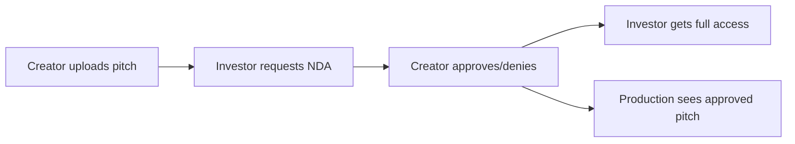
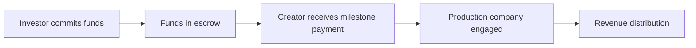

# Cross-Portal Implementation Prompt for Production & Creator Portals

## Context for Desktop LLM
You are implementing consistent patterns across a movie pitch marketplace with three distinct portals (Creator, Investor, Production). The Investor Portal has been successfully implemented with robust authentication, data handling, and UI patterns. Your task is to apply these patterns consistently to the Production and Creator portals while ensuring proper business workflow communication between all three.

## Investor Portal Architecture (Reference Implementation)

### 1. Authentication Pattern
```typescript
// Pattern: Portal-specific login with loading states and timeout protection
// Location: frontend/src/pages/InvestorLogin.tsx

interface PortalLoginPattern {
  // Core hooks
  useLoadingState: {
    timeout: 15000,
    onTimeout: () => clearAuthenticationState(),
    states: ['idle', 'logging-in', 'logging-out', 'switching-portal', 'loading-data']
  },
  
  // Authentication flow
  loginFlow: async (email: string, password: string) => {
    setLoading('logging-in', 'Authenticating {portal} account...');
    try {
      await login{Portal}(email, password);
      setTimeout(() => {
        clearLoading();
        navigate('/{portal}/dashboard');
      }, 100); // State propagation delay
    } catch (error) {
      clearLoading();
      handleError(error);
    }
  },
  
  // Portal switching
  portalSwitchCleanup: () => {
    clearLoading();
    clearAuthenticationState();
  }
}
```

### 2. Dashboard Data Management
```typescript
// Pattern: Safe data fetching with fallbacks
// Location: frontend/src/pages/InvestorDashboard.tsx

interface DashboardDataPattern {
  // Data structure
  portfolioData: {
    totalInvestment: number | null,
    activeDeals: number | null,
    roi: number | null,
    portfolioPitches: Array<PitchWithDetails>
  },
  
  // Fetching pattern
  fetchDashboardData: async () => {
    try {
      const [stats, portfolio, saved, notifications] = await Promise.all([
        investorService.getInvestorStats(),
        investorService.getPortfolio(),
        investorService.getSavedPitches(),
        notificationService.getNotifications()
      ]);
      
      // Safe data extraction with formatters
      setData({
        totalInvestment: safeNumber(stats?.data?.totalInvestment, 0),
        activeDeals: safeNumber(stats?.data?.activeDeals, 0),
        roi: safeNumber(stats?.data?.roi, 0),
        pitches: portfolio?.data || []
      });
    } catch (error) {
      setData(DEFAULT_DASHBOARD_DATA);
    }
  }
}
```

### 3. Service Layer Pattern
```typescript
// Pattern: Portal-specific service with consistent error handling
// Location: frontend/src/services/investor.service.ts

class PortalService {
  private readonly API_PREFIX = '/api/{portal}';
  
  // Generic method pattern
  async getPortalData<T>(endpoint: string): Promise<ApiResponse<T>> {
    try {
      const response = await api.get(`${this.API_PREFIX}${endpoint}`);
      return {
        success: true,
        data: response.data,
        error: null
      };
    } catch (error) {
      return {
        success: false,
        data: null,
        error: error.message || 'Failed to fetch data'
      };
    }
  }
  
  // Portal-specific methods
  getStats = () => this.getPortalData<PortalStats>('/stats');
  getPortfolio = () => this.getPortalData<Portfolio>('/portfolio');
  getAnalytics = () => this.getPortalData<Analytics>('/analytics');
}
```

### 4. WebSocket Portal Switching
```typescript
// Pattern: Portal-aware WebSocket management
// Location: frontend/src/contexts/WebSocketContext.tsx

const portalSwitchDetection = {
  // Track portal changes
  previousUserType: useRef(localStorage.getItem('userType')),
  
  // Auto-disconnect on portal switch
  checkPortalSwitch: () => {
    const currentUserType = localStorage.getItem('userType');
    if (previousUserType.current && 
        currentUserType && 
        previousUserType.current !== currentUserType) {
      console.log(`Portal switch: ${previousUserType.current} → ${currentUserType}`);
      disconnect();
      clearWebSocketState();
    }
    previousUserType.current = currentUserType;
  }
}
```

### 5. Safe Number Formatting
```typescript
// Pattern: Prevent $NaN in financial displays
// Location: frontend/src/utils/formatters.ts

const safeFormatters = {
  safeNumber: (value: unknown, fallback = 0) => {
    if (value === null || value === undefined) return fallback;
    const num = Number(value);
    return Number.isNaN(num) ? fallback : num;
  },
  
  formatCurrency: (value: unknown) => {
    const safe = safeNumber(value, 0);
    return new Intl.NumberFormat('en-US', {
      style: 'currency',
      currency: 'USD'
    }).format(safe);
  }
}
```

## Implementation Guide for Production Portal

### Required Components
```typescript
// 1. ProductionLogin.tsx
// Copy InvestorLogin.tsx pattern but:
- Change loginInvestor → loginProduction
- Update demo credentials to production company account
- Modify color scheme: green → purple/indigo
- Update icons: DollarSign → Film/Clapperboard

// 2. ProductionDashboard.tsx  
// Adapt InvestorDashboard.tsx with:
interface ProductionDashboardData {
  activeProjects: number;
  totalBudget: number;
  inProduction: number;
  completedProjects: number;
  projectPitches: Pitch[];
}

// 3. production.service.ts
class ProductionService extends PortalService {
  API_PREFIX = '/api/production';
  
  getProjects = () => this.getPortalData<Project[]>('/projects');
  getBudgetAnalytics = () => this.getPortalData<BudgetStats>('/analytics/budget');
  getProductionSchedule = () => this.getPortalData<Schedule>('/schedule');
  getCrewRequests = () => this.getPortalData<CrewRequest[]>('/crew-requests');
}
```

### Production-Specific Features
```typescript
// Production company needs:
1. Project pipeline management
2. Budget tracking across projects  
3. Crew assignment workflows
4. Distribution planning
5. Revenue projections
```

## Implementation Guide for Creator Portal

### Required Components
```typescript
// 1. CreatorLogin.tsx
// Copy InvestorLogin.tsx pattern but:
- Change loginInvestor → loginCreator
- Update demo credentials to creator account
- Modify color scheme: green → blue/cyan
- Update icons: DollarSign → Pen/Edit

// 2. CreatorDashboard.tsx
interface CreatorDashboardData {
  totalPitches: number;
  viewCount: number;
  savedByInvestors: number;
  activeNDAs: number;
  myPitches: Pitch[];
  recentActivity: Activity[];
}

// 3. creator.service.ts
class CreatorService extends PortalService {
  API_PREFIX = '/api/creator';
  
  getMyPitches = () => this.getPortalData<Pitch[]>('/pitches');
  getPitchAnalytics = (id: string) => this.getPortalData<Analytics>(`/pitches/${id}/analytics`);
  getNDARequests = () => this.getPortalData<NDARequest[]>('/nda-requests');
  getRevenue = () => this.getPortalData<Revenue>('/revenue');
}
```

### Creator-Specific Features
```typescript
// Creator needs:
1. Pitch creation and editing
2. View tracking and analytics
3. NDA request management
4. Investor interaction tracking
5. Revenue/royalty tracking
```

## Cross-Portal Business Workflows

### 1. NDA Workflow


**Implementation Pattern:**
```typescript
// Shared NDA service used by all portals
class NDAWorkflowService {
  // Creator side
  async handleNDARequest(requestId: string, action: 'approve' | 'deny') {
    await api.post(`/api/nda/requests/${requestId}`, { action });
    // Notify investor via WebSocket
    wsService.send('nda-status-change', { requestId, action });
  }
  
  // Investor side  
  async requestNDA(pitchId: string) {
    await api.post('/api/nda/request', { pitchId });
    // Notify creator via WebSocket
    wsService.send('new-nda-request', { pitchId });
  }
  
  // Production side
  async viewApprovedPitches() {
    // Only see pitches where creator has approved production access
    return api.get('/api/production/approved-pitches');
  }
}
```

### 2. Investment Flow


**Implementation Pattern:**
```typescript
interface InvestmentWorkflow {
  // Investor initiates
  commitFunds: (pitchId: string, amount: number) => Promise<Investment>;
  
  // Creator receives notifications
  onInvestmentReceived: (callback: (investment: Investment) => void) => void;
  
  // Production tracks
  trackProjectFunding: (pitchId: string) => Promise<FundingStatus>;
}
```

### 3. Communication Channels
```typescript
// WebSocket event routing by portal
const portalEventRouting = {
  creator: [
    'new-view',
    'nda-request', 
    'investment-received',
    'production-interest'
  ],
  
  investor: [
    'pitch-updated',
    'nda-approved',
    'roi-update',
    'new-pitch-match'
  ],
  
  production: [
    'project-funded',
    'crew-available',
    'distribution-offer',
    'budget-approved'
  ]
};
```

## Portal Guard Implementation
```typescript
// Apply to all portal routes
// Location: frontend/src/components/PortalGuard.tsx

<PortalGuard requiredPortal="production">
  <ProductionDashboard />
</PortalGuard>

<PortalGuard requiredPortal="creator">
  <CreatorDashboard />
</PortalGuard>
```

## Testing Checklist for Each Portal

### Authentication Tests
- [ ] Login with correct credentials
- [ ] Login with wrong credentials  
- [ ] Demo account auto-fill
- [ ] Portal switching cleanup
- [ ] Timeout handling (15s)
- [ ] Loading states

### Dashboard Tests
- [ ] Data loads without $NaN
- [ ] Empty state handling
- [ ] Error state recovery
- [ ] Real-time updates via WebSocket
- [ ] Responsive design

### Cross-Portal Tests
- [ ] Creator → Investor portal switch
- [ ] Investor → Production portal switch
- [ ] WebSocket disconnection on switch
- [ ] localStorage cleanup
- [ ] No auth token leakage

## Implementation Order

1. **Phase 1: Core Structure**
   - Create login pages for Creator and Production
   - Implement portal services
   - Add portal guards to routes

2. **Phase 2: Dashboards**
   - Build dashboard components with safe data handling
   - Connect to backend APIs
   - Add loading and error states

3. **Phase 3: Business Workflows**
   - Implement NDA workflows
   - Add investment tracking
   - Set up notification system

4. **Phase 4: WebSocket Integration**
   - Portal-specific event handlers
   - Real-time dashboard updates
   - Cross-portal notifications

5. **Phase 5: Testing & Refinement**
   - Run authentication tests
   - Verify data formatting
   - Test portal switching
   - Validate business workflows

## Key Principles

1. **Consistency**: All portals follow the same patterns
2. **Safety**: All data is sanitized with safeNumber/formatters
3. **Isolation**: Each portal has separate auth state
4. **Communication**: WebSocket enables real-time cross-portal updates
5. **Recovery**: Timeouts and error boundaries prevent stuck states

## Research Topics for Desktop LLM

When implementing these patterns, research:

1. **Multi-tenant authentication best practices**
   - Session isolation between user types
   - Token refresh strategies
   - Cross-origin authentication

2. **Real-time communication patterns**
   - WebSocket room management by user type
   - Event routing and filtering
   - Offline queue management

3. **Financial data handling**
   - Decimal precision for currency
   - Escrow and milestone patterns
   - Revenue distribution algorithms

4. **Role-based access control (RBAC)**
   - Granular permissions per portal
   - Resource-level access control
   - Audit logging

5. **State management strategies**
   - Portal-specific stores
   - Shared business logic
   - Cache invalidation patterns

## Expected Outcomes

After implementing these patterns:

1. **Consistent UX**: Users experience the same quality across all portals
2. **Clean Separation**: No authentication leakage between portals
3. **Reliable Data**: No $NaN or undefined values in UI
4. **Real-time Updates**: All portals receive relevant notifications
5. **Business Alignment**: Workflows make sense for each user type

## Next Steps

1. Start with Production Portal (similar to Investor)
2. Then implement Creator Portal (most complex)
3. Test cross-portal workflows thoroughly
4. Add comprehensive error tracking
5. Document any deviations from patterns

This prompt provides a complete blueprint for implementing consistent portal patterns while maintaining proper business workflow communication.