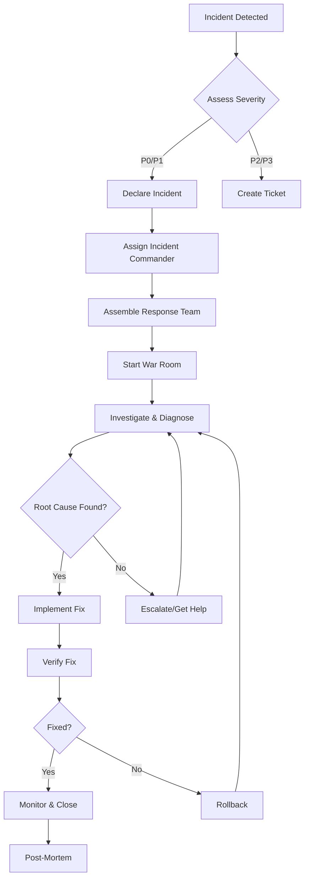

# Incident Response Playbook

## 🚨 Pitchey Platform - Incident Response Guide

### 📊 Incident Severity Levels

| Level | Definition | Response Time | Examples | Escalation |
|-------|------------|---------------|----------|------------|
| **P0 - Critical** | Complete service outage or data loss | < 15 min | Site down, data breach, total auth failure | Immediate - All hands |
| **P1 - High** | Major feature broken affecting >30% users | < 30 min | Payment processing down, login failures | Engineering Lead + On-call |
| **P2 - Medium** | Significant degradation or partial outage | < 2 hours | Slow performance, partial feature failure | On-call engineer |
| **P3 - Low** | Minor issue with workaround available | < 24 hours | UI glitches, non-critical bugs | Regular triage |

## 🔄 Incident Response Flow



## 👥 Incident Response Roles

### Incident Commander (IC)
- **Responsibilities**: Overall incident coordination, communication, decisions
- **Authority**: Can make any decision needed to resolve incident
- **Not doing**: Hands-on technical work

### Technical Lead
- **Responsibilities**: Technical investigation, solution implementation
- **Reports to**: Incident Commander
- **Focus**: Root cause analysis and fix

### Communications Lead
- **Responsibilities**: Status updates, stakeholder communication
- **Channels**: Slack, status page, email
- **Frequency**: Every 30 minutes for P0/P1

### Scribe
- **Responsibilities**: Document timeline, actions, decisions
- **Output**: Incident report for post-mortem
- **Tools**: Incident template, shared doc

## 📋 Incident Response Procedures

### 1. Detection & Triage (0-5 minutes)

#### Automated Detection
- Monitoring alerts (Sentry, CloudFlare)
- Health check failures
- Error rate thresholds exceeded
- Performance degradation alerts

#### Manual Detection
- User reports via support
- Team member observation
- Social media mentions

#### Initial Assessment
```bash
# Quick health check
curl https://pitchey-production.cavelltheleaddev.workers.dev/health

# Check error rates
curl https://pitchey-production.cavelltheleaddev.workers.dev/metrics | grep error

# View recent logs
wrangler tail --env production

# Check Sentry for new errors
open https://sentry.io/organizations/pitchey/issues/
```

### 2. Incident Declaration (5-15 minutes)

#### P0/P1 Incidents
```markdown
@channel INCIDENT DECLARED - P[0/1]
**Service**: Pitchey Production
**Severity**: P[0/1] - [Critical/High]
**Impact**: [User impact description]
**IC**: @[name]
**War Room**: [Link to call]
**Tracking**: [Incident ID]
```

#### Create War Room
- **Slack Channel**: #incident-YYYYMMDD-description
- **Video Call**: [Zoom/Meet link]
- **Shared Doc**: [Google Doc for notes]

### 3. Investigation (15-30 minutes)

#### System Status Checks

```bash
# API Health
curl -s https://pitchey-production.cavelltheleaddev.workers.dev/health | jq .

# Database Status
curl -s https://pitchey-production.cavelltheleaddev.workers.dev/api/admin/db/status \
  -H "Authorization: Bearer $ADMIN_TOKEN" | jq .

# Cache Status
curl -s https://pitchey-production.cavelltheleaddev.workers.dev/api/admin/cache/stats \
  -H "Authorization: Bearer $ADMIN_TOKEN" | jq .

# WebSocket Status
wscat -c wss://pitchey-production.cavelltheleaddev.workers.dev/ws
```

#### Log Analysis

```bash
# Worker logs
wrangler tail --env production --format json | jq 'select(.level=="error")'

# Search for specific errors
wrangler tail --env production | grep -i "error\|fail\|timeout"

# Database slow queries
deno run --allow-all scripts/analyze-slow-queries.ts
```

#### Performance Analysis

```bash
# Response time analysis
curl -w "@curl-format.txt" -o /dev/null -s \
  https://pitchey-production.cavelltheleaddev.workers.dev/api/pitches/trending

# Load test specific endpoint
ab -n 100 -c 10 https://pitchey-production.cavelltheleaddev.workers.dev/health
```

### 4. Mitigation & Recovery

#### Quick Wins
1. **Clear Cache** - If stale data issues
   ```bash
   curl -X DELETE https://pitchey-production.cavelltheleaddev.workers.dev/api/admin/cache \
     -H "Authorization: Bearer $ADMIN_TOKEN"
   ```

2. **Increase Rate Limits** - If legitimate traffic spike
   ```bash
   wrangler deploy --env production --var RATE_LIMIT=1000
   ```

3. **Scale Database** - If connection pool exhausted
   ```bash
   # Increase Hyperdrive connections
   wrangler hyperdrive update <ID> --max-connections=50
   ```

#### Rollback Procedures
See [ROLLBACK_PROCEDURES.md](./ROLLBACK_PROCEDURES.md)

#### Emergency Fixes
```bash
# Deploy hotfix
git checkout -b hotfix/incident-fix
# Make changes
git commit -m "HOTFIX: [description]"
git push origin hotfix/incident-fix
gh pr create --title "HOTFIX: [description]" --body "Fixes incident #XXX"
gh pr merge --auto --merge
```

### 5. Communication Templates

#### Status Page Updates

**Investigating**
```
We are investigating reports of [service] experiencing [issue].
We will provide updates as more information becomes available.
```

**Identified**
```
We have identified the issue causing [service] to [behavior].
Our team is working on implementing a fix.
```

**Monitoring**
```
A fix has been implemented and we are monitoring the results.
[Service] should be operating normally.
```

**Resolved**
```
The issue with [service] has been resolved.
All systems are operating normally.
We apologize for any inconvenience.
```

#### Internal Updates (Every 30 min for P0/P1)
```markdown
**UPDATE** - [Time]
**Status**: [Investigating/Identified/Fixing/Monitoring]
**Current State**: [What's happening]
**Next Steps**: [What we're doing]
**ETA**: [Best estimate or "TBD"]
**Need**: [Any help needed]
```

### 6. Resolution Verification

```bash
# Comprehensive health check
./scripts/verify-deployment.sh

# Test critical flows
./tests/smoke/critical-paths.test.ts

# Monitor metrics for 15 minutes
watch -n 30 'curl -s https://pitchey-production.cavelltheleaddev.workers.dev/metrics | grep -E "error_rate|response_time|active_users"'
```

## 🔍 Incident Scenarios

### Scenario 1: Complete Outage
```bash
# 1. Check CloudFlare status
curl -s https://www.cloudflarestatus.com/api/v2/status.json | jq .

# 2. Check Worker status
wrangler deployments list

# 3. Check database connectivity
psql "$DATABASE_URL" -c "SELECT 1"

# 4. Emergency rollback if needed
wrangler rollback --env production
```

### Scenario 2: Database Connection Errors
```bash
# 1. Check connection pool
curl -s $PRODUCTION_URL/api/admin/db/pool \
  -H "Authorization: Bearer $ADMIN_TOKEN"

# 2. Reset connections
wrangler deploy --env production --restart

# 3. Scale if needed
wrangler hyperdrive update <ID> --max-connections=100
```

### Scenario 3: High Error Rate
```bash
# 1. Identify error source
wrangler tail --env production --format json | \
  jq 'select(.level=="error") | {endpoint: .pathname, error: .error}'

# 2. Check specific endpoint
curl -v $PRODUCTION_URL/[problematic-endpoint]

# 3. Temporary disable if needed
wrangler deploy --env production --var FEATURE_FLAG_[FEATURE]=false
```

### Scenario 4: Performance Degradation
```bash
# 1. Check cache hit rates
curl -s $PRODUCTION_URL/api/admin/cache/stats \
  -H "Authorization: Bearer $ADMIN_TOKEN"

# 2. Warm cache
curl -X POST $PRODUCTION_URL/api/admin/cache/warm \
  -H "Authorization: Bearer $ADMIN_TOKEN"

# 3. Check slow queries
deno run --allow-all scripts/analyze-slow-queries.ts
```

## 📊 Post-Incident

### Incident Closure Checklist
- [ ] Service fully restored
- [ ] Monitoring shows normal metrics
- [ ] No related alerts firing
- [ ] Status page updated
- [ ] Stakeholders notified
- [ ] Initial timeline documented
- [ ] Post-mortem scheduled

### Post-Mortem Process (Within 48 hours)

#### Meeting Agenda (1 hour)
1. **Timeline Review** (15 min)
2. **Root Cause Analysis** (20 min)
3. **What Went Well** (10 min)
4. **What Could Improve** (10 min)
5. **Action Items** (5 min)

#### Post-Mortem Document Template
See template in [ROLLBACK_PROCEDURES.md](./ROLLBACK_PROCEDURES.md#post-mortem-template)

#### Action Items Tracking
```markdown
| Action | Owner | Due Date | Status |
|--------|-------|----------|--------|
| [Preventive measure] | @name | YYYY-MM-DD | Todo |
| [Process improvement] | @name | YYYY-MM-DD | Todo |
| [Monitoring addition] | @name | YYYY-MM-DD | Todo |
```

## 🛠️ Tools & Resources

### Monitoring Dashboards
- **CloudFlare Analytics**: https://dash.cloudflare.com
- **Sentry Errors**: https://sentry.io/organizations/pitchey/
- **Application Metrics**: https://pitchey-production.cavelltheleaddev.workers.dev/metrics
- **Status Page**: https://status.pitchey.com

### Communication Channels
- **Incident Slack**: #incidents
- **War Room Template**: [Zoom link template]
- **Status Page Admin**: https://manage.statuspage.io
- **On-Call Schedule**: [PagerDuty/Opsgenie link]

### Emergency Contacts
| Service | Contact | Method |
|---------|---------|--------|
| CloudFlare Support | support@cloudflare.com | Email/Chat |
| Neon Support | support@neon.tech | Email |
| Upstash Support | support@upstash.com | Email |
| SendGrid Support | support@sendgrid.com | Email |

### Useful Commands Cheatsheet
```bash
# View live logs
wrangler tail --env production

# Check deployment status
wrangler deployments list

# Quick rollback
wrangler rollback --env production

# Clear all caches
curl -X DELETE $PRODUCTION_URL/api/admin/cache -H "Authorization: Bearer $ADMIN_TOKEN"

# Database query
psql "$DATABASE_URL" -c "[SQL QUERY]"

# Force cache warm
curl -X POST $PRODUCTION_URL/api/admin/cache/warm -H "Authorization: Bearer $ADMIN_TOKEN"

# Check worker CPU usage
curl -s $PRODUCTION_URL/metrics | grep worker_cpu

# Test specific endpoint
curl -w "Response time: %{time_total}s\n" $PRODUCTION_URL/[endpoint]
```

## 📈 Continuous Improvement

### Monthly Review
- Incident frequency trends
- Mean Time To Resolution (MTTR)
- Most common incident types
- Action items completion rate

### Quarterly Updates
- Playbook effectiveness review
- Tool and process improvements
- Team training needs
- Automation opportunities

### Key Metrics to Track
- **MTTD** - Mean Time To Detect
- **MTTA** - Mean Time To Acknowledge
- **MTTR** - Mean Time To Resolve
- **Incident Rate** - Incidents per deployment
- **Recurrence Rate** - Repeat incidents

---

**Remember**: 
- Stay calm and methodical
- Over-communicate during incidents
- Focus on resolution, not blame
- Every incident is a learning opportunity
- Customer impact is the priority