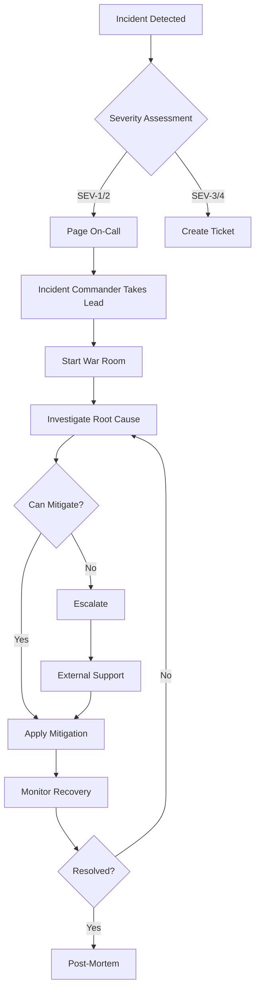

# Incident Response Playbooks

## 🚨 Incident Severity Levels

| Level | Name | Definition | Response Time | Examples |
|-------|------|------------|---------------|----------|
| **SEV-1** | Critical | Complete service outage or data breach | < 15 minutes | Database down, security breach, complete outage |
| **SEV-2** | Major | Significant degradation affecting many users | < 30 minutes | Auth service down, payment failures, API errors >50% |
| **SEV-3** | Minor | Limited impact on subset of users | < 2 hours | Slow queries, intermittent errors, single feature broken |
| **SEV-4** | Low | Minimal impact, cosmetic issues | < 24 hours | UI glitches, non-critical warnings, documentation issues |

## 📋 Playbook 1: Complete Service Outage

### Detection Signals
- Health check endpoints returning 500/503
- Multiple monitoring alerts firing
- User reports via support channels
- Zero traffic in analytics

### Immediate Response (0-5 minutes)
```bash
#!/bin/bash
# 1. Verify the outage
curl -I https://pitchey-production.cavelltheleaddev.workers.dev/health

# 2. Check Cloudflare status
curl https://www.cloudflarestatus.com/api/v2/status.json

# 3. Check database connectivity
PGPASSWORD=$DB_PASSWORD psql -h $DB_HOST -U $DB_USER -d pitchey -c "SELECT 1"

# 4. Activate incident response
./scripts/incident-response.sh start SEV-1 "Complete service outage"
```

### Investigation Steps (5-15 minutes)
1. **Check Recent Deployments**
   ```bash
   wrangler tail --format json | jq '.outcome'
   git log --oneline -10
   ```

2. **Review Error Logs**
   ```bash
   wrangler tail --search "error" --limit 100
   ```

3. **Database Status**
   ```sql
   SELECT * FROM pg_stat_activity WHERE state != 'idle';
   SELECT * FROM pg_stat_database WHERE datname = 'pitchey';
   ```

4. **Redis Status**
   ```bash
   curl -H "Authorization: Bearer $REDIS_TOKEN" \
     https://chief-anteater-20186.upstash.io/info
   ```

### Mitigation Actions
1. **Rollback Deployment** (if deployment-related)
   ```bash
   wrangler rollback
   cd frontend && wrangler pages rollback
   ```

2. **Failover to Backup** (if database-related)
   ```bash
   # Switch to read replica
   export DATABASE_URL=$DATABASE_REPLICA_URL
   wrangler secret put DATABASE_URL
   ```

3. **Enable Maintenance Mode**
   ```bash
   wrangler secret put MAINTENANCE_MODE true
   wrangler deploy
   ```

### Communication Template
```markdown
**Status Page Update:**
We are currently experiencing a service outage affecting all users. 
Our team has been notified and is investigating.

**Slack/Discord:**
@channel SEV-1 Incident Declared
- Issue: Complete service outage
- Impact: All users affected
- Status: Investigating
- Lead: [Incident Commander]
- Thread: [Link to thread]

**Customer Email:**
Subject: Pitchey Service Disruption

We are currently experiencing technical difficulties with our platform.
Our team is working to restore service as quickly as possible.
Updates will be provided every 30 minutes at status.pitchey.com
```

### Resolution Checklist
- [ ] Service restored and verified
- [ ] Root cause identified
- [ ] Monitoring alerts cleared
- [ ] Status page updated
- [ ] Customer communication sent
- [ ] Post-mortem scheduled

---

## 📋 Playbook 2: Database Performance Degradation

### Detection Signals
- Query response time > 1000ms
- Database CPU > 90%
- Connection pool exhausted
- Timeout errors in logs

### Immediate Response
```sql
-- 1. Identify slow queries
SELECT 
  pid,
  now() - pg_stat_activity.query_start AS duration,
  query,
  state
FROM pg_stat_activity
WHERE (now() - pg_stat_activity.query_start) > interval '30 seconds'
ORDER BY duration DESC;

-- 2. Kill long-running queries
SELECT pg_terminate_backend(pid) 
FROM pg_stat_activity 
WHERE (now() - pg_stat_activity.query_start) > interval '5 minutes'
  AND query NOT ILIKE '%autovacuum%';

-- 3. Check table bloat
SELECT 
  schemaname,
  tablename,
  pg_size_pretty(pg_total_relation_size(schemaname||'.'||tablename)) AS size
FROM pg_tables
WHERE schemaname NOT IN ('pg_catalog', 'information_schema')
ORDER BY pg_total_relation_size(schemaname||'.'||tablename) DESC
LIMIT 10;
```

### Mitigation Steps
1. **Enable Read Replica Routing**
   ```typescript
   // Temporarily route reads to replica
   const ROUTE_TO_REPLICA = true;
   
   async function executeQuery(query: string) {
     const isWrite = query.match(/INSERT|UPDATE|DELETE/i);
     const db = isWrite ? primaryDB : replicaDB;
     return await db.execute(query);
   }
   ```

2. **Increase Connection Pool**
   ```javascript
   // Temporarily increase limits
   const poolConfig = {
     max: 100,  // Increased from 20
     idleTimeoutMillis: 60000,
     connectionTimeoutMillis: 5000
   };
   ```

3. **Emergency Cache All Queries**
   ```typescript
   // Force cache all read queries
   const EMERGENCY_CACHE_TTL = 300; // 5 minutes
   
   async function cachedQuery(key: string, query: () => Promise<any>) {
     const cached = await redis.get(key);
     if (cached) return cached;
     
     const result = await query();
     await redis.setex(key, EMERGENCY_CACHE_TTL, result);
     return result;
   }
   ```

---

## 📋 Playbook 3: Security Incident Response

### Detection Signals
- Unusual authentication patterns
- Spike in failed login attempts
- Data access from unknown IPs
- Suspicious API usage patterns

### Immediate Response (0-5 minutes)
```bash
#!/bin/bash
# Security Incident Response Script

# 1. Enable enhanced logging
wrangler secret put SECURITY_LOGGING true

# 2. Block suspicious IPs
cat > blocked-ips.txt << EOF
192.168.1.1
10.0.0.1
EOF

while IFS= read -r ip; do
  curl -X POST "https://api.cloudflare.com/client/v4/zones/$ZONE_ID/firewall/access_rules/rules" \
    -H "Authorization: Bearer $CF_API_TOKEN" \
    -H "Content-Type: application/json" \
    --data "{
      \"mode\": \"block\",
      \"configuration\": {
        \"target\": \"ip\",
        \"value\": \"$ip\"
      },
      \"notes\": \"Blocked due to security incident $(date)\"
    }"
done < blocked-ips.txt

# 3. Force logout all users
redis-cli --eval force-logout.lua
```

### Investigation Steps
1. **Audit Authentication Logs**
   ```sql
   -- Recent authentication attempts
   SELECT 
     created_at,
     email,
     ip_address,
     user_agent,
     success
   FROM auth_logs
   WHERE created_at > NOW() - INTERVAL '1 hour'
   ORDER BY created_at DESC;
   
   -- Failed attempts by IP
   SELECT 
     ip_address,
     COUNT(*) as attempts,
     MAX(created_at) as last_attempt
   FROM auth_logs
   WHERE success = false
     AND created_at > NOW() - INTERVAL '1 hour'
   GROUP BY ip_address
   HAVING COUNT(*) > 5
   ORDER BY attempts DESC;
   ```

2. **Check Data Access Patterns**
   ```sql
   -- Unusual data access
   SELECT 
     u.email,
     al.action,
     al.resource,
     al.ip_address,
     al.created_at
   FROM audit_logs al
   JOIN users u ON al.user_id = u.id
   WHERE al.created_at > NOW() - INTERVAL '24 hours'
     AND (
       al.ip_address NOT IN (SELECT DISTINCT ip_address FROM user_known_ips)
       OR al.action IN ('bulk_export', 'api_key_created', 'permission_escalation')
     )
   ORDER BY al.created_at DESC;
   ```

### Containment Actions
1. **Enable Strict Mode**
   ```typescript
   // Enable additional security checks
   export const SECURITY_CONFIG = {
     requireMFA: true,
     sessionTimeout: 900, // 15 minutes
     maxLoginAttempts: 3,
     ipWhitelist: true,
     apiRateLimit: 10, // requests per minute
   };
   ```

2. **Rotate Affected Credentials**
   ```bash
   # Rotate all API keys
   ./scripts/rotate-api-keys.sh --all --force
   
   # Force password reset for affected users
   psql -c "UPDATE users SET force_password_reset = true WHERE last_login > NOW() - INTERVAL '24 hours'"
   ```

---

## 📋 Playbook 4: Data Corruption/Loss

### Detection Signals
- Inconsistent query results
- Foreign key violations
- Missing records reports
- Backup validation failures

### Immediate Response
```bash
# 1. Stop writes to prevent further corruption
wrangler secret put READ_ONLY_MODE true

# 2. Create immediate backup
pg_dump -h $DB_HOST -U $DB_USER -d pitchey -f emergency-backup-$(date +%s).sql

# 3. Verify backup integrity
pg_restore --list emergency-backup-*.sql
```

### Recovery Steps
1. **Identify Corruption Scope**
   ```sql
   -- Check table integrity
   SELECT 
     schemaname,
     tablename,
     pg_size_pretty(pg_relation_size(schemaname||'.'||tablename)) as size
   FROM pg_tables
   WHERE schemaname = 'public';
   
   -- Verify foreign keys
   SELECT
     conname AS constraint_name,
     conrelid::regclass AS table_name,
     confrelid::regclass AS referenced_table
   FROM pg_constraint
   WHERE contype = 'f'
     AND NOT EXISTS (
       SELECT 1 FROM pg_constraint
       WHERE contype = 'f'
     );
   ```

2. **Point-in-Time Recovery**
   ```bash
   # Restore to specific timestamp
   pg_restore -h $DB_HOST -U $DB_USER -d pitchey_recovery \
     --clean --if-exists \
     --no-owner --no-privileges \
     backup-20240101-120000.sql
   
   # Verify recovery
   psql -d pitchey_recovery -c "SELECT COUNT(*) FROM users"
   ```

---

## 📋 Playbook 5: Payment System Failure

### Detection Signals
- Payment gateway errors
- Failed transaction spikes
- Customer payment complaints
- Webhook delivery failures

### Immediate Response
```typescript
// 1. Enable payment bypass mode
const PAYMENT_BYPASS = true;

// 2. Queue failed payments for retry
async function queueFailedPayment(payment: Payment) {
  await redis.lpush('payment:retry:queue', JSON.stringify({
    ...payment,
    retryCount: 0,
    queuedAt: Date.now()
  }));
}

// 3. Switch to backup payment provider
const ACTIVE_PROVIDER = process.env.BACKUP_PAYMENT_PROVIDER;
```

### Recovery Actions
1. **Process Queued Payments**
   ```typescript
   async function processPaymentQueue() {
     while (true) {
       const payment = await redis.rpop('payment:retry:queue');
       if (!payment) break;
       
       try {
         await processPayment(JSON.parse(payment));
       } catch (error) {
         // Re-queue with exponential backoff
         await requeuePayment(payment, error);
       }
     }
   }
   ```

2. **Reconciliation**
   ```sql
   -- Find unmatched payments
   SELECT 
     p.id,
     p.amount,
     p.status,
     t.stripe_id
   FROM payments p
   LEFT JOIN transactions t ON p.id = t.payment_id
   WHERE p.created_at > NOW() - INTERVAL '24 hours'
     AND p.status = 'pending'
     AND t.id IS NULL;
   ```

---

## 📋 Playbook 6: DDoS Attack Response

### Detection Signals
- Request rate > 10000 RPS
- Origin server CPU > 95%
- Unusual traffic patterns
- Multiple timeout errors

### Immediate Response
```bash
# 1. Enable Cloudflare Under Attack Mode
curl -X PATCH "https://api.cloudflare.com/client/v4/zones/$ZONE_ID/settings/security_level" \
  -H "Authorization: Bearer $CF_API_TOKEN" \
  -H "Content-Type: application/json" \
  --data '{"value":"under_attack"}'

# 2. Enable rate limiting
curl -X POST "https://api.cloudflare.com/client/v4/zones/$ZONE_ID/rate_limits" \
  -H "Authorization: Bearer $CF_API_TOKEN" \
  -H "Content-Type: application/json" \
  --data '{
    "match": {
      "request": {
        "url": "*.pitchey.com/*"
      }
    },
    "threshold": 50,
    "period": 60,
    "action": {
      "mode": "challenge"
    }
  }'

# 3. Block attacking IPs/ASNs
./scripts/block-attack-sources.sh
```

### Mitigation Steps
1. **Enable Challenge Pages**
2. **Increase Cache TTL**
3. **Disable Non-Essential Features**
4. **Scale Infrastructure**

---

## 🔄 Incident Response Flow



---

## 📞 Incident Communication

### Internal Communication
```markdown
**Slack Channel: #incidents**

@channel - SEV-[1-4] Incident
Status: [Investigating/Mitigating/Monitoring/Resolved]
Impact: [Description]
Lead: @[username]
Duration: [XX minutes]
Next Update: [Time]
```

### External Communication
```markdown
**Status Page Template:**
[Service] Experiencing Issues
We're investigating reports of [issue description].
Impact: [Percentage] of users may experience [symptoms]
Next update in [30] minutes
```

---

## 📝 Post-Mortem Template

```markdown
# Incident Post-Mortem: [INCIDENT-ID]

## Summary
- Date: [YYYY-MM-DD]
- Duration: [XX minutes]
- Severity: SEV-[1-4]
- Impact: [Users/Revenue]

## Timeline
- HH:MM - Detection
- HH:MM - Response initiated
- HH:MM - Root cause identified
- HH:MM - Mitigation applied
- HH:MM - Resolution confirmed

## Root Cause
[Technical explanation]

## Lessons Learned
1. What went well
2. What went wrong
3. Where we got lucky

## Action Items
- [ ] [Owner] - [Action] - [Due Date]
- [ ] [Owner] - [Action] - [Due Date]

## Prevention Measures
[Long-term fixes]
```

---

## 🎯 Incident Metrics

Track these KPIs:
- **MTTD** (Mean Time To Detect): < 5 minutes
- **MTTA** (Mean Time To Acknowledge): < 15 minutes  
- **MTTR** (Mean Time To Resolve): < 60 minutes
- **Incident Rate**: < 1 per week
- **Post-Mortem Completion**: 100% for SEV-1/2

---

*Last Updated: December 2024*
*Review Frequency: Monthly*
*Owner: Platform Team*