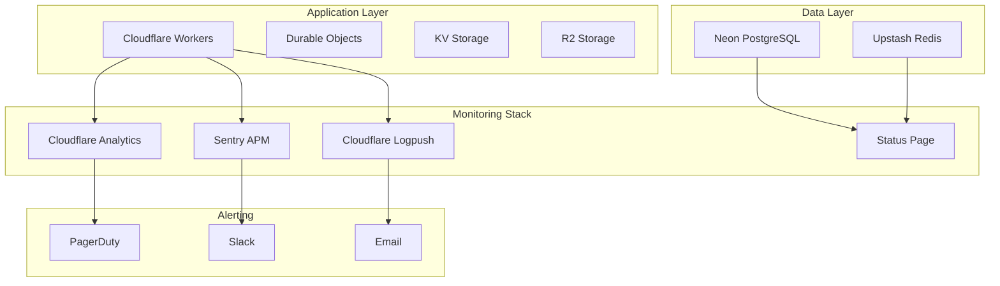

# Production Monitoring & Alerting Setup for Pitchey

**Comprehensive Observability Strategy**  
**Date:** December 11, 2024

## 🎯 Monitoring Architecture



## 1. Cloudflare Analytics Engine Setup

```typescript
// src/monitoring/analytics.ts
export class AnalyticsEngine {
  constructor(
    private analytics: AnalyticsEngineDataset,
    private env: Env
  ) {}
  
  // Track performance metrics
  async trackPerformance(
    request: Request,
    response: Response,
    timing: {
      startTime: number;
      dbTime?: number;
      cacheTime?: number;
    }
  ): Promise<void> {
    const totalTime = Date.now() - timing.startTime;
    
    await this.analytics.writeDataPoint({
      // Dimensions
      blobs: [
        request.url,
        request.method,
        response.status.toString()
      ],
      // Metrics
      doubles: [
        totalTime,
        timing.dbTime || 0,
        timing.cacheTime || 0
      ],
      // Metadata
      indexes: [
        this.env.ENVIRONMENT,
        request.headers.get('CF-Ray') || 'unknown'
      ]
    });
  }
  
  // Track business metrics
  async trackBusinessEvent(
    eventType: 'pitch_created' | 'investment_made' | 'nda_signed',
    metadata: Record<string, any>
  ): Promise<void> {
    await this.analytics.writeDataPoint({
      blobs: [
        eventType,
        metadata.userId,
        metadata.portal
      ],
      doubles: [
        metadata.amount || 0,
        1 // Count
      ],
      indexes: [
        new Date().toISOString(),
        this.env.ENVIRONMENT
      ]
    });
  }
  
  // Track errors
  async trackError(
    error: Error,
    context: {
      url: string;
      method: string;
      userId?: string;
    }
  ): Promise<void> {
    await this.analytics.writeDataPoint({
      blobs: [
        error.name,
        error.message,
        context.url,
        context.method
      ],
      doubles: [1], // Error count
      indexes: [
        context.userId || 'anonymous',
        this.env.ENVIRONMENT
      ]
    });
  }
}

// Usage in Worker
export default {
  async fetch(request: Request, env: Env, ctx: ExecutionContext): Promise<Response> {
    const startTime = Date.now();
    const analytics = new AnalyticsEngine(env.ANALYTICS, env);
    
    try {
      // Process request
      const response = await handleRequest(request, env);
      
      // Track success metrics
      ctx.waitUntil(
        analytics.trackPerformance(request, response, {
          startTime,
          dbTime: (request as any).dbTime,
          cacheTime: (request as any).cacheTime
        })
      );
      
      return response;
    } catch (error) {
      // Track error metrics
      ctx.waitUntil(
        analytics.trackError(error as Error, {
          url: request.url,
          method: request.method,
          userId: (request as any).userId
        })
      );
      
      throw error;
    }
  }
};
```

## 2. Sentry Integration with Context

```typescript
// src/monitoring/sentry-enhanced.ts
import * as Sentry from '@sentry/cloudflare';

export function initSentry(env: Env) {
  Sentry.init({
    dsn: env.SENTRY_DSN,
    environment: env.ENVIRONMENT,
    release: env.RELEASE_VERSION,
    
    // Performance monitoring
    tracesSampleRate: env.ENVIRONMENT === 'production' ? 0.1 : 1.0,
    
    // Session tracking
    autoSessionTracking: true,
    
    // Integrations
    integrations: [
      new Sentry.Integrations.Http({ tracing: true }),
      new Sentry.Integrations.Console(),
      new Sentry.Integrations.LinkedErrors()
    ],
    
    // Data scrubbing
    beforeSend(event, hint) {
      // Remove sensitive data
      if (event.request?.cookies) {
        delete event.request.cookies;
      }
      
      if (event.request?.headers) {
        delete event.request.headers['authorization'];
        delete event.request.headers['cookie'];
      }
      
      // Add context
      event.contexts = {
        ...event.contexts,
        cloudflare: {
          colo: hint.originalException?.cf?.colo,
          ray: hint.originalException?.cf?.ray,
          country: hint.originalException?.cf?.country
        }
      };
      
      return event;
    },
    
    // Breadcrumb filtering
    beforeBreadcrumb(breadcrumb) {
      // Filter out noisy breadcrumbs
      if (breadcrumb.category === 'console' && breadcrumb.level === 'debug') {
        return null;
      }
      return breadcrumb;
    }
  });
}

// Enhanced error tracking
export class SentryMonitor {
  static captureException(
    error: Error,
    context?: {
      user?: { id: string; email: string; role: string };
      tags?: Record<string, string>;
      extra?: Record<string, any>;
      fingerprint?: string[];
    }
  ): void {
    Sentry.withScope((scope) => {
      // Set user context
      if (context?.user) {
        scope.setUser({
          id: context.user.id,
          email: context.user.email,
          role: context.user.role
        });
      }
      
      // Set tags
      if (context?.tags) {
        Object.entries(context.tags).forEach(([key, value]) => {
          scope.setTag(key, value);
        });
      }
      
      // Set extra context
      if (context?.extra) {
        Object.entries(context.extra).forEach(([key, value]) => {
          scope.setExtra(key, value);
        });
      }
      
      // Custom fingerprinting for better grouping
      if (context?.fingerprint) {
        scope.setFingerprint(context.fingerprint);
      }
      
      Sentry.captureException(error);
    });
  }
  
  static captureMessage(
    message: string,
    level: 'debug' | 'info' | 'warning' | 'error' = 'info',
    context?: Record<string, any>
  ): void {
    Sentry.withScope((scope) => {
      if (context) {
        Object.entries(context).forEach(([key, value]) => {
          scope.setExtra(key, value);
        });
      }
      
      Sentry.captureMessage(message, level);
    });
  }
  
  static async measureTransaction<T>(
    name: string,
    operation: string,
    fn: () => Promise<T>
  ): Promise<T> {
    const transaction = Sentry.startTransaction({
      name,
      op: operation
    });
    
    Sentry.getCurrentHub().configureScope(scope => 
      scope.setSpan(transaction)
    );
    
    try {
      const result = await fn();
      transaction.setStatus('ok');
      return result;
    } catch (error) {
      transaction.setStatus('internal_error');
      throw error;
    } finally {
      transaction.finish();
    }
  }
}
```

## 3. Real-time Alerting Configuration

```typescript
// src/monitoring/alerting.ts
export class AlertingService {
  private readonly THRESHOLDS = {
    errorRate: {
      warning: 0.01, // 1% error rate
      critical: 0.05 // 5% error rate
    },
    responseTime: {
      warning: 1000, // 1 second
      critical: 3000 // 3 seconds
    },
    dbLatency: {
      warning: 100, // 100ms
      critical: 500 // 500ms
    },
    cacheHitRate: {
      warning: 0.7, // 70% hit rate
      critical: 0.5 // 50% hit rate
    }
  };
  
  constructor(
    private pagerduty: PagerDutyClient,
    private slack: SlackClient,
    private env: Env
  ) {}
  
  async checkThresholds(metrics: SystemMetrics): Promise<void> {
    const alerts: Alert[] = [];
    
    // Check error rate
    if (metrics.errorRate > this.THRESHOLDS.errorRate.critical) {
      alerts.push({
        severity: 'critical',
        title: 'High Error Rate',
        message: `Error rate is ${(metrics.errorRate * 100).toFixed(2)}%`,
        metric: 'error_rate',
        value: metrics.errorRate
      });
    } else if (metrics.errorRate > this.THRESHOLDS.errorRate.warning) {
      alerts.push({
        severity: 'warning',
        title: 'Elevated Error Rate',
        message: `Error rate is ${(metrics.errorRate * 100).toFixed(2)}%`,
        metric: 'error_rate',
        value: metrics.errorRate
      });
    }
    
    // Check response time
    if (metrics.p99ResponseTime > this.THRESHOLDS.responseTime.critical) {
      alerts.push({
        severity: 'critical',
        title: 'High Response Time',
        message: `P99 response time is ${metrics.p99ResponseTime}ms`,
        metric: 'response_time',
        value: metrics.p99ResponseTime
      });
    }
    
    // Check database latency
    if (metrics.dbLatency > this.THRESHOLDS.dbLatency.critical) {
      alerts.push({
        severity: 'critical',
        title: 'Database Performance Degradation',
        message: `Database latency is ${metrics.dbLatency}ms`,
        metric: 'db_latency',
        value: metrics.dbLatency
      });
    }
    
    // Check cache hit rate
    if (metrics.cacheHitRate < this.THRESHOLDS.cacheHitRate.critical) {
      alerts.push({
        severity: 'warning',
        title: 'Low Cache Hit Rate',
        message: `Cache hit rate is ${(metrics.cacheHitRate * 100).toFixed(2)}%`,
        metric: 'cache_hit_rate',
        value: metrics.cacheHitRate
      });
    }
    
    // Send alerts
    for (const alert of alerts) {
      await this.sendAlert(alert);
    }
  }
  
  private async sendAlert(alert: Alert): Promise<void> {
    // Deduplication
    const alertKey = `${alert.metric}:${alert.severity}`;
    const lastAlert = await this.env.KV.get(`alert:${alertKey}`, 'json') as number;
    const now = Date.now();
    
    // Don't send same alert more than once per hour
    if (lastAlert && now - lastAlert < 3600000) {
      return;
    }
    
    // Send to appropriate channel based on severity
    if (alert.severity === 'critical') {
      // Page on-call engineer
      await this.pagerduty.createIncident({
        title: alert.title,
        description: alert.message,
        urgency: 'high',
        service: 'pitchey-production',
        details: {
          metric: alert.metric,
          value: alert.value,
          threshold: this.THRESHOLDS[alert.metric],
          environment: this.env.ENVIRONMENT
        }
      });
    }
    
    // Always send to Slack
    await this.slack.postMessage({
      channel: alert.severity === 'critical' ? '#alerts-critical' : '#alerts-warning',
      text: `🚨 ${alert.title}`,
      blocks: [
        {
          type: 'section',
          text: {
            type: 'mrkdwn',
            text: `*${alert.title}*\n${alert.message}`
          }
        },
        {
          type: 'context',
          elements: [
            {
              type: 'mrkdwn',
              text: `Metric: ${alert.metric} | Value: ${alert.value} | Environment: ${this.env.ENVIRONMENT}`
            }
          ]
        }
      ]
    });
    
    // Update last alert time
    await this.env.KV.put(`alert:${alertKey}`, JSON.stringify(now), {
      expirationTtl: 7200 // 2 hours
    });
  }
}
```

## 4. Custom Metrics Dashboard

```typescript
// src/monitoring/dashboard.ts
export class MetricsDashboard {
  private readonly METRICS_WINDOW = 300000; // 5 minutes
  
  constructor(
    private analytics: AnalyticsEngineDataset,
    private kv: KVNamespace
  ) {}
  
  async collectMetrics(): Promise<DashboardMetrics> {
    const now = Date.now();
    const fiveMinutesAgo = now - this.METRICS_WINDOW;
    
    // Query Analytics Engine
    const query = `
      SELECT 
        COUNT(*) as total_requests,
        SUM(CASE WHEN status >= 400 THEN 1 ELSE 0 END) as errors,
        AVG(response_time) as avg_response_time,
        PERCENTILE_CONT(0.99) WITHIN GROUP (ORDER BY response_time) as p99_response_time,
        AVG(db_time) as avg_db_time,
        AVG(cache_time) as avg_cache_time,
        COUNT(DISTINCT user_id) as unique_users
      FROM metrics
      WHERE timestamp >= ?
    `;
    
    const results = await this.analytics.query(query, [fiveMinutesAgo]);
    
    // Calculate derived metrics
    const errorRate = results.errors / results.total_requests;
    const throughput = results.total_requests / (this.METRICS_WINDOW / 1000);
    
    // Get cache statistics
    const cacheStats = await this.getCacheStats();
    
    // Get database pool stats
    const dbPoolStats = await this.getDBPoolStats();
    
    return {
      timestamp: now,
      requests: {
        total: results.total_requests,
        errors: results.errors,
        errorRate,
        throughput
      },
      performance: {
        avgResponseTime: results.avg_response_time,
        p99ResponseTime: results.p99_response_time,
        avgDbTime: results.avg_db_time,
        avgCacheTime: results.avg_cache_time
      },
      users: {
        active: results.unique_users
      },
      cache: cacheStats,
      database: dbPoolStats
    };
  }
  
  private async getCacheStats(): Promise<CacheStats> {
    const stats = await this.kv.get('cache:stats', 'json') as any || {};
    
    return {
      hits: stats.hits || 0,
      misses: stats.misses || 0,
      hitRate: stats.hits / (stats.hits + stats.misses) || 0,
      size: stats.size || 0,
      evictions: stats.evictions || 0
    };
  }
  
  private async getDBPoolStats(): Promise<DBPoolStats> {
    // Query from health check endpoint
    const health = await fetch('http://localhost:8787/api/health/db');
    const data = await health.json() as any;
    
    return {
      activeConnections: data.poolStats?.active || 0,
      idleConnections: data.poolStats?.idle || 0,
      waitingRequests: data.poolStats?.waiting || 0,
      latency: data.latencyMs || 0
    };
  }
  
  async generateReport(): Promise<string> {
    const metrics = await this.collectMetrics();
    
    return `
# Pitchey Platform Metrics Report
Generated: ${new Date(metrics.timestamp).toISOString()}

## Request Metrics
- Total Requests: ${metrics.requests.total}
- Errors: ${metrics.requests.errors}
- Error Rate: ${(metrics.requests.errorRate * 100).toFixed(2)}%
- Throughput: ${metrics.requests.throughput.toFixed(2)} req/s

## Performance
- Avg Response Time: ${metrics.performance.avgResponseTime.toFixed(2)}ms
- P99 Response Time: ${metrics.performance.p99ResponseTime.toFixed(2)}ms
- Avg DB Time: ${metrics.performance.avgDbTime.toFixed(2)}ms
- Avg Cache Time: ${metrics.performance.avgCacheTime.toFixed(2)}ms

## Cache Performance
- Hit Rate: ${(metrics.cache.hitRate * 100).toFixed(2)}%
- Total Hits: ${metrics.cache.hits}
- Total Misses: ${metrics.cache.misses}
- Cache Size: ${metrics.cache.size}
- Evictions: ${metrics.cache.evictions}

## Database Pool
- Active Connections: ${metrics.database.activeConnections}
- Idle Connections: ${metrics.database.idleConnections}
- Waiting Requests: ${metrics.database.waitingRequests}
- Avg Latency: ${metrics.database.latency}ms

## Active Users
- Unique Users (5 min): ${metrics.users.active}
    `;
  }
}
```

## 5. Automated Health Checks

```bash
#!/bin/bash
# monitoring/health-check-cron.sh

# Run every minute via cron
# */1 * * * * /path/to/health-check-cron.sh

API_URL="https://pitchey-production.cavelltheleaddev.workers.dev"
SLACK_WEBHOOK="https://hooks.slack.com/services/YOUR/WEBHOOK/URL"

# Function to send Slack alert
send_alert() {
    local message=$1
    local severity=$2
    
    curl -X POST $SLACK_WEBHOOK \
        -H 'Content-Type: application/json' \
        -d "{
            \"text\": \"🚨 Health Check Alert\",
            \"attachments\": [{
                \"color\": \"$severity\",
                \"text\": \"$message\",
                \"footer\": \"Pitchey Monitoring\",
                \"ts\": $(date +%s)
            }]
        }"
}

# Check overall health
response=$(curl -s -w "\n%{http_code}" "$API_URL/api/health/all")
http_code=$(echo "$response" | tail -n1)
body=$(echo "$response" | sed '$d')

if [ "$http_code" != "200" ]; then
    send_alert "Health check failed with status $http_code" "danger"
    exit 1
fi

# Parse JSON response
overall=$(echo "$body" | jq -r '.overall')

if [ "$overall" == "unhealthy" ]; then
    send_alert "System is unhealthy: $body" "danger"
elif [ "$overall" == "degraded" ]; then
    send_alert "System is degraded: $body" "warning"
fi

# Check specific components
db_status=$(echo "$body" | jq -r '.checks.database.status')
if [ "$db_status" != "healthy" ]; then
    send_alert "Database is $db_status" "danger"
fi

worker_status=$(echo "$body" | jq -r '.checks.worker.status')
if [ "$worker_status" != "healthy" ]; then
    send_alert "Worker is $worker_status" "warning"
fi

# Check response time
db_latency=$(echo "$body" | jq -r '.checks.database.latencyMs')
if [ "$db_latency" -gt "500" ]; then
    send_alert "High database latency: ${db_latency}ms" "warning"
fi
```

## 6. Status Page Configuration

```typescript
// src/monitoring/status-page.ts
export class StatusPageUpdater {
  private readonly COMPONENTS = {
    api: 'cmp_api_123',
    database: 'cmp_db_456',
    cache: 'cmp_cache_789',
    websocket: 'cmp_ws_012'
  };
  
  constructor(
    private statusPageApi: StatusPageAPI,
    private env: Env
  ) {}
  
  async updateComponentStatus(
    component: keyof typeof this.COMPONENTS,
    status: 'operational' | 'degraded_performance' | 'partial_outage' | 'major_outage'
  ): Promise<void> {
    await this.statusPageApi.updateComponent(
      this.COMPONENTS[component],
      {
        status,
        updated_at: new Date().toISOString()
      }
    );
  }
  
  async createIncident(
    title: string,
    impact: 'none' | 'minor' | 'major' | 'critical',
    affectedComponents: string[],
    message: string
  ): Promise<void> {
    await this.statusPageApi.createIncident({
      name: title,
      status: 'investigating',
      impact,
      component_ids: affectedComponents.map(c => this.COMPONENTS[c]),
      body: message,
      metadata: {
        environment: this.env.ENVIRONMENT,
        timestamp: new Date().toISOString()
      }
    });
  }
  
  async autoUpdate(healthData: any): Promise<void> {
    // Map health status to component status
    const mappings = {
      healthy: 'operational',
      degraded: 'degraded_performance',
      unhealthy: 'major_outage'
    };
    
    // Update each component
    await this.updateComponentStatus(
      'api',
      mappings[healthData.checks.worker.status]
    );
    
    await this.updateComponentStatus(
      'database',
      mappings[healthData.checks.database.status]
    );
    
    await this.updateComponentStatus(
      'cache',
      mappings[healthData.checks.integration.services.redis ? 'healthy' : 'unhealthy']
    );
    
    await this.updateComponentStatus(
      'websocket',
      mappings[healthData.checks.integration.services.websocket ? 'healthy' : 'unhealthy']
    );
    
    // Create incident if system is unhealthy
    if (healthData.overall === 'unhealthy') {
      await this.createIncident(
        'System Health Degradation',
        'major',
        ['api', 'database'],
        'Automated detection of system health issues. Investigation in progress.'
      );
    }
  }
}
```

## 7. Logging Strategy

```typescript
// src/monitoring/structured-logging.ts
export class StructuredLogger {
  private readonly LOG_LEVELS = {
    debug: 10,
    info: 20,
    warn: 30,
    error: 40,
    critical: 50
  };
  
  constructor(
    private env: Env,
    private context: {
      service: string;
      version: string;
      environment: string;
    }
  ) {}
  
  private formatLog(
    level: string,
    message: string,
    metadata?: Record<string, any>
  ): string {
    return JSON.stringify({
      timestamp: new Date().toISOString(),
      level,
      levelValue: this.LOG_LEVELS[level],
      message,
      ...this.context,
      ...metadata,
      cf: {
        ray: metadata?.cfRay,
        colo: metadata?.cfColo
      }
    });
  }
  
  debug(message: string, metadata?: Record<string, any>): void {
    if (this.env.ENVIRONMENT !== 'production') {
      console.log(this.formatLog('debug', message, metadata));
    }
  }
  
  info(message: string, metadata?: Record<string, any>): void {
    console.log(this.formatLog('info', message, metadata));
  }
  
  warn(message: string, metadata?: Record<string, any>): void {
    console.warn(this.formatLog('warn', message, metadata));
  }
  
  error(message: string, error?: Error, metadata?: Record<string, any>): void {
    console.error(this.formatLog('error', message, {
      ...metadata,
      error: {
        name: error?.name,
        message: error?.message,
        stack: this.env.ENVIRONMENT !== 'production' ? error?.stack : undefined
      }
    }));
  }
  
  critical(message: string, error?: Error, metadata?: Record<string, any>): void {
    const log = this.formatLog('critical', message, {
      ...metadata,
      error: {
        name: error?.name,
        message: error?.message,
        stack: error?.stack
      }
    });
    
    console.error(log);
    
    // Send immediate alert for critical errors
    // This would trigger PagerDuty/Slack alerts
  }
}
```

## Monitoring Setup Checklist

### ✅ Immediate Setup (Day 1)
- [ ] Configure Cloudflare Analytics Engine
- [ ] Set up Sentry with proper DSN
- [ ] Implement health check endpoints
- [ ] Configure basic alerting (email)
- [ ] Set up structured logging

### ✅ Short-term (Week 1)
- [ ] Integrate PagerDuty for on-call
- [ ] Set up Slack notifications
- [ ] Configure Cloudflare Logpush
- [ ] Create custom dashboards
- [ ] Implement SLO tracking

### ✅ Medium-term (Month 1)
- [ ] Set up distributed tracing
- [ ] Implement synthetic monitoring
- [ ] Configure auto-scaling alerts
- [ ] Create runbooks for common issues
- [ ] Set up performance budgets

## Alert Response Runbooks

### High Error Rate
1. Check Sentry for error patterns
2. Review recent deployments
3. Check database connection pool
4. Verify external service status
5. Roll back if necessary

### Database Performance Issues
1. Check active queries in Neon dashboard
2. Review connection pool metrics
3. Check for lock contention
4. Scale database if needed
5. Implement query optimization

### Cache Performance Degradation
1. Check Redis memory usage
2. Review cache eviction metrics
3. Verify cache key patterns
4. Adjust TTL if necessary
5. Consider cache warming

## Conclusion

This comprehensive monitoring and alerting setup provides full observability into the Pitchey platform, enabling rapid incident response and proactive performance optimization. The multi-layered approach ensures no critical issues go unnoticed while avoiding alert fatigue through intelligent deduplication and severity-based routing.