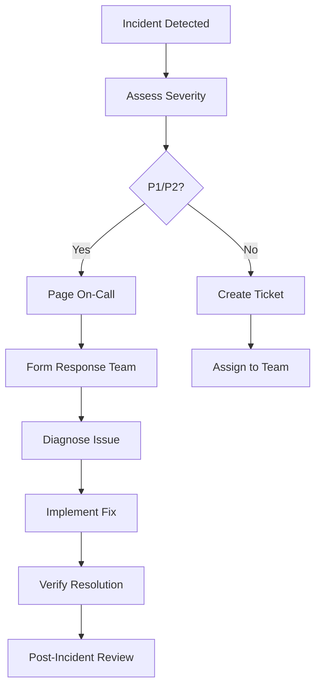

# Pitchey Platform Operational Runbooks
*Version 1.0 | December 13, 2024*

## Table of Contents
1. [Incident Response Procedures](#incident-response-procedures)
2. [Service Recovery Runbooks](#service-recovery-runbooks)
3. [Deployment Procedures](#deployment-procedures)
4. [Monitoring and Alerting](#monitoring-and-alerting)
5. [Database Operations](#database-operations)
6. [Security Incident Response](#security-incident-response)
7. [Troubleshooting Guides](#troubleshooting-guides)
8. [Emergency Contacts](#emergency-contacts)

---

## Incident Response Procedures

### 🚨 Severity Levels

#### Critical (P1) - Immediate Response Required
- **Definition**: Complete service outage or data loss
- **Response Time**: 15 minutes
- **Escalation**: Immediately notify on-call engineer
- **Examples**: API completely down, database corruption, security breach

#### High (P2) - Urgent Response Required  
- **Definition**: Significant performance degradation or partial outage
- **Response Time**: 30 minutes
- **Escalation**: Notify team lead within 1 hour
- **Examples**: High error rates (>5%), slow response times (>2s)

#### Medium (P3) - Standard Response
- **Definition**: Minor issues or performance concerns
- **Response Time**: 4 hours during business hours
- **Examples**: Individual endpoint failures, cache misses

#### Low (P4) - Scheduled Response
- **Definition**: Enhancement requests or minor bugs
- **Response Time**: Next business day

### 🔄 Incident Response Workflow



### 📋 Incident Response Checklist

#### Initial Response (First 15 minutes)
- [ ] **Acknowledge the incident** in monitoring system
- [ ] **Assess severity** using criteria above
- [ ] **Notify stakeholders** via appropriate channels
- [ ] **Form response team** for P1/P2 incidents
- [ ] **Create incident channel** (Slack/Teams)
- [ ] **Begin impact assessment**

#### Investigation Phase
- [ ] **Check service status** at https://pitchey-api-prod.ndlovucavelle.workers.dev/api/health
- [ ] **Review recent deployments** in GitHub Actions
- [ ] **Analyze logs** in Cloudflare Workers dashboard
- [ ] **Check external dependencies** (Neon DB, Redis)
- [ ] **Monitor error rates** and response times

#### Resolution Phase
- [ ] **Implement fix** following change management process
- [ ] **Test fix** in staging environment if possible
- [ ] **Deploy fix** to production
- [ ] **Verify resolution** with monitoring data
- [ ] **Communicate status** to stakeholders

#### Post-Incident
- [ ] **Document timeline** and actions taken
- [ ] **Schedule post-mortem** within 48 hours
- [ ] **Update runbooks** based on learnings
- [ ] **Implement preventive measures**

---

## Service Recovery Runbooks

### 🔧 API Service Recovery

#### Symptoms
- Health endpoint returning 5xx errors
- High response times (>2000ms)
- Complete service unavailability

#### Immediate Actions
```bash
# 1. Check service status
curl -I https://pitchey-api-prod.ndlovucavelle.workers.dev/api/health

# 2. Check Cloudflare Workers dashboard
# - Navigate to Workers & Pages > pitchey-production
# - Review error logs and metrics

# 3. Check database connectivity
# - Navigate to Neon dashboard
# - Verify database is running and accessible

# 4. Emergency deployment rollback
wrangler rollback --name pitchey-production
```

#### Recovery Steps
1. **Identify root cause** using monitoring data
2. **Check recent changes** in Git history
3. **Rollback if necessary** using Cloudflare deployment history
4. **Fix underlying issue** and redeploy
5. **Monitor for 30 minutes** to ensure stability

### 💾 Database Recovery

#### Symptoms
- Database connection timeouts
- High query response times
- Connection pool exhaustion

#### Immediate Actions
```bash
# 1. Check Neon database status
# Navigate to: https://console.neon.tech/

# 2. Monitor connection pool
# Check Hyperdrive metrics in Cloudflare dashboard

# 3. Review slow queries
# Check Neon query insights dashboard
```

#### Recovery Steps
1. **Scale database compute** if CPU/memory exhausted
2. **Reset connection pool** in Hyperdrive settings
3. **Kill long-running queries** if identified
4. **Enable read replicas** for read-heavy workloads
5. **Implement query optimization** for problematic queries

### 🗄️ Cache Recovery

#### Symptoms
- High cache miss rates
- Slow API responses
- Redis connection failures

#### Immediate Actions
```bash
# 1. Check Redis status (Upstash)
# Navigate to Upstash Redis dashboard

# 2. Verify cache connectivity
curl -s "https://pitchey-api-prod.ndlovucavelle.workers.dev/api/health" | jq '.services.cache'

# 3. Clear cache if corrupted
# Use Upstash dashboard to flush cache
```

#### Recovery Steps
1. **Restart Redis instance** if unresponsive
2. **Clear corrupted cache data** selectively
3. **Update cache configuration** if needed
4. **Warm up critical cache entries**
5. **Monitor cache hit rates** for improvement

---

## Deployment Procedures

### 🚀 Production Deployment Checklist

#### Pre-Deployment
- [ ] **Code review completed** with approval from team lead
- [ ] **Tests passing** in CI/CD pipeline
- [ ] **Database migrations** tested and ready
- [ ] **Rollback plan** documented
- [ ] **Stakeholder notification** sent (for major changes)

#### Deployment Process
```bash
# 1. Deploy to production
git checkout main
git pull origin main
wrangler deploy

# 2. Verify deployment
curl -s "https://pitchey-api-prod.ndlovucavelle.workers.dev/api/health"

# 3. Monitor for 10 minutes
# Watch Cloudflare Workers metrics for errors

# 4. Test critical endpoints
./test-security-verification.sh --production
```

#### Post-Deployment
- [ ] **Monitor error rates** for 30 minutes
- [ ] **Verify key functionality** works correctly
- [ ] **Check performance metrics** for degradation
- [ ] **Update deployment log** with version info
- [ ] **Notify stakeholders** of successful deployment

### 🔄 Emergency Rollback

```bash
# Option 1: Cloudflare Dashboard Rollback
# 1. Go to Workers & Pages > pitchey-production
# 2. Click "Deployments" tab
# 3. Find previous stable version
# 4. Click "Promote to Production"

# Option 2: Git-based Rollback
git revert HEAD
git push origin main
wrangler deploy

# Option 3: Specific Version Rollback
git checkout <stable-commit-hash>
wrangler deploy
```

---

## Monitoring and Alerting

### 📊 Key Metrics to Monitor

#### Application Performance
- **Response Time P95**: <500ms (Alert at >1000ms)
- **Error Rate**: <1% (Alert at >5%)  
- **Request Volume**: Monitor for unusual spikes
- **Success Rate**: >99% (Alert at <95%)

#### Infrastructure Health
- **Worker CPU Time**: <8ms (Alert at >10ms)
- **Database Connections**: <50 (Alert at >100)
- **Cache Hit Ratio**: >80% (Alert at <70%)
- **Memory Usage**: <100MB (Alert at >120MB)

### 🚨 Alert Response Procedures

#### High Response Time Alert
```bash
# 1. Check current performance
curl -w "@curl-format.txt" -s "https://pitchey-api-prod.ndlovucavelle.workers.dev/api/health"

# 2. Review recent deployments
git log --oneline -10

# 3. Check database performance
# Navigate to Neon dashboard > Query insights

# 4. Analyze slow endpoints
# Check Cloudflare Workers analytics
```

#### High Error Rate Alert
```bash
# 1. Identify error sources
# Check Cloudflare Workers logs for error patterns

# 2. Check external dependencies
curl -I https://api.neon.tech/v2/projects

# 3. Review error trends
# Analyze if errors are trending upward

# 4. Implement immediate fix if possible
# Or schedule emergency deployment
```

### 📈 Performance Baselines

| Metric | Baseline | Warning | Critical |
|--------|----------|---------|----------|
| Response Time (P95) | <200ms | >500ms | >1000ms |
| Error Rate | <0.1% | >1% | >5% |
| Database Connections | <10 | >50 | >100 |
| Cache Hit Ratio | >90% | <80% | <70% |
| Worker CPU | <5ms | >8ms | >10ms |

---

## Database Operations

### 🗃️ Neon Database Management

#### Daily Operations
```sql
-- Check database size
SELECT pg_size_pretty(pg_database_size('neondb')) as db_size;

-- Monitor active connections
SELECT count(*) as active_connections FROM pg_stat_activity WHERE state = 'active';

-- Check slow queries
SELECT query, mean_exec_time, calls 
FROM pg_stat_statements 
WHERE mean_exec_time > 1000 
ORDER BY mean_exec_time DESC 
LIMIT 10;
```

#### Backup and Recovery
```bash
# 1. Create backup branch (automatic in Neon)
# Neon automatically creates point-in-time recovery branches

# 2. Manual backup if needed
pg_dump $DATABASE_URL > backup_$(date +%Y%m%d).sql

# 3. Restore from backup
# Use Neon console to restore from specific point in time

# 4. Test restore
# Create test branch and verify data integrity
```

#### Database Maintenance
```sql
-- Weekly maintenance queries
VACUUM ANALYZE;
REINDEX DATABASE neondb;

-- Check for bloated tables
SELECT schemaname, tablename, 
       pg_size_pretty(pg_total_relation_size(schemaname||'.'||tablename)) as size
FROM pg_tables 
ORDER BY pg_total_relation_size(schemaname||'.'||tablename) DESC 
LIMIT 10;
```

### 🔄 Migration Procedures

#### Pre-Migration Checklist
- [ ] **Backup database** (Neon branch created)
- [ ] **Test migration** on development branch
- [ ] **Review breaking changes** in migration
- [ ] **Plan rollback procedure**
- [ ] **Schedule maintenance window** if needed

#### Migration Execution
```bash
# 1. Create migration branch in Neon
# Use Neon console to create branch from main

# 2. Apply migrations to branch
DATABASE_URL="<branch-url>" deno run --allow-all src/db/migrate.ts

# 3. Test migrations
# Run integration tests against branch

# 4. Promote branch to main
# Use Neon console to promote branch
```

---

## Security Incident Response

### 🛡️ Security Incident Types

#### Data Breach (P1)
- **Immediate Actions**: Isolate affected systems, preserve evidence
- **Notification**: Legal team within 1 hour
- **Investigation**: Forensic analysis required
- **Communication**: Prepare customer notification

#### Unauthorized Access (P1-P2)  
- **Immediate Actions**: Revoke access, change credentials
- **Investigation**: Review access logs and patterns
- **Remediation**: Strengthen access controls

#### DDoS Attack (P2)
- **Immediate Actions**: Enable Cloudflare DDoS protection
- **Mitigation**: Analyze traffic patterns, implement rate limiting
- **Monitoring**: Watch for attack evolution

### 🔒 Security Response Procedures

#### Credential Compromise
```bash
# 1. Immediately rotate affected credentials
wrangler secret put JWT_SECRET  # Enter new secret
wrangler secret put DATABASE_URL  # If DB credentials compromised

# 2. Check access logs
# Review Cloudflare Analytics for unusual patterns

# 3. Force user re-authentication
# Invalidate all existing JWT tokens by changing secret

# 4. Audit user accounts
# Check for unauthorized user creation or modification
```

#### SQL Injection Attempt
```bash
# 1. Check application logs
# Look for suspicious query patterns in Cloudflare logs

# 2. Review input validation
# Verify all user inputs are properly sanitized

# 3. Update security rules
# Strengthen input validation and SQL injection protection

# 4. Monitor for continued attempts
# Set up enhanced logging for SQL injection patterns
```

### 🔐 Emergency Security Actions

#### Immediate Isolation
```bash
# 1. Enable maintenance mode (if available)
# Temporarily block all traffic while investigating

# 2. Review recent changes
git log --since="24 hours ago" --oneline

# 3. Check for malicious uploads
# Review file upload logs and stored files

# 4. Scan for vulnerabilities
./test-security-verification.sh --production
```

---

## Troubleshooting Guides

### 🔍 Common Issues and Solutions

#### "Database Connection Failed"
**Symptoms**: 500 errors, connection timeout messages
**Diagnosis**:
```bash
# Check database status
curl -s "https://pitchey-api-prod.ndlovucavelle.workers.dev/api/health" | jq '.services.database'

# Test direct connection
psql "$DATABASE_URL" -c "SELECT 1;"
```
**Solutions**:
1. Verify DATABASE_URL secret is correct
2. Check Neon database status in console  
3. Restart Hyperdrive connection pooling
4. Scale database compute if overloaded

#### "High Memory Usage"
**Symptoms**: Worker crashes, memory limit errors
**Diagnosis**: Check Cloudflare Workers analytics for memory usage
**Solutions**:
1. Optimize large object processing
2. Implement streaming for file uploads
3. Add memory usage monitoring
4. Review and optimize memory-intensive operations

#### "Cache Miss Storms"
**Symptoms**: Slow responses, high database load
**Diagnosis**: Monitor cache hit ratios in Redis dashboard
**Solutions**:
1. Identify frequently requested uncached data
2. Implement cache warming strategies
3. Increase cache TTL for stable data
4. Add cache monitoring and alerting

#### "Authentication Failures"
**Symptoms**: 401 errors, login failures
**Diagnosis**:
```bash
# Test JWT secret
echo $JWT_SECRET | wc -c  # Should be >32 characters

# Test auth endpoint
curl -X POST -H "Content-Type: application/json" \
  -d '{"email":"test@example.com","password":"test"}' \
  "https://pitchey-api-prod.ndlovucavelle.workers.dev/api/auth/creator/login"
```
**Solutions**:
1. Verify JWT_SECRET is properly set
2. Check token expiration times
3. Review CORS configuration
4. Test with valid credentials

### 🛠️ Debugging Tools

#### Log Analysis
```bash
# 1. Cloudflare Workers logs
# Navigate to Workers & Pages > pitchey-production > Logs

# 2. Real-time log streaming
wrangler tail

# 3. Filter logs by status code
# Use Cloudflare dashboard filters for 4xx/5xx errors

# 4. Search logs by pattern
# Use Cloudflare search functionality for specific errors
```

#### Performance Analysis
```bash
# 1. Response time analysis
curl -w "@curl-timing.txt" -s "https://pitchey-api-prod.ndlovucavelle.workers.dev/api/health"

# 2. Load testing
./quick-capacity-test.sh

# 3. Database query analysis
# Use Neon query insights dashboard

# 4. Cache performance check
# Monitor Upstash Redis metrics
```

---

## Emergency Contacts

### 🚨 On-Call Rotation
- **Primary**: Platform Team Lead
- **Secondary**: Senior Engineer  
- **Escalation**: Engineering Manager

### 📞 Contact Methods
- **Slack**: #pitchey-alerts
- **Email**: alerts@pitchey.com
- **Phone**: Emergency escalation only

### 🔗 External Contacts
- **Cloudflare Support**: Enterprise support portal
- **Neon Support**: Console support chat
- **Upstash Support**: Email support

---

## Appendix

### 📚 Additional Resources
- [API Documentation](./API_ENDPOINTS_DOCUMENTATION.md)
- [Security Verification Guide](./test-security-verification.sh)
- [Capacity Planning Report](./CAPACITY_PLANNING_REPORT.md)
- [Monitoring Dashboard Setup](./monitoring/production-dashboard-setup.sh)

### 🔄 Runbook Maintenance
- **Review Schedule**: Monthly
- **Update Triggers**: After incidents, deployments, architecture changes
- **Owner**: Platform Team
- **Last Updated**: December 13, 2024

---

*This runbook is a living document. Please update it as processes evolve and new scenarios are encountered.*