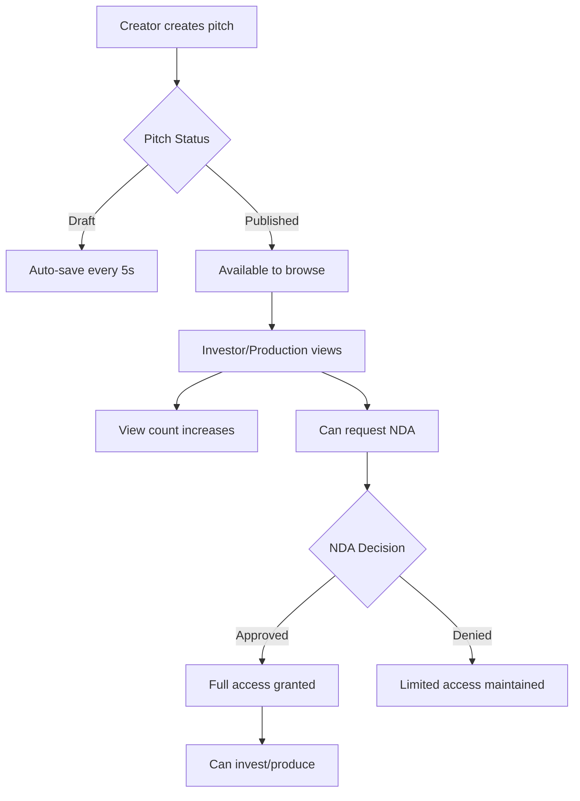
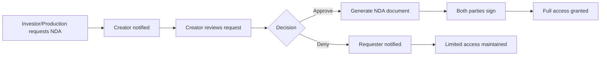
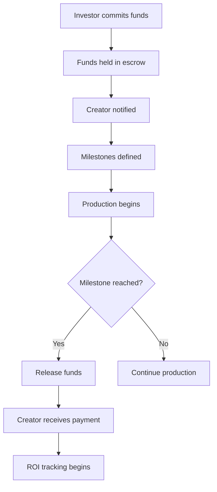
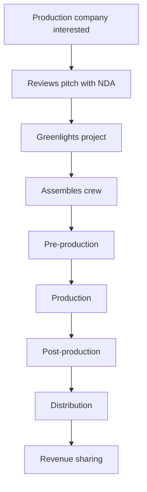
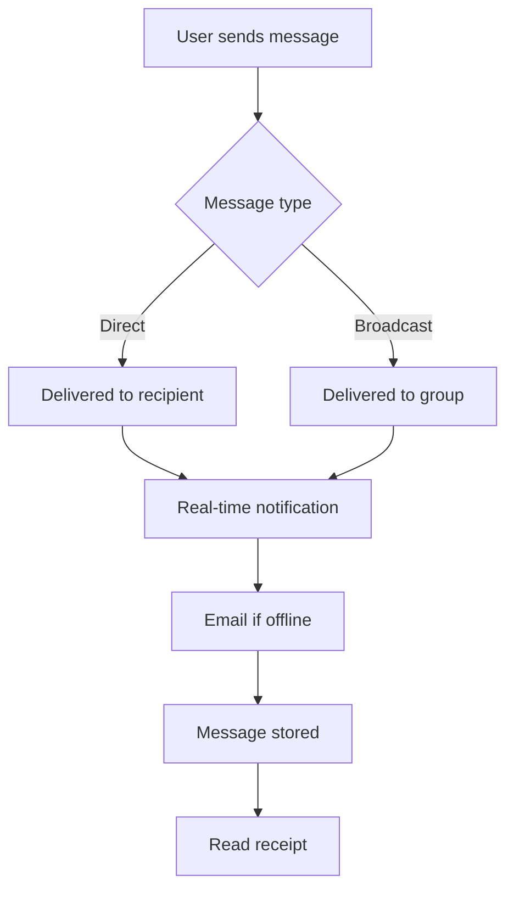

# Cross-Portal Business Workflow Patterns

## Core Business Workflows

### 1. Pitch Lifecycle Workflow


**Implementation:**
```typescript
// Pitch creation (Creator)
const createPitch = async (pitchData) => {
  const pitch = await creatorService.createPitch(pitchData);
  
  // Notify investors of new pitch matching their interests
  websocket.emit('pitch.created', {
    pitchId: pitch.id,
    genre: pitch.genre,
    budget: pitch.budget
  });
  
  // Start auto-save for drafts
  if (pitch.status === 'draft') {
    startAutoSave(pitch.id);
  }
  
  return pitch;
};

// Pitch viewing (Investor/Production)
const viewPitch = async (pitchId, viewerType) => {
  // Track view
  await api.post(`/api/pitches/${pitchId}/view`, {
    viewerType,
    timestamp: new Date()
  });
  
  // Notify creator of view
  websocket.emit('pitch.viewed', {
    pitchId,
    viewerType
  });
  
  // Check NDA status
  const ndaStatus = await checkNDAStatus(pitchId);
  return { pitch, ndaStatus };
};
```

### 2. NDA Request & Approval Workflow


**Implementation:**
```typescript
// NDA Request Flow
class NDAWorkflow {
  // Step 1: Request NDA (Investor/Production)
  async requestNDA(pitchId: string, requesterId: string, requesterType: string) {
    const request = await api.post('/api/nda/request', {
      pitchId,
      requesterId,
      requesterType,
      requestedAt: new Date()
    });
    
    // Real-time notification to creator
    websocket.sendToUser(pitch.creatorId, 'nda.request', {
      requestId: request.id,
      pitchTitle: pitch.title,
      requesterName: requester.name,
      requesterType
    });
    
    // Email notification
    await emailService.sendNDARequest(pitch.creator.email, {
      pitchTitle: pitch.title,
      requesterName: requester.name
    });
    
    return request;
  }
  
  // Step 2: Creator responds (Creator)
  async respondToNDA(requestId: string, action: 'approve' | 'deny', creatorId: string) {
    const request = await api.get(`/api/nda/requests/${requestId}`);
    
    if (action === 'approve') {
      // Generate NDA document
      const ndaDoc = await generateNDADocument(request);
      
      // Create signing session
      const signingSession = await createSigningSession(ndaDoc, [
        creatorId,
        request.requesterId
      ]);
      
      // Notify requester
      websocket.sendToUser(request.requesterId, 'nda.approved', {
        requestId,
        signingUrl: signingSession.url,
        expiresAt: signingSession.expiresAt
      });
      
      // Grant access after signing
      onSigningComplete(signingSession.id, () => {
        grantFullAccess(request.pitchId, request.requesterId);
      });
    } else {
      // Notify denial
      websocket.sendToUser(request.requesterId, 'nda.denied', {
        requestId,
        reason: request.denialReason
      });
    }
    
    return { success: true, action };
  }
  
  // Step 3: Access control
  async checkAccess(pitchId: string, userId: string) {
    const nda = await api.get(`/api/nda/check`, {
      params: { pitchId, userId }
    });
    
    return {
      hasAccess: nda.signed && nda.active,
      level: nda.signed ? 'full' : 'limited',
      expiresAt: nda.expiresAt
    };
  }
}
```

### 3. Investment Flow


**Implementation:**
```typescript
// Investment Workflow
class InvestmentWorkflow {
  // Step 1: Investor commits
  async commitInvestment(pitchId: string, investorId: string, amount: number) {
    // Validate investor has NDA access
    const access = await ndaWorkflow.checkAccess(pitchId, investorId);
    if (!access.hasAccess) {
      throw new Error('NDA required for investment');
    }
    
    // Create investment record
    const investment = await api.post('/api/investments', {
      pitchId,
      investorId,
      amount,
      status: 'pending',
      createdAt: new Date()
    });
    
    // Hold funds in escrow
    const escrow = await paymentService.createEscrow({
      investmentId: investment.id,
      amount,
      releaseConditions: pitch.milestones
    });
    
    // Notify creator
    websocket.sendToUser(pitch.creatorId, 'investment.received', {
      investmentId: investment.id,
      amount,
      investorName: investor.name,
      escrowId: escrow.id
    });
    
    // Email confirmation
    await emailService.sendInvestmentConfirmation(investor.email, {
      pitchTitle: pitch.title,
      amount,
      escrowDetails: escrow
    });
    
    return investment;
  }
  
  // Step 2: Milestone tracking
  async completeMilestone(pitchId: string, milestoneId: string) {
    const milestone = await api.get(`/api/milestones/${milestoneId}`);
    const investments = await api.get(`/api/pitches/${pitchId}/investments`);
    
    // Release proportional funds
    for (const investment of investments) {
      const releaseAmount = investment.amount * milestone.percentage;
      
      await paymentService.releaseFunds({
        escrowId: investment.escrowId,
        amount: releaseAmount,
        recipientId: pitch.creatorId
      });
      
      // Update ROI tracking
      await updateROI(investment.id, {
        released: releaseAmount,
        milestone: milestone.name
      });
      
      // Notify investor
      websocket.sendToUser(investment.investorId, 'milestone.completed', {
        milestone: milestone.name,
        amountReleased: releaseAmount,
        remainingInEscrow: investment.amount - releaseAmount
      });
    }
    
    return { success: true, milestone };
  }
  
  // Step 3: ROI calculation
  async calculateROI(investmentId: string) {
    const investment = await api.get(`/api/investments/${investmentId}`);
    const pitch = await api.get(`/api/pitches/${investment.pitchId}`);
    
    const roi = {
      invested: investment.amount,
      returned: 0,
      projected: 0,
      percentage: 0
    };
    
    // Calculate from revenue
    if (pitch.revenue) {
      const investorShare = pitch.revenue * (investment.amount / pitch.totalFunding);
      roi.returned = investorShare;
      roi.percentage = ((investorShare - investment.amount) / investment.amount) * 100;
    }
    
    // Project future returns
    if (pitch.projectedRevenue) {
      roi.projected = pitch.projectedRevenue * (investment.amount / pitch.totalFunding);
    }
    
    return roi;
  }
}
```

### 4. Production Pipeline Workflow


**Implementation:**
```typescript
// Production Workflow
class ProductionWorkflow {
  // Step 1: Express interest
  async expressInterest(pitchId: string, productionCompanyId: string) {
    // Request NDA first
    const ndaRequest = await ndaWorkflow.requestNDA(
      pitchId, 
      productionCompanyId, 
      'production'
    );
    
    // Create interest record
    const interest = await api.post('/api/production/interest', {
      pitchId,
      companyId: productionCompanyId,
      status: 'reviewing',
      ndaRequestId: ndaRequest.id
    });
    
    // Notify creator
    websocket.sendToUser(pitch.creatorId, 'production.interest', {
      companyName: company.name,
      companyProfile: company.profile,
      previousProjects: company.projects
    });
    
    return interest;
  }
  
  // Step 2: Greenlight project
  async greenlightProject(pitchId: string, productionCompanyId: string, terms: any) {
    // Create production agreement
    const agreement = await api.post('/api/production/agreements', {
      pitchId,
      companyId: productionCompanyId,
      budget: terms.budget,
      timeline: terms.timeline,
      revenueShare: terms.revenueShare,
      status: 'pending_signatures'
    });
    
    // Notify all stakeholders
    const stakeholders = await getStakeholders(pitchId);
    for (const stakeholder of stakeholders) {
      websocket.sendToUser(stakeholder.id, 'project.greenlit', {
        agreementId: agreement.id,
        productionCompany: company.name,
        startDate: terms.startDate
      });
    }
    
    // Create project pipeline
    const project = await createProject({
      pitchId,
      agreementId: agreement.id,
      status: 'pre-production',
      phases: ['pre-production', 'production', 'post-production', 'distribution']
    });
    
    return project;
  }
  
  // Step 3: Crew assembly
  async assembleCrew(projectId: string, requirements: CrewRequirement[]) {
    const crewRequests = [];
    
    for (const requirement of requirements) {
      const request = await api.post('/api/crew/requests', {
        projectId,
        role: requirement.role,
        skills: requirement.skills,
        budget: requirement.budget,
        startDate: requirement.startDate,
        duration: requirement.duration
      });
      
      // Broadcast to qualified crew
      websocket.broadcast('crew.request', {
        projectId,
        role: requirement.role,
        company: company.name,
        budget: requirement.budget
      }, {
        filter: { skills: requirement.skills }
      });
      
      crewRequests.push(request);
    }
    
    return crewRequests;
  }
  
  // Step 4: Revenue distribution
  async distributeRevenue(projectId: string, revenue: number) {
    const project = await api.get(`/api/projects/${projectId}`);
    const agreement = await api.get(`/api/agreements/${project.agreementId}`);
    const investments = await api.get(`/api/pitches/${project.pitchId}/investments`);
    
    // Calculate shares
    const distribution = {
      creator: revenue * agreement.creatorShare,
      production: revenue * agreement.productionShare,
      investors: revenue * agreement.investorShare
    };
    
    // Distribute to creator
    await paymentService.transfer({
      to: project.creatorId,
      amount: distribution.creator,
      type: 'revenue_share'
    });
    
    // Distribute to investors proportionally
    for (const investment of investments) {
      const investorShare = distribution.investors * 
        (investment.amount / project.totalInvestment);
      
      await paymentService.transfer({
        to: investment.investorId,
        amount: investorShare,
        type: 'roi_distribution'
      });
      
      // Update ROI
      await updateROI(investment.id, {
        distributed: investorShare,
        totalReturn: investment.totalReturn + investorShare
      });
    }
    
    // Notify all parties
    await notifyRevenueDistribution(projectId, distribution);
    
    return distribution;
  }
}
```

### 5. Communication & Messaging Workflow


**Implementation:**
```typescript
// Messaging Workflow
class MessagingWorkflow {
  // Message routing by portal
  async sendMessage(
    from: { id: string, type: string },
    to: { id?: string, type?: string, group?: string },
    content: MessageContent
  ) {
    // Validate communication allowed
    const canCommunicate = await this.validateCommunication(from, to);
    if (!canCommunicate) {
      throw new Error('Communication not allowed between these parties');
    }
    
    // Create message record
    const message = await api.post('/api/messages', {
      fromId: from.id,
      fromType: from.type,
      toId: to.id,
      toType: to.type,
      content,
      status: 'sent',
      createdAt: new Date()
    });
    
    // Real-time delivery
    if (to.id) {
      // Direct message
      const isOnline = await websocket.isUserOnline(to.id);
      if (isOnline) {
        websocket.sendToUser(to.id, 'message.received', {
          messageId: message.id,
          from: from,
          content,
          timestamp: message.createdAt
        });
      } else {
        // Queue for offline delivery
        await queueOfflineMessage(to.id, message);
        
        // Send email notification
        await emailService.sendMessageNotification(to.email, {
          from: from.name,
          preview: content.text.substring(0, 100)
        });
      }
    } else if (to.group) {
      // Group broadcast
      const members = await getGroupMembers(to.group);
      for (const member of members) {
        await this.sendMessage(from, { id: member.id, type: member.type }, content);
      }
    }
    
    return message;
  }
  
  // Communication rules
  async validateCommunication(from: any, to: any): Promise<boolean> {
    const rules = {
      // Creator can message investors/production with NDA
      creator_to_investor: async () => {
        return await hasNDA(from.pitchId, to.id);
      },
      creator_to_production: async () => {
        return await hasNDA(from.pitchId, to.id);
      },
      
      // Investor can message creators after investment
      investor_to_creator: async () => {
        return await hasInvestment(to.pitchId, from.id);
      },
      
      // Production can message creators after interest
      production_to_creator: async () => {
        return await hasProductionInterest(to.pitchId, from.id);
      },
      
      // Within same portal always allowed
      same_portal: () => from.type === to.type
    };
    
    const ruleKey = `${from.type}_to_${to.type}`;
    const rule = rules[ruleKey] || rules.same_portal;
    
    return await rule();
  }
  
  // Offline message queue
  async processOfflineQueue(userId: string) {
    const messages = await getOfflineMessages(userId);
    
    for (const message of messages) {
      websocket.sendToUser(userId, 'message.received', message);
      await markMessageDelivered(message.id);
    }
    
    return messages.length;
  }
}
```

### 6. Notification & Alert System
```typescript
// Centralized notification dispatcher
class NotificationDispatcher {
  private channels = ['websocket', 'email', 'sms', 'push'];
  
  async dispatch(
    userId: string,
    notification: Notification,
    preferences?: NotificationPreferences
  ) {
    const userPrefs = preferences || await getUserPreferences(userId);
    
    for (const channel of this.channels) {
      if (userPrefs[channel] && userPrefs.events.includes(notification.type)) {
        await this.sendViaChannel(channel, userId, notification);
      }
    }
    
    // Store in notification center
    await storeNotification(userId, notification);
  }
  
  private async sendViaChannel(channel: string, userId: string, notification: Notification) {
    switch (channel) {
      case 'websocket':
        websocket.sendToUser(userId, 'notification', notification);
        break;
      case 'email':
        await emailService.sendNotification(userId, notification);
        break;
      case 'sms':
        await smsService.send(userId, notification.shortText);
        break;
      case 'push':
        await pushService.send(userId, notification);
        break;
    }
  }
}

// Portal-specific notification events
const NOTIFICATION_EVENTS = {
  creator: [
    'pitch.viewed',
    'pitch.saved',
    'nda.requested',
    'investment.received',
    'milestone.completed',
    'production.interested',
    'message.received'
  ],
  investor: [
    'pitch.created',
    'pitch.updated',
    'nda.approved',
    'roi.distributed',
    'project.greenlit',
    'milestone.completed'
  ],
  production: [
    'pitch.available',
    'project.funded',
    'crew.applied',
    'milestone.reached',
    'distribution.started'
  ]
};
```

## Business Logic Rules

### Access Control Matrix
```typescript
const ACCESS_CONTROL = {
  // What each portal can access
  creator: {
    can_view: ['own_pitches', 'own_analytics', 'nda_requests', 'investments'],
    can_edit: ['own_pitches', 'nda_responses'],
    can_delete: ['own_pitches'],
    requires_nda: []
  },
  
  investor: {
    can_view: ['public_pitches', 'own_investments', 'own_portfolio'],
    can_edit: ['own_profile', 'investment_preferences'],
    can_delete: ['saved_pitches'],
    requires_nda: ['full_pitch_details', 'financial_data', 'contact_creator']
  },
  
  production: {
    can_view: ['public_pitches', 'crew_available', 'own_projects'],
    can_edit: ['own_projects', 'crew_requests'],
    can_delete: ['crew_requests'],
    requires_nda: ['full_pitch_details', 'budget_details', 'contact_creator']
  }
};
```

### State Transitions
```typescript
const STATE_MACHINES = {
  pitch: {
    states: ['draft', 'published', 'under_review', 'funded', 'in_production', 'completed'],
    transitions: {
      draft: ['published', 'deleted'],
      published: ['under_review', 'funded', 'archived'],
      under_review: ['funded', 'rejected', 'published'],
      funded: ['in_production', 'cancelled'],
      in_production: ['completed', 'paused'],
      completed: ['distributed']
    }
  },
  
  nda: {
    states: ['pending', 'approved', 'denied', 'expired', 'revoked'],
    transitions: {
      pending: ['approved', 'denied', 'expired'],
      approved: ['expired', 'revoked'],
      denied: [],
      expired: ['renewed'],
      revoked: []
    }
  },
  
  investment: {
    states: ['pending', 'escrow', 'active', 'completed', 'refunded'],
    transitions: {
      pending: ['escrow', 'cancelled'],
      escrow: ['active', 'refunded'],
      active: ['completed', 'defaulted'],
      completed: ['distributed'],
      refunded: []
    }
  }
};
```

## Integration Points

### API Endpoints by Portal
```typescript
const API_STRUCTURE = {
  '/api/creator/*': 'Creator-specific endpoints',
  '/api/investor/*': 'Investor-specific endpoints',
  '/api/production/*': 'Production-specific endpoints',
  '/api/shared/*': 'Shared endpoints (auth, messages, notifications)',
  '/api/public/*': 'Public endpoints (browse, search)'
};
```

### WebSocket Rooms
```typescript
const WEBSOCKET_ROOMS = {
  // Portal-specific rooms
  'creator:{userId}': 'Individual creator updates',
  'investor:{userId}': 'Individual investor updates',
  'production:{companyId}': 'Production company updates',
  
  // Pitch-specific rooms
  'pitch:{pitchId}': 'Updates for pitch stakeholders',
  'pitch:{pitchId}:investors': 'Investor-only updates',
  
  // Project rooms
  'project:{projectId}': 'Project team updates',
  'project:{projectId}:crew': 'Crew coordination'
};
```

This comprehensive business workflow documentation provides the blueprint for how all three portals interact and communicate with each other in the Pitchey platform.