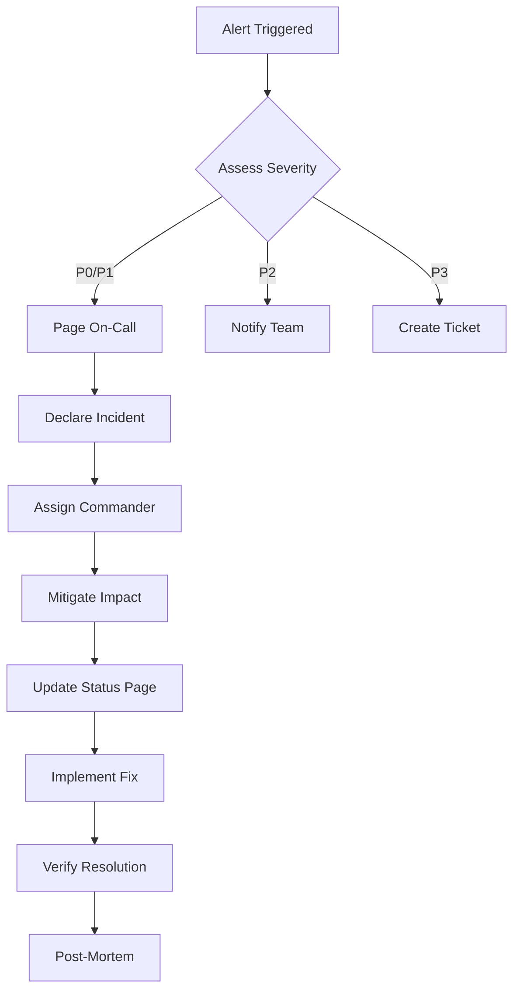

# Disaster Recovery & Incident Response Plan

**Business Continuity for Pitchey Platform**  
**Date:** December 11, 2024

## 🚨 Incident Severity Levels

| Level | Description | Response Time | Example |
|-------|-------------|---------------|---------|
| **P0 - Critical** | Complete service outage affecting all users | < 15 minutes | Database failure, complete platform down |
| **P1 - High** | Major functionality broken for >30% users | < 30 minutes | Authentication system failure, payment processing down |
| **P2 - Medium** | Significant feature degraded | < 2 hours | Search not working, slow performance |
| **P3 - Low** | Minor feature issue | < 24 hours | UI glitch, non-critical API endpoint issue |

## 1. Incident Response Playbook

### 🔥 Immediate Response Protocol



### Incident Command Structure

```typescript
// src/incident/incident-manager.ts
export class IncidentManager {
  private readonly roles = {
    commander: null as string | null,     // Decision maker
    technical: null as string | null,     // Technical lead
    communications: null as string | null, // Customer updates
    scribe: null as string | null         // Documentation
  };
  
  async declareIncident(
    severity: 'P0' | 'P1' | 'P2' | 'P3',
    description: string,
    affectedSystems: string[]
  ): Promise<string> {
    const incidentId = `INC-${Date.now()}`;
    
    // 1. Create incident record
    const incident = {
      id: incidentId,
      severity,
      description,
      affectedSystems,
      startTime: new Date().toISOString(),
      status: 'active',
      timeline: []
    };
    
    // 2. Auto-assign roles based on severity
    if (severity === 'P0' || severity === 'P1') {
      await this.pageOnCall();
      this.assignRoles(severity);
    }
    
    // 3. Create communication channels
    await this.createChannels(incidentId);
    
    // 4. Update status page
    await this.updateStatusPage(severity, description);
    
    // 5. Start recording
    this.startRecording(incident);
    
    return incidentId;
  }
  
  private async pageOnCall(): Promise<void> {
    // PagerDuty integration
    await fetch('https://api.pagerduty.com/incidents', {
      method: 'POST',
      headers: {
        'Authorization': `Token token=${process.env.PAGERDUTY_TOKEN}`,
        'Content-Type': 'application/json'
      },
      body: JSON.stringify({
        incident: {
          type: 'incident',
          title: 'Platform Critical Incident',
          service: {
            id: process.env.PAGERDUTY_SERVICE_ID,
            type: 'service_reference'
          },
          urgency: 'high',
          body: {
            type: 'incident_body',
            details: 'Critical platform incident requiring immediate attention'
          }
        }
      })
    });
  }
  
  private assignRoles(severity: string): void {
    // Role assignment based on escalation matrix
    const escalationMatrix = {
      P0: {
        commander: 'cto@pitchey.com',
        technical: 'lead-engineer@pitchey.com',
        communications: 'head-support@pitchey.com',
        scribe: 'devops@pitchey.com'
      },
      P1: {
        commander: 'lead-engineer@pitchey.com',
        technical: 'senior-engineer@pitchey.com',
        communications: 'support-lead@pitchey.com',
        scribe: 'engineer@pitchey.com'
      }
    };
    
    Object.assign(this.roles, escalationMatrix[severity]);
  }
  
  private async createChannels(incidentId: string): Promise<void> {
    // Create Slack channel
    await fetch('https://slack.com/api/conversations.create', {
      method: 'POST',
      headers: {
        'Authorization': `Bearer ${process.env.SLACK_TOKEN}`,
        'Content-Type': 'application/json'
      },
      body: JSON.stringify({
        name: `incident-${incidentId.toLowerCase()}`,
        is_private: false,
        purpose: `Incident response for ${incidentId}`
      })
    });
    
    // Create video bridge
    // Create shared document
  }
  
  private async updateStatusPage(
    severity: string,
    description: string
  ): Promise<void> {
    const impact = severity === 'P0' ? 'critical' : 
                   severity === 'P1' ? 'major' : 'minor';
    
    await fetch('https://api.statuspage.io/v1/pages/PAGE_ID/incidents', {
      method: 'POST',
      headers: {
        'Authorization': `OAuth ${process.env.STATUSPAGE_TOKEN}`,
        'Content-Type': 'application/json'
      },
      body: JSON.stringify({
        incident: {
          name: `Service Degradation - ${new Date().toISOString()}`,
          status: 'investigating',
          impact_override: impact,
          body: description,
          component_ids: this.getAffectedComponentIds(severity),
          deliver_notifications: true
        }
      })
    });
  }
  
  private startRecording(incident: any): void {
    // Start automated timeline recording
    setInterval(() => {
      // Capture system state
      this.captureSystemState(incident.id);
    }, 60000); // Every minute
  }
  
  private async captureSystemState(incidentId: string): Promise<void> {
    const state = {
      timestamp: new Date().toISOString(),
      health: await this.checkHealth(),
      metrics: await this.gatherMetrics(),
      logs: await this.captureLogs()
    };
    
    // Store for post-mortem
    await this.storeIncidentData(incidentId, state);
  }
}
```

## 2. Disaster Recovery Procedures

### Database Recovery

```bash
#!/bin/bash
# database-recovery.sh

echo "🗄️ Starting Database Recovery Process"

# 1. Assess damage
echo "Assessing database state..."
NEON_STATUS=$(curl -s https://console.neon.tech/api/v2/projects/${NEON_PROJECT_ID}/status \
  -H "Authorization: Bearer ${NEON_API_KEY}")

if [[ $NEON_STATUS == *"healthy"* ]]; then
  echo "✅ Database is healthy"
  exit 0
fi

# 2. Attempt automatic recovery
echo "Attempting automatic recovery..."
curl -X POST https://console.neon.tech/api/v2/projects/${NEON_PROJECT_ID}/restart \
  -H "Authorization: Bearer ${NEON_API_KEY}"

sleep 30

# 3. Check if recovery successful
NEON_STATUS=$(curl -s https://console.neon.tech/api/v2/projects/${NEON_PROJECT_ID}/status \
  -H "Authorization: Bearer ${NEON_API_KEY}")

if [[ $NEON_STATUS == *"healthy"* ]]; then
  echo "✅ Automatic recovery successful"
  exit 0
fi

# 4. Failover to backup
echo "⚠️ Automatic recovery failed. Initiating failover..."

# Create new branch from last known good state
BACKUP_BRANCH=$(curl -X POST https://console.neon.tech/api/v2/projects/${NEON_PROJECT_ID}/branches \
  -H "Authorization: Bearer ${NEON_API_KEY}" \
  -H "Content-Type: application/json" \
  -d '{
    "branch": {
      "name": "recovery-'$(date +%s)'",
      "parent_timestamp": "'${LAST_GOOD_TIMESTAMP}'"
    }
  }' | jq -r '.branch.id')

echo "Created recovery branch: $BACKUP_BRANCH"

# 5. Update connection string
echo "Updating application configuration..."
wrangler secret put DATABASE_URL <<< "postgresql://...@${BACKUP_BRANCH}.neon.tech/..."

# 6. Deploy with new connection
echo "Deploying with recovered database..."
wrangler deploy --env production

echo "✅ Database recovery complete"
```

### Service Recovery Priority

```typescript
// src/recovery/service-recovery.ts
export class ServiceRecoveryOrchestrator {
  private readonly RECOVERY_ORDER = [
    'database',      // Priority 1: Data layer
    'auth',          // Priority 2: Authentication
    'api',           // Priority 3: Core API
    'websocket',     // Priority 4: Real-time features
    'cdn',           // Priority 5: Static assets
    'analytics'      // Priority 6: Non-critical
  ];
  
  async executeRecovery(): Promise<void> {
    const recoveryLog = [];
    
    for (const service of this.RECOVERY_ORDER) {
      const startTime = Date.now();
      
      try {
        console.log(`Recovering ${service}...`);
        await this.recoverService(service);
        
        recoveryLog.push({
          service,
          status: 'recovered',
          duration: Date.now() - startTime
        });
        
        console.log(`✅ ${service} recovered`);
        
      } catch (error) {
        recoveryLog.push({
          service,
          status: 'failed',
          error: error.message,
          duration: Date.now() - startTime
        });
        
        console.error(`❌ ${service} recovery failed:`, error);
        
        // Activate fallback
        await this.activateFallback(service);
      }
    }
    
    // Generate recovery report
    this.generateReport(recoveryLog);
  }
  
  private async recoverService(service: string): Promise<void> {
    const recoveryStrategies = {
      database: this.recoverDatabase,
      auth: this.recoverAuth,
      api: this.recoverAPI,
      websocket: this.recoverWebSocket,
      cdn: this.recoverCDN,
      analytics: this.recoverAnalytics
    };
    
    const strategy = recoveryStrategies[service];
    if (strategy) {
      await strategy.call(this);
    }
  }
  
  private async recoverDatabase(): Promise<void> {
    // 1. Check connection
    const sql = neon(process.env.DATABASE_URL!);
    await sql`SELECT 1`;
    
    // 2. Verify data integrity
    const integrityCheck = await sql`
      SELECT 
        COUNT(*) as user_count,
        (SELECT COUNT(*) FROM pitches) as pitch_count,
        (SELECT COUNT(*) FROM ndas) as nda_count
      FROM users
    `;
    
    if (integrityCheck[0].user_count === 0) {
      throw new Error('Database integrity check failed');
    }
    
    // 3. Warm connection pool
    for (let i = 0; i < 5; i++) {
      await sql`SELECT 1`;
    }
  }
  
  private async recoverAuth(): Promise<void> {
    // Test JWT signing/verification
    const token = await jwt.sign({ test: true }, process.env.JWT_SECRET!);
    const verified = await jwt.verify(token, process.env.JWT_SECRET!);
    
    if (!verified) {
      throw new Error('JWT verification failed');
    }
  }
  
  private async activateFallback(service: string): Promise<void> {
    const fallbacks = {
      database: async () => {
        // Switch to read-only mode
        console.log('Activating database read-only mode');
        await this.enableReadOnlyMode();
      },
      auth: async () => {
        // Use cached sessions only
        console.log('Activating cached session mode');
        await this.enableCachedAuth();
      },
      api: async () => {
        // Serve from cache
        console.log('Activating API cache mode');
        await this.enableAPICacheMode();
      }
    };
    
    const fallback = fallbacks[service];
    if (fallback) {
      await fallback();
    }
  }
}
```

## 3. Backup & Restore Strategy

### Automated Backup System

```typescript
// src/backup/backup-manager.ts
export class BackupManager {
  private readonly BACKUP_SCHEDULE = {
    database: '0 */6 * * *',    // Every 6 hours
    code: '0 0 * * *',          // Daily
    configuration: '0 */12 * * *', // Every 12 hours
    media: '0 0 * * 0'          // Weekly
  };
  
  async performBackup(type: 'full' | 'incremental'): Promise<string> {
    const backupId = `backup-${Date.now()}`;
    const manifest = {
      id: backupId,
      type,
      timestamp: new Date().toISOString(),
      components: []
    };
    
    // 1. Database backup
    const dbBackup = await this.backupDatabase(type);
    manifest.components.push(dbBackup);
    
    // 2. Configuration backup
    const configBackup = await this.backupConfiguration();
    manifest.components.push(configBackup);
    
    // 3. Media backup (R2)
    if (type === 'full') {
      const mediaBackup = await this.backupMedia();
      manifest.components.push(mediaBackup);
    }
    
    // 4. Store manifest
    await this.storeManifest(manifest);
    
    // 5. Verify backup
    await this.verifyBackup(backupId);
    
    return backupId;
  }
  
  private async backupDatabase(type: string): Promise<BackupComponent> {
    // Neon point-in-time recovery
    const branch = await fetch(`https://console.neon.tech/api/v2/projects/${process.env.NEON_PROJECT_ID}/branches`, {
      method: 'POST',
      headers: {
        'Authorization': `Bearer ${process.env.NEON_API_KEY}`,
        'Content-Type': 'application/json'
      },
      body: JSON.stringify({
        branch: {
          name: `backup-${Date.now()}`,
          parent_id: process.env.NEON_MAIN_BRANCH_ID
        }
      })
    });
    
    const branchData = await branch.json();
    
    return {
      type: 'database',
      location: branchData.branch.id,
      size: branchData.branch.logical_size,
      timestamp: new Date().toISOString()
    };
  }
  
  private async backupConfiguration(): Promise<BackupComponent> {
    // Backup all environment variables and secrets
    const config = {
      timestamp: new Date().toISOString(),
      environment: process.env.ENVIRONMENT,
      workers: await this.getWorkerConfig(),
      routes: await this.getRoutes(),
      kv: await this.getKVNamespaces()
    };
    
    // Encrypt sensitive data
    const encrypted = await this.encrypt(JSON.stringify(config));
    
    // Store in R2
    await env.R2_BUCKET.put(
      `backups/config/${Date.now()}.enc`,
      encrypted
    );
    
    return {
      type: 'configuration',
      location: `backups/config/${Date.now()}.enc`,
      size: encrypted.byteLength,
      timestamp: new Date().toISOString()
    };
  }
  
  async restore(backupId: string): Promise<void> {
    console.log(`Starting restoration from backup: ${backupId}`);
    
    // 1. Retrieve manifest
    const manifest = await this.getManifest(backupId);
    
    // 2. Validate backup integrity
    if (!await this.validateBackup(manifest)) {
      throw new Error('Backup validation failed');
    }
    
    // 3. Create restoration point
    const restorePoint = await this.createRestorePoint();
    
    try {
      // 4. Restore each component
      for (const component of manifest.components) {
        await this.restoreComponent(component);
      }
      
      // 5. Verify restoration
      await this.verifyRestoration();
      
      console.log('✅ Restoration complete');
      
    } catch (error) {
      // Rollback on failure
      console.error('Restoration failed, rolling back...');
      await this.rollbackTo(restorePoint);
      throw error;
    }
  }
}
```

## 4. Runbooks for Common Incidents

### Runbook: Database Connection Exhaustion

```markdown
# Database Connection Pool Exhausted

## Symptoms
- Error: "too many connections"
- API response times > 5 seconds
- Health check failures

## Immediate Actions
1. **Check current connections**
   ```sql
   SELECT count(*) FROM pg_stat_activity;
   ```

2. **Kill idle connections**
   ```sql
   SELECT pg_terminate_backend(pid)
   FROM pg_stat_activity
   WHERE state = 'idle'
   AND state_change < now() - interval '10 minutes';
   ```

3. **Restart connection pool**
   ```bash
   wrangler deploy --env production --var RESTART_POOL=true
   ```

## Root Cause Analysis
- Check for connection leaks
- Review recent deployments
- Analyze query patterns

## Prevention
- Implement connection timeout
- Add connection pool monitoring
- Set up alerting for pool usage > 80%
```

### Runbook: DDoS Attack

```typescript
// src/runbooks/ddos-mitigation.ts
export class DDoSMitigation {
  async execute(): Promise<void> {
    // 1. Enable Cloudflare Under Attack Mode
    await this.enableUnderAttackMode();
    
    // 2. Increase rate limiting
    await this.tightenRateLimits();
    
    // 3. Block malicious IPs
    await this.blockMaliciousIPs();
    
    // 4. Enable challenge pages
    await this.enableChallenges();
    
    // 5. Scale resources
    await this.scaleResources();
  }
  
  private async enableUnderAttackMode(): Promise<void> {
    await fetch(`https://api.cloudflare.com/client/v4/zones/${ZONE_ID}/settings/security_level`, {
      method: 'PATCH',
      headers: {
        'X-Auth-Email': process.env.CF_EMAIL,
        'X-Auth-Key': process.env.CF_API_KEY,
        'Content-Type': 'application/json'
      },
      body: JSON.stringify({
        value: 'under_attack'
      })
    });
  }
  
  private async tightenRateLimits(): Promise<void> {
    // Reduce limits to 10% of normal
    const emergencyLimits = {
      api: 10,      // 10 requests per minute
      auth: 2,      // 2 login attempts per 15 minutes
      general: 20   // 20 requests per minute
    };
    
    // Apply via Cloudflare API
    // ...
  }
  
  private async blockMaliciousIPs(): Promise<void> {
    // Get attack patterns from analytics
    const attackPatterns = await this.getAttackPatterns();
    
    // Create firewall rules
    for (const pattern of attackPatterns) {
      await this.createFirewallRule(pattern);
    }
  }
}
```

## 5. Communication Templates

### Status Page Updates

```typescript
// src/incident/status-templates.ts
export const STATUS_TEMPLATES = {
  investigating: {
    title: 'Investigating {service} Issues',
    body: 'We are currently investigating reports of issues with {service}. Our team is working to identify the root cause and will provide updates as soon as we have more information.'
  },
  identified: {
    title: 'Issue Identified',
    body: 'We have identified the issue affecting {service}. The problem is related to {cause}. Our team is working on implementing a fix.'
  },
  monitoring: {
    title: 'Fix Implemented - Monitoring',
    body: 'A fix has been implemented for the {service} issue. We are currently monitoring the system to ensure stability. Service should be returning to normal.'
  },
  resolved: {
    title: 'Issue Resolved',
    body: 'The issue affecting {service} has been resolved. All systems are operational. We apologize for any inconvenience caused.'
  }
};

// Customer communication
export const CUSTOMER_TEMPLATES = {
  initial: `
Dear Customer,

We are currently experiencing technical difficulties with our platform. Our team is actively working to resolve the issue.

Affected Services: {services}
Started: {start_time}
Current Status: {status}

We will provide updates every 30 minutes via our status page: https://status.pitchey.com

We apologize for any inconvenience.

Best regards,
Pitchey Support Team
  `,
  
  resolution: `
Dear Customer,

We are pleased to inform you that the technical issue affecting our platform has been resolved.

Duration: {duration}
Root Cause: {cause}
Actions Taken: {actions}

We have implemented additional monitoring to prevent similar issues in the future.

If you continue to experience any problems, please contact support@pitchey.com

Thank you for your patience.

Best regards,
Pitchey Support Team
  `
};
```

## 6. Post-Mortem Process

### Post-Mortem Template

```markdown
# Post-Mortem: [Incident ID]

## Incident Summary
- **Date**: 
- **Duration**: 
- **Impact**: 
- **Severity**: 

## Timeline
- **HH:MM** - Initial alert
- **HH:MM** - Incident declared
- **HH:MM** - Root cause identified
- **HH:MM** - Fix deployed
- **HH:MM** - Incident resolved

## Root Cause
[Detailed explanation of what caused the incident]

## Impact Analysis
- **Users Affected**: 
- **Revenue Impact**: 
- **Data Loss**: None/Minimal/Significant

## What Went Well
- 
- 
- 

## What Went Wrong
- 
- 
- 

## Action Items
| Action | Owner | Due Date | Status |
|--------|-------|----------|--------|
| | | | |

## Lessons Learned
- 
- 
- 

## Prevention Measures
- 
- 
- 
```

## 7. Regular Disaster Preparedness

### Monthly Drills

```bash
#!/bin/bash
# monthly-dr-drill.sh

echo "🚨 Starting Monthly Disaster Recovery Drill"

# 1. Test backup restoration
echo "Testing backup restoration..."
./test-restore.sh

# 2. Test failover procedures
echo "Testing failover procedures..."
./test-failover.sh

# 3. Test incident communication
echo "Testing incident communication..."
./test-communications.sh

# 4. Test monitoring and alerting
echo "Testing monitoring and alerting..."
./test-alerts.sh

# 5. Review runbooks
echo "Reviewing and updating runbooks..."
./review-runbooks.sh

echo "✅ Disaster Recovery Drill Complete"
```

## Recovery Time Objectives (RTO) & Recovery Point Objectives (RPO)

| Service | RTO | RPO | Backup Frequency |
|---------|-----|-----|------------------|
| Database | 15 min | 1 hour | Every 6 hours + continuous replication |
| API | 5 min | N/A | Stateless - instant recovery |
| Authentication | 10 min | 5 min | Session cache every 5 min |
| Media Storage | 30 min | 1 hour | Daily incremental |
| Configuration | 5 min | 12 hours | Every 12 hours |

## Emergency Contacts

- **Cloudflare Support**: Enterprise support portal
- **Neon Support**: support@neon.tech
- **Upstash Support**: support@upstash.com
- **Internal Escalation**: Via PagerDuty

This comprehensive disaster recovery and incident response plan ensures business continuity and rapid recovery from any failure scenario.