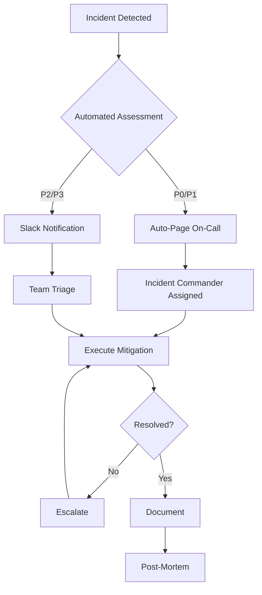

# 🚨 Pitchey Platform - Complete Disaster Recovery & Incident Response Guide

**Version:** 1.0  
**Last Updated:** December 2024  
**Status:** Production Ready

## Table of Contents

1. [Executive Summary](#executive-summary)
2. [Recovery Objectives](#recovery-objectives)
3. [Incident Response Framework](#incident-response-framework)
4. [Disaster Recovery Procedures](#disaster-recovery-procedures)
5. [Backup Strategy](#backup-strategy)
6. [Communication Protocols](#communication-protocols)
7. [Testing & Validation](#testing--validation)
8. [Quick Reference](#quick-reference)

---

## Executive Summary

This document provides comprehensive disaster recovery and incident response procedures for the Pitchey platform. It includes automated recovery systems, manual procedures, and communication protocols to ensure business continuity and minimal downtime.

### Key Components Implemented

✅ **Automated Incident Response System**
- `src/incident/incident-commander.ts` - TypeScript incident management
- `scripts/incident-response.sh` - Bash automation for incident handling

✅ **Disaster Recovery Automation**
- `scripts/disaster-recovery.sh` - Full recovery orchestration
- `scripts/backup-automation.sh` - Automated backup management

✅ **Database Schema for Tracking**
- `src/db/schema/incidents.ts` - Complete incident tracking schema

✅ **Monitoring & Alerting**
- Integration with PagerDuty, Slack, StatusPage
- Automated health checks and recovery triggers

---

## Recovery Objectives

### RTO (Recovery Time Objective) Targets

| Service | Target RTO | Maximum RTO | Priority |
|---------|------------|-------------|----------|
| Database | 15 minutes | 30 minutes | P0 |
| API Gateway | 5 minutes | 15 minutes | P0 |
| Authentication | 10 minutes | 20 minutes | P0 |
| WebSocket Services | 15 minutes | 30 minutes | P1 |
| Cache Layer | 20 minutes | 45 minutes | P2 |
| Media Storage | 30 minutes | 60 minutes | P2 |

### RPO (Recovery Point Objective) Targets

| Data Type | Target RPO | Maximum RPO | Backup Frequency |
|-----------|------------|-------------|------------------|
| Database | 1 hour | 4 hours | Every 6 hours + PITR |
| User Sessions | 5 minutes | 15 minutes | Continuous sync |
| Configuration | 12 hours | 24 hours | Every 12 hours |
| Media Files | 24 hours | 48 hours | Daily + versioning |

---

## Incident Response Framework

### Severity Levels

#### P0 - Critical (Complete Outage)
- **Response Time:** < 15 minutes
- **Auto-Page:** Yes
- **Examples:** Database failure, complete platform outage, security breach

#### P1 - Major (Significant Impact)
- **Response Time:** < 30 minutes
- **Auto-Page:** Yes
- **Examples:** Auth system down, payment failures, API errors >50%

#### P2 - Medium (Limited Impact)
- **Response Time:** < 2 hours
- **Auto-Page:** No (Slack only)
- **Examples:** Slow performance, single feature broken, cache issues

#### P3 - Low (Minimal Impact)
- **Response Time:** < 24 hours
- **Auto-Page:** No
- **Examples:** UI glitches, documentation issues, non-critical warnings

### Incident Response Flow



### Using the Incident Commander

#### Automated Detection & Response

```bash
# Run automated incident detection
./scripts/incident-response.sh detect

# Output:
# ✅ Checking error rate...
# ✅ Checking database health...
# ✅ Checking API health...
# 🚨 Issue detected: High error rate
# 🔧 Applying automated mitigation...
# ✅ Issue resolved
```

#### Manual Incident Declaration

```bash
# Declare a P0 incident
./scripts/incident-response.sh start P0 "Database Outage" "Primary database not responding"

# Interactive menu
./scripts/incident-response.sh menu
```

#### TypeScript Integration

```typescript
import { IncidentCommander } from './src/incident/incident-commander';

const commander = new IncidentCommander(env);

// Declare incident programmatically
const incidentId = await commander.declareIncident(
  Severity.P1,
  'High Error Rate',
  'Error rate exceeds 5% threshold',
  ['api', 'database']
);

// Apply mitigation
await commander.applyMitigation('restart_worker', 'system');

// Resolve incident
await commander.resolveIncident('Automated mitigation successful', 'system');
```

---

## Disaster Recovery Procedures

### Quick Recovery Commands

#### 1. Full System Recovery
```bash
# Execute complete disaster recovery
./scripts/disaster-recovery.sh full

# This will:
# 1. Create emergency backup (if possible)
# 2. Assess system damage
# 3. Execute recovery in priority order
# 4. Verify recovery
# 5. Generate report
```

#### 2. Database-Only Recovery
```bash
# Recover database with automatic failover
./scripts/disaster-recovery.sh database

# Manual Neon failover
curl -X POST https://console.neon.tech/api/v2/projects/$NEON_PROJECT_ID/branches \
  -H "Authorization: Bearer $NEON_API_KEY" \
  -d '{"branch": {"name": "recovery-'$(date +%s)'"}}'
```

#### 3. API Recovery
```bash
# Recover API with rollback if needed
./scripts/disaster-recovery.sh api

# Manual Worker rollback
wrangler rollback --env production
```

### Detailed Recovery Procedures

#### Database Failure Recovery

**Automated Process:**
1. System detects database failure
2. Attempts Neon endpoint restart
3. If fails, creates recovery branch from PITR
4. Updates connection strings
5. Redeploys Worker with new connection

**Manual Process:**
```sql
-- 1. Check database status
SELECT 1;

-- 2. Kill problematic connections
SELECT pg_terminate_backend(pid)
FROM pg_stat_activity
WHERE state = 'idle' AND state_change < now() - interval '10 minutes';

-- 3. If complete failure, switch to recovery branch
-- Use Neon console or API to create branch from timestamp
```

#### API Outage Recovery

**Automated Process:**
1. System detects API failure
2. Attempts Worker restart via redeploy
3. If fails, rolls back to previous version
4. Enables circuit breaker if partial failure

**Manual Process:**
```bash
# 1. Check Worker status
wrangler tail --env production

# 2. Redeploy
wrangler deploy --env production

# 3. If issues persist, rollback
wrangler rollback --env production

# 4. Enable maintenance mode if needed
wrangler secret put MAINTENANCE_MODE true --env production
```

---

## Backup Strategy

### Automated Backup System

#### Setup Automated Backups
```bash
# Configure cron jobs for all backup types
./scripts/backup-automation.sh setup-cron

# This creates:
# - Database backup every 6 hours
# - Config backup every 12 hours
# - Media backup daily
# - Full backup weekly
```

#### Manual Backup Operations
```bash
# Create immediate database backup
./scripts/backup-automation.sh backup database

# Create full system backup
./scripts/backup-automation.sh backup full

# Verify backup integrity
./scripts/backup-automation.sh verify /path/to/backup.gz

# Test recovery process
./scripts/backup-automation.sh test
```

### Backup Storage Locations

1. **Primary:** Local disk (`/var/backups/pitchey/`)
2. **Secondary:** Cloudflare R2 (`r2://pitchey-backups/`)
3. **Archive:** Neon branches (PITR)

### Retention Policy

| Backup Type | Local Retention | Cloud Retention | Archive |
|-------------|----------------|-----------------|---------|
| Database | 7 days | 30 days | 90 days |
| Configuration | 30 days | 90 days | 1 year |
| Media | 3 days | 90 days | Indefinite |
| Full | 14 days | 90 days | 1 year |

---

## Communication Protocols

### Incident Communication Matrix

| Severity | Internal | External | Status Page | Customer Email |
|----------|----------|----------|-------------|----------------|
| P0 | Immediate | 15 min | Immediate | 30 min |
| P1 | Immediate | 30 min | 15 min | 1 hour |
| P2 | 15 min | 2 hours | 30 min | Optional |
| P3 | 1 hour | Next day | Optional | No |

### Communication Channels

#### Slack Integration
```bash
# Configure Slack webhook
export SLACK_WEBHOOK="https://hooks.slack.com/services/YOUR/WEBHOOK"

# Channels:
# #incidents - All incident notifications
# #alerts-critical - P0/P1 only
# #alerts-warning - P2/P3
```

#### PagerDuty Setup
```bash
# Configure PagerDuty
export PAGERDUTY_ROUTING_KEY="your-routing-key"
export PAGERDUTY_SERVICE_ID="your-service-id"

# Escalation policy:
# 1. Primary on-call (immediate)
# 2. Secondary on-call (5 minutes)
# 3. Team lead (15 minutes)
# 4. CTO (30 minutes)
```

#### Status Page Updates
```bash
# Manual status update
curl -X POST https://api.statuspage.io/v1/pages/$PAGE_ID/incidents \
  -H "Authorization: OAuth $STATUSPAGE_API_KEY" \
  -d '{"incident": {"name": "Service Degradation", "status": "investigating"}}'
```

### Communication Templates

#### Initial Notification
```
🚨 INCIDENT DECLARED: [INC-XXXXX]
Severity: P[0-3]
Title: [Brief description]
Impact: [User-facing impact]
Status: Investigating
Commander: [Name]
Channel: #incident-[id]
```

#### Customer Communication
```
Subject: Pitchey Platform - Service Status Update

We are currently experiencing [issue description]. Our team is actively working to resolve this issue.

Current Status: [Investigating/Identified/Monitoring/Resolved]
Affected Services: [List]
Next Update: Within [30] minutes

We apologize for any inconvenience. Updates available at: https://status.pitchey.com
```

---

## Testing & Validation

### Monthly Disaster Recovery Drill

```bash
# Run monthly DR drill (first Saturday of month)
0 2 1-7 * 6 /scripts/disaster-recovery.sh test

# Components tested:
# ✓ Backup restoration
# ✓ Database failover
# ✓ API rollback
# ✓ Cache recovery
# ✓ Communication channels
```

### Recovery Test Scenarios

#### Scenario 1: Database Failure
```bash
# Simulate database failure
psql -c "SELECT pg_terminate_backend(pid) FROM pg_stat_activity WHERE pid <> pg_backend_pid()"

# Verify automatic recovery
./scripts/incident-response.sh detect
```

#### Scenario 2: High Error Rate
```bash
# Generate errors to trigger detection
for i in {1..100}; do
  curl -X POST $API_URL/api/error-test
done

# Check if mitigation triggered
tail -f /tmp/pitchey-incidents/*.log
```

### Validation Checklist

- [ ] All backup types created successfully
- [ ] Backups verified and restorable
- [ ] Incident detection working
- [ ] Auto-mitigation triggers correctly
- [ ] Notifications sent to all channels
- [ ] Status page updates automatically
- [ ] Recovery meets RTO targets
- [ ] Data loss within RPO targets
- [ ] Post-mortem process initiated
- [ ] Documentation updated

---

## Quick Reference

### Emergency Contacts

| Role | Contact | Availability |
|------|---------|--------------|
| Primary On-Call | PagerDuty | 24/7 |
| Database Admin | DBA Team | Business hours |
| Security Team | security@pitchey.com | 24/7 |
| Cloudflare Support | Enterprise portal | 24/7 |
| Neon Support | support@neon.tech | 24/7 |

### Critical Commands

```bash
# 🚨 EMERGENCY COMMANDS

# Stop all writes (enable read-only)
wrangler secret put READ_ONLY_MODE true --env production

# Clear all cache
curl -X POST https://api.cloudflare.com/client/v4/zones/$ZONE_ID/purge_cache \
  -H "Authorization: Bearer $CF_API_TOKEN" \
  -d '{"purge_everything": true}'

# Emergency database backup
pg_dump $DATABASE_URL | gzip > emergency-$(date +%s).sql.gz

# Rollback deployment
wrangler rollback --env production

# Scale database (Neon)
curl -X PATCH https://console.neon.tech/api/v2/projects/$PROJECT/endpoints/$ENDPOINT \
  -H "Authorization: Bearer $NEON_API_KEY" \
  -d '{"endpoint": {"compute_size": "xlarge"}}'
```

### Recovery Priorities

1. **Restore Data Integrity** - Ensure no data loss
2. **Restore Authentication** - Users can log in
3. **Restore Core API** - Basic functionality
4. **Restore Full Service** - All features
5. **Optimize Performance** - Return to normal

### Key Metrics to Monitor

- Error rate < 1%
- P99 latency < 1000ms
- Database connections < 80% limit
- Cache hit rate > 70%
- Successful auth rate > 99%

---

## Continuous Improvement

### Post-Incident Actions

1. **Within 24 hours:** Initial incident report
2. **Within 72 hours:** Schedule post-mortem
3. **Within 1 week:** Complete post-mortem
4. **Within 2 weeks:** Implement action items
5. **Monthly:** Review and update procedures

### Regular Reviews

- **Weekly:** Review recent incidents
- **Monthly:** Update runbooks
- **Quarterly:** Full DR test
- **Annually:** Complete audit

---

## Appendix

### Environment Variables Required

```bash
# Database
DATABASE_URL=
DATABASE_REPLICA_URL=

# Neon
NEON_API_KEY=
NEON_PROJECT_ID=
NEON_ENDPOINT_ID=

# Cloudflare
CF_API_TOKEN=
CF_ZONE_ID=
CF_ACCOUNT_ID=

# Monitoring
SLACK_WEBHOOK=
PAGERDUTY_ROUTING_KEY=
STATUSPAGE_API_KEY=
STATUSPAGE_PAGE_ID=

# Redis
REDIS_URL=
REDIS_TOKEN=

# Backup
R2_BUCKET=
BACKUP_DIR=/var/backups/pitchey
```

### File Locations

- Incident logs: `/tmp/pitchey-incidents/`
- Backup files: `/var/backups/pitchey/`
- Recovery logs: `/tmp/pitchey-recovery-*.log`
- Automation scripts: `scripts/`
- TypeScript code: `src/incident/`

---

**Document Status:** This is a living document. Updates should be made after each incident, DR test, or significant infrastructure change.

**Last Reviewed:** December 2024  
**Next Review:** January 2025  
**Owner:** Platform Team