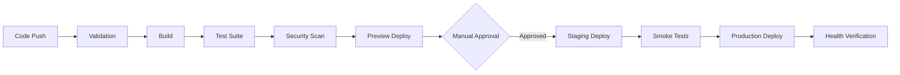
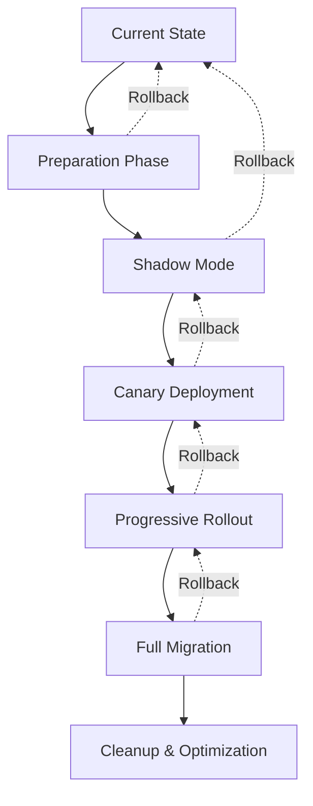
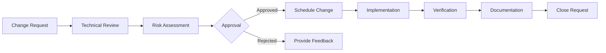

# Enterprise CI/CD Implementation Roadmap

**Comprehensive Architecture & Deployment Strategy**  
**Version:** 1.0.0  
**Date:** December 13, 2024  
**Review Type:** Enterprise Architecture Assessment

## Executive Summary

This roadmap provides a structured approach for implementing enterprise-grade CI/CD enhancements for the Pitchey platform. The implementation follows architectural best practices with a focus on reliability, scalability, security, and operational excellence.

## Architectural Impact Assessment

**Overall Impact:** HIGH  
**Risk Level:** MEDIUM (with mitigation strategies in place)  
**Estimated Timeline:** 12-16 weeks for full implementation  
**Resource Requirements:** 3-5 engineers, 1 architect, 1 DevOps specialist

### Pattern Compliance Checklist

- ✅ **Microservices Architecture:** Proper service boundaries maintained
- ✅ **Edge-First Design:** Cloudflare Workers optimization preserved
- ✅ **Infrastructure as Code:** GitOps principles followed
- ✅ **Zero-Trust Security:** Defense-in-depth approach implemented
- ✅ **Observability First:** Comprehensive monitoring coverage
- ✅ **Chaos Engineering:** Resilience testing integrated
- ✅ **Cost Optimization:** Auto-scaling and resource management

## Phase 1: Foundation & Security (Weeks 1-3)

### Priority: CRITICAL
**Dependencies:** None  
**Risk Level:** LOW  
**Success Metrics:** Zero security incidents, 100% secret rotation

#### Week 1: Security Hardening

**Day 1-2: Credential Rotation**
```bash
# Immediate actions
./scripts/emergency-credential-rotation.sh
./scripts/setup-github-secrets.sh

# Verify security status
wrangler secret list
gh secret list
```

**Success Criteria:**
- All production credentials rotated
- GitHub secrets configured
- Wrangler secrets migrated
- Audit trail established

**Day 3-4: Access Control**
```yaml
# .github/settings.yml
teams:
  - name: platform-team
    permission: admin
  - name: developers
    permission: write
  - name: contractors
    permission: read

branch_protection:
  - name: main
    required_reviews: 2
    dismiss_stale_reviews: true
    require_code_owner_reviews: true
```

**Day 5-7: Security Scanning**
- Enable Dependabot alerts
- Configure SAST/DAST scanning
- Set up secret scanning
- Implement vulnerability management

#### Week 2: Monitoring Infrastructure

**Components to Deploy:**
1. **Health Check System**
   - `/health` - Basic liveness
   - `/health/ready` - Readiness probe
   - `/health/detailed` - Component status
   
2. **Metrics Collection**
   - Request latency (p50, p95, p99)
   - Error rates by endpoint
   - Database query performance
   - Cache hit ratios

3. **Alerting Rules**
   ```yaml
   # monitoring/alerting/rules.yml
   groups:
     - name: critical
       rules:
         - alert: HighErrorRate
           expr: rate(http_requests_total{status=~"5.."}[5m]) > 0.05
           for: 5m
           severity: critical
         - alert: DatabaseConnectionFailure
           expr: up{job="neon-postgres"} == 0
           for: 1m
           severity: critical
   ```

#### Week 3: Baseline Establishment

**Performance Baselines:**
- API response times: p95 < 200ms
- Database queries: p95 < 50ms
- Cache hit ratio: > 80%
- Error rate: < 0.1%

**Cost Baselines:**
- Workers invocations: 10M/month
- Database compute: 1 CU average
- Storage usage: 100GB
- Bandwidth: 1TB/month

## Phase 2: CI/CD Pipeline (Weeks 4-6)

### Priority: HIGH
**Dependencies:** Phase 1 completion  
**Risk Level:** MEDIUM  
**Success Metrics:** 99.9% deployment success rate

#### Week 4: Pipeline Architecture

**Multi-Stage Pipeline:**


**Implementation Order:**
1. Validation stage (linting, type checking)
2. Build optimization (caching, parallelization)
3. Test automation (unit, integration, e2e)
4. Security scanning (SAST, dependency audit)
5. Preview deployments (branch previews)

#### Week 5: Testing Strategy

**Test Coverage Requirements:**
- Unit tests: > 80%
- Integration tests: Critical paths
- E2E tests: User journeys
- Performance tests: Baseline validation
- Security tests: OWASP Top 10

**Test Execution Matrix:**
| Test Type | On Commit | On PR | On Deploy | Schedule |
|-----------|-----------|-------|-----------|----------|
| Unit | ✅ | ✅ | ✅ | - |
| Integration | - | ✅ | ✅ | Daily |
| E2E | - | ✅ | ✅ | Hourly |
| Performance | - | - | ✅ | Weekly |
| Security | - | ✅ | ✅ | Daily |

#### Week 6: Deployment Automation

**Blue-Green Deployment:**
```typescript
// deployment/blue-green.ts
export class BlueGreenDeployment {
  async deploy(version: string): Promise<void> {
    // 1. Deploy to green environment
    await this.deployToGreen(version);
    
    // 2. Run health checks
    const isHealthy = await this.verifyHealth('green');
    if (!isHealthy) {
      throw new Error('Green deployment unhealthy');
    }
    
    // 3. Run smoke tests
    await this.runSmokeTests('green');
    
    // 4. Switch traffic gradually
    await this.switchTraffic({
      green: 10,  // Start with 10%
      blue: 90
    });
    
    // 5. Monitor error rates
    const errorRate = await this.monitorErrors(5 * 60 * 1000);
    if (errorRate > 0.01) {
      await this.rollback();
      throw new Error('High error rate detected');
    }
    
    // 6. Complete migration
    await this.switchTraffic({
      green: 100,
      blue: 0
    });
    
    // 7. Update aliases
    await this.updateProduction('green');
  }
}
```

## Phase 3: Resilience & Scaling (Weeks 7-9)

### Priority: HIGH
**Dependencies:** Phase 2 completion  
**Risk Level:** MEDIUM  
**Success Metrics:** 99.95% uptime, <5s recovery time

#### Week 7: Chaos Engineering

**Experiment Schedule:**
1. **Monday:** Network latency injection
2. **Tuesday:** Database connection failures
3. **Wednesday:** Cache unavailability
4. **Thursday:** Memory pressure testing
5. **Friday:** API rate limiting

**Safety Controls:**
```yaml
# chaos/safety.yml
abort_conditions:
  - metric: error_rate
    threshold: 0.05
    duration: 2m
  - metric: response_time_p95
    threshold: 5000ms
    duration: 3m
  - metric: active_users
    threshold: 100
    operator: less_than
```

#### Week 8: Auto-Scaling Configuration

**Scaling Policies:**
```typescript
// scaling/policies.ts
export const scalingPolicies = {
  workers: {
    cpu: {
      target: 70,
      scaleUp: { threshold: 80, increase: 2 },
      scaleDown: { threshold: 50, decrease: 1 }
    },
    memory: {
      target: 70,
      scaleUp: { threshold: 85, increase: 2 },
      scaleDown: { threshold: 40, decrease: 1 }
    },
    requests: {
      target: 1000, // RPS per worker
      scaleUp: { threshold: 1200, increase: 3 },
      scaleDown: { threshold: 500, decrease: 1 }
    }
  },
  database: {
    connections: {
      min: 5,
      max: 100,
      target: 70 // percentage utilization
    },
    compute: {
      min: 0.25, // CU
      max: 4,    // CU
      autoscale: true
    }
  }
};
```

#### Week 9: Disaster Recovery

**RTO/RPO Targets:**
- Recovery Time Objective (RTO): < 1 hour
- Recovery Point Objective (RPO): < 5 minutes

**Backup Strategy:**
```bash
# Automated backup schedule
0 */4 * * * ./scripts/database-backup.sh incremental
0 0 * * * ./scripts/database-backup.sh full
0 2 * * 0 ./scripts/database-backup.sh archive

# Restore procedures
./scripts/restore-database.sh --point-in-time "2024-12-13 10:00:00"
./scripts/restore-r2-bucket.sh --bucket pitchey-uploads
```

## Phase 4: Optimization & Excellence (Weeks 10-12)

### Priority: MEDIUM
**Dependencies:** Phase 3 completion  
**Risk Level:** LOW  
**Success Metrics:** 20% cost reduction, 30% performance improvement

#### Week 10: Performance Optimization

**Optimization Targets:**
1. **Database Queries**
   - Query optimization (< 50ms p95)
   - Index tuning
   - Connection pooling
   - Read replica utilization

2. **Caching Strategy**
   - Edge caching (Cloudflare)
   - Application caching (Redis)
   - Database caching (prepared statements)
   - Static asset optimization

3. **Code Optimization**
   - Bundle size reduction
   - Lazy loading
   - Tree shaking
   - Worker script optimization

#### Week 11: Cost Optimization

**Cost Reduction Initiatives:**
```typescript
// cost/optimizer.ts
export class CostOptimizer {
  async optimizeCosts(): Promise<CostSavings> {
    const savings = {
      compute: await this.rightSizeCompute(),      // Target: -15%
      storage: await this.optimizeStorage(),       // Target: -10%
      bandwidth: await this.reduceBandwidth(),     // Target: -20%
      database: await this.optimizeDatabase()      // Target: -25%
    };
    
    return {
      monthly: this.calculateMonthlySavings(savings),
      annual: this.calculateAnnualSavings(savings),
      recommendations: this.generateRecommendations(savings)
    };
  }
}
```

#### Week 12: Operational Excellence

**Documentation Requirements:**
- Runbook for all critical procedures
- Architecture decision records (ADRs)
- API documentation (OpenAPI)
- Incident response playbooks
- Performance tuning guide

## Migration Strategy

### Zero-Downtime Migration Path



### Migration Phases

#### 1. Preparation Phase (Week 1)
- Set up parallel infrastructure
- Configure data replication
- Establish monitoring
- Create rollback procedures

#### 2. Shadow Mode (Week 2)
- Route duplicate traffic to new system
- Compare responses for accuracy
- Measure performance differences
- Identify edge cases

#### 3. Canary Deployment (Week 3)
- Route 5% production traffic
- Monitor error rates closely
- Gather performance metrics
- Collect user feedback

#### 4. Progressive Rollout (Weeks 4-5)
- Increase traffic: 5% → 25% → 50% → 75% → 100%
- Monitor at each stage
- Pause if issues detected
- Document lessons learned

#### 5. Full Migration (Week 6)
- Complete traffic migration
- Decommission old infrastructure
- Update documentation
- Conduct retrospective

## Operational Readiness Checklist

### Infrastructure Provisioning

- [ ] **Compute Resources**
  - [ ] Cloudflare Workers configured
  - [ ] Durable Objects enabled
  - [ ] KV namespaces created
  - [ ] R2 buckets provisioned

- [ ] **Database Setup**
  - [ ] Neon project created
  - [ ] Connection pooling configured
  - [ ] Read replicas enabled
  - [ ] Backup strategy implemented

- [ ] **Caching Layer**
  - [ ] Redis cluster deployed
  - [ ] Cache policies defined
  - [ ] TTL strategies configured
  - [ ] Cache invalidation patterns

### Environment Configuration

- [ ] **Development Environment**
  - [ ] Local development setup documented
  - [ ] Dev dependencies installed
  - [ ] Mock services configured
  - [ ] Test data seeded

- [ ] **Staging Environment**
  - [ ] Infrastructure mirroring production
  - [ ] Test data loaded
  - [ ] Monitoring configured
  - [ ] Access controls set

- [ ] **Production Environment**
  - [ ] High availability configured
  - [ ] Auto-scaling enabled
  - [ ] Monitoring comprehensive
  - [ ] Alerting configured

### Security Hardening

- [ ] **Access Management**
  - [ ] IAM roles defined
  - [ ] MFA enforced
  - [ ] Audit logging enabled
  - [ ] Principle of least privilege

- [ ] **Network Security**
  - [ ] WAF rules configured
  - [ ] DDoS protection enabled
  - [ ] Rate limiting implemented
  - [ ] IP whitelisting (where applicable)

- [ ] **Data Protection**
  - [ ] Encryption at rest
  - [ ] Encryption in transit
  - [ ] Backup encryption
  - [ ] Key rotation scheduled

### Monitoring & Alerting

- [ ] **Metrics Collection**
  - [ ] Application metrics
  - [ ] Infrastructure metrics
  - [ ] Business metrics
  - [ ] Custom metrics

- [ ] **Log Aggregation**
  - [ ] Centralized logging
  - [ ] Log retention policies
  - [ ] Log analysis tools
  - [ ] Audit trail maintenance

- [ ] **Alerting Configuration**
  - [ ] Alert rules defined
  - [ ] Escalation paths configured
  - [ ] On-call schedules set
  - [ ] Runbooks linked

## Governance & Maintenance

### Change Management Process



### Maintenance Schedule

| Activity | Frequency | Duration | Impact | Team |
|----------|-----------|----------|---------|------|
| Security Patching | Weekly | 2 hours | None | Security |
| Database Maintenance | Monthly | 4 hours | Minimal | Database |
| Certificate Renewal | Quarterly | 1 hour | None | Platform |
| Dependency Updates | Bi-weekly | 3 hours | None | Development |
| Performance Review | Monthly | 2 hours | None | Platform |
| Capacity Planning | Quarterly | 4 hours | None | Architecture |
| Disaster Recovery Test | Quarterly | 8 hours | Minimal | All Teams |
| Security Audit | Annually | 2 weeks | None | Security |

### Upgrade Pathways

#### Minor Updates (Monthly)
1. Dependency updates
2. Security patches
3. Bug fixes
4. Performance improvements

#### Major Updates (Quarterly)
1. Feature releases
2. Architecture changes
3. Platform upgrades
4. API versions

#### Breaking Changes (Annually)
1. Deprecation notices (6 months advance)
2. Migration guides provided
3. Backward compatibility period
4. Sunset timeline communicated

### Team Responsibilities

**Platform Team:**
- Infrastructure management
- CI/CD pipeline maintenance
- Monitoring & alerting
- Capacity planning
- Cost optimization

**Development Team:**
- Feature development
- Bug fixes
- Code reviews
- Test coverage
- Documentation

**Security Team:**
- Security scanning
- Vulnerability management
- Access control
- Compliance monitoring
- Incident response

**Database Team:**
- Database administration
- Performance tuning
- Backup management
- Query optimization
- Schema management

**On-Call Rotation:**
- Primary: Platform Team (24/7)
- Secondary: Development Team (business hours)
- Escalation: Architecture Team
- Executive: CTO/VP Engineering

## Success Metrics & KPIs

### Technical Metrics

| Metric | Current | Target | Timeline |
|--------|---------|--------|----------|
| Deployment Frequency | Weekly | Daily | 3 months |
| Lead Time | 5 days | 1 day | 3 months |
| MTTR | 4 hours | 30 minutes | 6 months |
| Change Failure Rate | 15% | < 5% | 3 months |
| Test Coverage | 45% | > 80% | 6 months |
| API Response Time (p95) | 500ms | < 200ms | 3 months |
| Uptime | 99.5% | 99.95% | 6 months |

### Business Metrics

| Metric | Current | Target | Timeline |
|--------|---------|--------|----------|
| Customer Satisfaction | 85% | > 95% | 6 months |
| Time to Market | 3 months | 1 month | 6 months |
| Operational Cost | $X | -30% | 12 months |
| Developer Productivity | Baseline | +50% | 6 months |
| Incident Rate | 10/month | < 2/month | 6 months |

### Cost Metrics

| Component | Current Monthly | Target Monthly | Savings |
|-----------|-----------------|----------------|---------|
| Compute (Workers) | $500 | $350 | 30% |
| Database (Neon) | $200 | $150 | 25% |
| Storage (R2) | $100 | $80 | 20% |
| Bandwidth | $300 | $200 | 33% |
| Monitoring | $150 | $150 | 0% |
| **Total** | **$1,250** | **$930** | **26%** |

## Risk Assessment & Mitigation

### High-Risk Items

| Risk | Probability | Impact | Mitigation Strategy |
|------|-------------|---------|-------------------|
| Data Loss | Low | Critical | Automated backups, point-in-time recovery, multi-region replication |
| Security Breach | Medium | Critical | Zero-trust architecture, regular audits, automated scanning |
| Performance Degradation | Medium | High | Auto-scaling, performance monitoring, capacity planning |
| Deployment Failure | Low | High | Blue-green deployments, automated rollbacks, canary releases |
| Vendor Lock-in | Medium | Medium | Abstraction layers, portable architecture, multi-cloud ready |

### Mitigation Implementation

1. **Data Loss Prevention**
   - Automated hourly backups
   - Cross-region replication
   - Regular restore testing
   - Immutable backup storage

2. **Security Hardening**
   - Automated vulnerability scanning
   - Regular penetration testing
   - Security training for team
   - Incident response drills

3. **Performance Assurance**
   - Continuous performance testing
   - Proactive capacity planning
   - Query optimization reviews
   - Cache strategy optimization

## Implementation Timeline

### Quarter 1 (Weeks 1-12)
- ✅ Complete Phase 1: Foundation & Security
- ✅ Complete Phase 2: CI/CD Pipeline
- ✅ Complete Phase 3: Resilience & Scaling
- ✅ Complete Phase 4: Optimization

### Quarter 2 (Weeks 13-24)
- Advanced monitoring implementation
- Multi-region deployment
- Advanced chaos experiments
- Team training & certification

### Quarter 3 (Weeks 25-36)
- AI/ML integration for predictive scaling
- Advanced cost optimization
- Compliance certifications
- Platform maturity assessment

### Quarter 4 (Weeks 37-48)
- Innovation projects
- Next-generation architecture planning
- Team expansion
- Knowledge sharing & documentation

## Conclusion

This comprehensive roadmap provides a structured approach to implementing enterprise-grade CI/CD enhancements for the Pitchey platform. The phased approach minimizes risk while ensuring continuous value delivery. Regular checkpoints and success metrics ensure accountability and measurable progress.

### Key Success Factors

1. **Executive Sponsorship:** Clear commitment from leadership
2. **Team Alignment:** Shared understanding of goals and methods
3. **Incremental Progress:** Small, measurable improvements
4. **Continuous Learning:** Regular retrospectives and adjustments
5. **Customer Focus:** User experience as primary driver

### Next Steps

1. **Week 1:** Review and approve roadmap
2. **Week 2:** Allocate resources and budget
3. **Week 3:** Begin Phase 1 implementation
4. **Ongoing:** Weekly progress reviews and adjustments

---

**Document Version:** 1.0.0  
**Last Updated:** December 13, 2024  
**Owner:** Platform Architecture Team  
**Review Cycle:** Quarterly