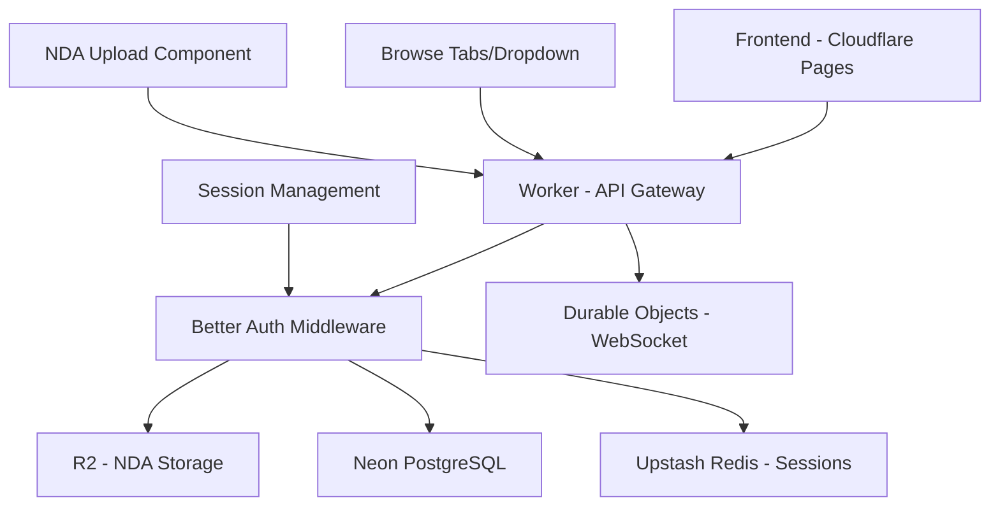

# Missing Components for Full Deployment - December 22, 2024

## Executive Summary
Based on Chrome DevTools verification and Context7 Better Auth documentation analysis, the production deployment is missing several critical components needed to implement the sophisticated NDA upload and browse tabs features. The current system uses basic implementations that lack the enhanced UX and proper backend integration.

## 🔴 Critical Missing Components

### 1. File Upload Infrastructure with Better Auth

#### What's Missing:
- **Multipart form data handling** in Cloudflare Workers
- **Better Auth middleware** for file upload authentication
- **R2 storage integration** for NDA documents
- **Session-based file access control**

#### What You Have:
```typescript
// Current: Basic button
<button>Upload NDA (PDF only)</button>
```

#### What You Need:
```typescript
// Enhanced NDAUploadSection with Better Auth
import { auth } from "@/lib/auth";

// Middleware for file upload
export async function middleware(request: Request) {
  const session = await auth.api.getSession({
    headers: request.headers,
  });
  
  if (!session?.user) {
    return new Response("Unauthorized", { status: 401 });
  }
  
  // Handle multipart upload to R2
  const formData = await request.formData();
  const file = formData.get("nda") as File;
  
  // Store in R2 with session context
  await uploadToR2(file, session.user.id);
}
```

### 2. Cloudflare Workers Configuration

#### Missing wrangler.toml Settings:
```toml
# Required for Better Auth AsyncLocalStorage
compatibility_flags = ["nodejs_compat"]
compatibility_date = "2024-09-23"

# R2 bucket binding for NDA storage
[[r2_buckets]]
binding = "NDA_STORAGE"
bucket_name = "pitchey-nda-documents"

# Durable Objects for WebSocket rooms
[[durable_objects.bindings]]
name = "WEBSOCKET_ROOMS"
class_name = "WebSocketRoom"
```

### 3. Browse API Tab Filtering

#### What's Missing:
- **Backend route handlers** for tab-specific queries
- **Database indexes** for optimized filtering
- **Better Auth session context** in browse queries

#### Current API:
```typescript
// Simple public endpoint
GET /api/pitches/public
```

#### Needed API:
```typescript
// Tab-specific with session context
export const browsePitches = async (request: Request) => {
  const url = new URL(request.url);
  const tab = url.searchParams.get('tab');
  const session = await auth.api.getSession({ headers: request.headers });
  
  let query = db.select().from(pitches);
  
  if (tab === 'trending') {
    query = query
      .where(and(
        gt(pitches.createdAt, sevenDaysAgo),
        gt(pitches.viewCount, 10)
      ))
      .orderBy(desc(pitches.engagementScore));
  } else if (tab === 'new') {
    query = query
      .where(gt(pitches.createdAt, thirtyDaysAgo))
      .orderBy(desc(pitches.createdAt));
  } else if (tab === 'popular') {
    query = query
      .where(or(
        gt(pitches.viewCount, 50),
        gt(pitches.likeCount, 20)
      ))
      .orderBy(desc(pitches.popularity));
  }
  
  // Apply NDA visibility based on session
  if (!session) {
    query = query.where(eq(pitches.requiresNDA, false));
  }
  
  return query;
};
```

### 4. NDA Upload Component Integration

#### Missing Frontend Components:
```typescript
// NDAUploadSection.tsx - NOT deployed
interface NDADocument {
  ndaType: 'none' | 'standard' | 'custom';
  file: File | null;
  uploadStatus: 'idle' | 'uploading' | 'completed' | 'error';
  uploadProgress: number;
}

// Features needed:
- Drag & drop zone
- Progress tracking
- File validation
- Preview capability
- Better Auth session validation
```

### 5. Database Schema Updates

#### Missing Columns:
```sql
-- Add to pitches table
ALTER TABLE pitches ADD COLUMN IF NOT EXISTS custom_nda_url TEXT;
ALTER TABLE pitches ADD COLUMN IF NOT EXISTS custom_nda_r2_key TEXT;
ALTER TABLE pitches ADD COLUMN IF NOT EXISTS nda_upload_date TIMESTAMP;
ALTER TABLE pitches ADD COLUMN IF NOT EXISTS engagement_score INTEGER DEFAULT 0;
ALTER TABLE pitches ADD COLUMN IF NOT EXISTS popularity_score INTEGER DEFAULT 0;

-- Add indexes for tab queries
CREATE INDEX idx_pitches_trending ON pitches(created_at DESC, engagement_score DESC) 
  WHERE status = 'published' AND created_at > CURRENT_DATE - INTERVAL '7 days';

CREATE INDEX idx_pitches_new ON pitches(created_at DESC) 
  WHERE status = 'published';

CREATE INDEX idx_pitches_popular ON pitches(popularity_score DESC, view_count DESC) 
  WHERE status = 'published';
```

## 🟡 Partially Missing Components

### 1. Better Auth Session Management
```typescript
// Need session-based file access
export const auth = betterAuth({
  session: {
    cookieCache: {
      enabled: true,
      maxAge: 300 // 5 minutes
    }
  },
  secondaryStorage: {
    // Redis for session storage
    get: async (key) => await redis.get(key),
    set: async (key, value, ttl) => await redis.set(key, value, "EX", ttl),
    delete: async (key) => await redis.del(key)
  }
});
```

### 2. WebSocket Room Management
```typescript
// Portal-specific rooms needed
export class WebSocketRoom implements DurableObject {
  sessions: Map<string, { ws: WebSocket, portal: string, userId: string }>;
  
  broadcast(message: string, portal?: string) {
    for (const [id, session] of this.sessions) {
      if (!portal || session.portal === portal) {
        session.ws.send(message);
      }
    }
  }
}
```

## 🟢 What's Already Working

### Existing Infrastructure:
- ✅ Better Auth basic authentication
- ✅ Portal-based login system
- ✅ Basic NDA radio buttons
- ✅ Dropdown sorting (could be kept)
- ✅ Cloudflare Pages deployment
- ✅ Demo accounts functional

## 📋 Deployment Checklist

### Phase 1: Backend Infrastructure (1-2 days)
- [ ] Update wrangler.toml with nodejs_compat flag
- [ ] Configure R2 bucket for NDA storage
- [ ] Deploy database schema updates
- [ ] Add Better Auth middleware for file uploads

### Phase 2: API Updates (2-3 days)
- [ ] Implement tab-specific browse endpoints
- [ ] Add multipart form handling in Worker
- [ ] Create NDA upload endpoint with R2 integration
- [ ] Add session-based access control

### Phase 3: Frontend Integration (2-3 days)
- [ ] Deploy NDAUploadSection component
- [ ] Wire up to CreatePitch form
- [ ] Add progress tracking and validation
- [ ] Implement tab UI (or enhance dropdown)

### Phase 4: Testing & Optimization (1-2 days)
- [ ] Test file upload with various sizes
- [ ] Verify tab filtering performance
- [ ] Ensure NDA access control works
- [ ] Load test with concurrent uploads

## 🚀 Quick Win Opportunities

### 1. Keep Dropdown, Add Backend Filtering
Instead of tabs, enhance the existing dropdown with proper backend filtering:
```typescript
// Map dropdown options to query filters
const sortFilters = {
  'Trending Now': { filter: 'trending', days: 7 },
  'Newest First': { filter: 'new', days: 30 },
  'Most Popular': { filter: 'popular', allTime: true }
};
```

### 2. Progressive NDA Upload
Start with basic upload, add features incrementally:
1. Phase 1: Basic file upload to R2
2. Phase 2: Add progress tracking
3. Phase 3: Add drag-and-drop
4. Phase 4: Add preview capability

### 3. Use Cloudflare's Built-in Features
Leverage Cloudflare's native capabilities:
- **R2**: Zero egress fees for NDA storage
- **Durable Objects**: WebSocket room management
- **Workers KV**: Cache browse results
- **D1**: Store file metadata

## 💡 Recommended Architecture



## Summary

To fully deploy your sophisticated implementations, you need:

1. **Infrastructure**: Cloudflare Workers configuration with nodejs_compat, R2 buckets, and Durable Objects
2. **Backend**: Multipart form handling, Better Auth middleware, tab-specific filtering
3. **Frontend**: NDAUploadSection component integration, progress tracking
4. **Database**: Schema updates with proper indexes for performance

The current production uses simpler implementations that work but lack the enhanced UX and performance optimizations you've designed. With Better Auth as your authentication layer, all file uploads and API access should flow through session validation to ensure security.

**Estimated Timeline**: 7-10 days for complete implementation
**Quick Wins Available**: 2-3 days for basic functionality with existing UI