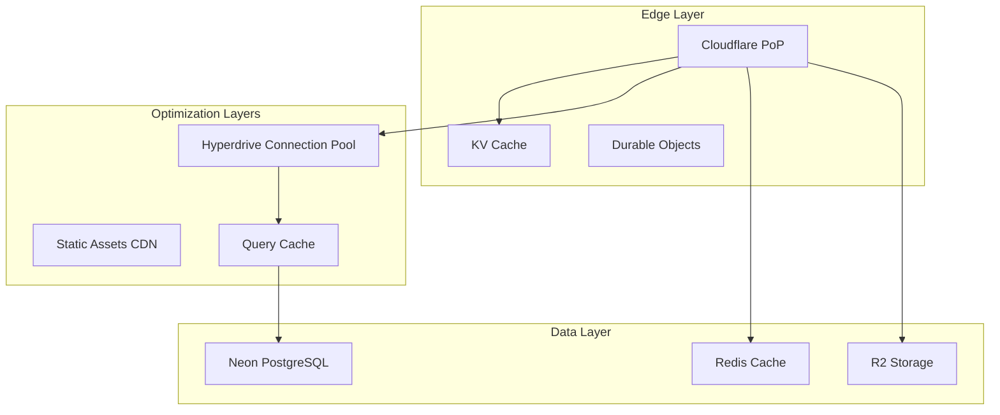

# Performance Optimization Strategies for Pitchey Platform

**Edge-First Performance with Cloudflare Workers & Neon PostgreSQL**  
**Date:** December 11, 2024

## 🚀 Performance Architecture



## 1. Database Performance Optimizations

### Connection Pooling with Hyperdrive
```typescript
// src/db/hyperdrive-config.ts
import { Pool } from '@neondatabase/serverless';

export class HyperdriveOptimizedPool {
  private static pools = new Map<string, Pool>();
  
  static getOptimizedPool(env: Env): Pool {
    const key = `${env.HYPERDRIVE.id}`;
    
    if (!this.pools.has(key)) {
      // Use Hyperdrive for connection pooling at the edge
      const pool = new Pool({
        connectionString: env.HYPERDRIVE.connectionString,
        
        // Optimal settings for edge environments
        max: 10,                      // Maximum pool size
        idleTimeoutMillis: 10000,     // 10 seconds
        connectionTimeoutMillis: 3000, // 3 seconds
        
        // Query optimization
        statement_timeout: 5000,       // 5 second query timeout
        query_timeout: 5000,
        
        // Connection optimization
        keepAlive: true,
        keepAliveInitialDelayMillis: 10000,
        
        // SSL optimization
        ssl: {
          rejectUnauthorized: true,
          require: true,
          ca: env.NEON_CA_CERT // Pinned certificate
        }
      });
      
      // Pre-warm connections
      pool.on('connect', (client) => {
        // Set optimal PostgreSQL parameters
        client.query('SET statement_timeout = 5000');
        client.query('SET idle_in_transaction_session_timeout = 10000');
        client.query('SET work_mem = "4MB"');
      });
      
      this.pools.set(key, pool);
    }
    
    return this.pools.get(key)!;
  }
}

// Query optimization with prepared statements
export class OptimizedQueries {
  private static preparedStatements = new Map<string, string>();
  
  static prepare(name: string, query: string): void {
    this.preparedStatements.set(name, query);
  }
  
  static async execute<T>(
    pool: Pool,
    name: string,
    params: any[]
  ): Promise<T> {
    const query = this.preparedStatements.get(name);
    if (!query) throw new Error(`Prepared statement ${name} not found`);
    
    // Use prepared statements for better performance
    const client = await pool.connect();
    try {
      // Prepare statement if not exists
      await client.query(`PREPARE ${name} AS ${query}`);
      
      // Execute prepared statement
      const result = await client.query(`EXECUTE ${name}(${params.map((_, i) => `$${i + 1}`).join(', ')})`, params);
      
      return result.rows as T;
    } finally {
      client.release();
    }
  }
}

// Initialize common prepared statements
OptimizedQueries.prepare('getUserById', 
  'SELECT id, email, role FROM users WHERE id = $1'
);
OptimizedQueries.prepare('getPitchesByStatus',
  'SELECT * FROM pitches WHERE status = $1 ORDER BY created_at DESC LIMIT $2'
);
```

### Database Indexing Strategy
```sql
-- Performance-critical indexes
-- src/db/performance-indexes.sql

-- User authentication (covering index)
CREATE INDEX CONCURRENTLY idx_users_email_role_password 
ON users(email, role) 
INCLUDE (id, password_hash)
WHERE deleted_at IS NULL;

-- Pitch browsing (partial index for published only)
CREATE INDEX CONCURRENTLY idx_pitches_published_created 
ON pitches(created_at DESC, view_count DESC) 
WHERE status = 'published' AND deleted_at IS NULL;

-- NDA lookups (composite index)
CREATE INDEX CONCURRENTLY idx_ndas_user_pitch_status 
ON ndas(user_id, pitch_id, status)
WHERE status IN ('pending', 'approved');

-- Investment tracking (BRIN index for time-series)
CREATE INDEX idx_investments_created_brin 
ON investment_interests 
USING BRIN(created_at) 
WITH (pages_per_range = 128);

-- Full-text search on pitches
CREATE INDEX idx_pitches_search 
ON pitches 
USING GIN(to_tsvector('english', title || ' ' || logline || ' ' || synopsis));

-- Analytics events (partitioned table optimization)
CREATE INDEX idx_analytics_events_partition 
ON analytics_events (event_type, created_at DESC)
WHERE created_at > CURRENT_DATE - INTERVAL '30 days';

-- Query performance view
CREATE MATERIALIZED VIEW mv_pitch_stats AS
SELECT 
  p.id,
  p.title,
  COUNT(DISTINCT v.user_id) as unique_views,
  COUNT(DISTINCT i.investor_id) as investor_interest,
  COUNT(DISTINCT n.id) as nda_requests,
  MAX(v.viewed_at) as last_viewed
FROM pitches p
LEFT JOIN pitch_views v ON p.id = v.pitch_id
LEFT JOIN investment_interests i ON p.id = i.pitch_id
LEFT JOIN ndas n ON p.id = n.pitch_id
WHERE p.status = 'published'
GROUP BY p.id, p.title;

-- Refresh materialized view periodically
CREATE INDEX idx_mv_pitch_stats ON mv_pitch_stats(id);
```

## 2. Caching Strategy

### Multi-Layer Cache Implementation
```typescript
// src/cache/multi-layer-cache.ts
export class MultiLayerCache {
  constructor(
    private kv: KVNamespace,        // Cloudflare KV (global)
    private redis: Redis,           // Upstash Redis (regional)
    private memory: Map<string, any> // In-memory (request-scoped)
  ) {}
  
  // Cache configuration per data type
  private readonly CACHE_CONFIG = {
    user: {
      memory: 60,      // 1 minute
      redis: 300,      // 5 minutes
      kv: 3600        // 1 hour
    },
    pitch: {
      memory: 30,      // 30 seconds
      redis: 180,      // 3 minutes
      kv: 1800        // 30 minutes
    },
    analytics: {
      memory: 10,      // 10 seconds
      redis: 60,       // 1 minute
      kv: 300         // 5 minutes
    }
  };
  
  async get<T>(
    key: string,
    type: keyof typeof this.CACHE_CONFIG
  ): Promise<T | null> {
    const config = this.CACHE_CONFIG[type];
    
    // L1: Memory cache (fastest)
    const memoryValue = this.memory.get(key);
    if (memoryValue) {
      return memoryValue;
    }
    
    // L2: Redis cache (fast)
    try {
      const redisValue = await this.redis.get(key);
      if (redisValue) {
        // Populate memory cache
        this.memory.set(key, redisValue);
        setTimeout(() => this.memory.delete(key), config.memory * 1000);
        return redisValue as T;
      }
    } catch (error) {
      console.warn('Redis cache miss:', error);
    }
    
    // L3: KV cache (durable)
    const kvValue = await this.kv.get(key, 'json');
    if (kvValue) {
      // Populate upper layers
      await this.warmCache(key, kvValue, type);
      return kvValue as T;
    }
    
    return null;
  }
  
  async set<T>(
    key: string,
    value: T,
    type: keyof typeof this.CACHE_CONFIG
  ): Promise<void> {
    const config = this.CACHE_CONFIG[type];
    
    // Write to all layers in parallel
    await Promise.all([
      // Memory cache
      Promise.resolve(this.memory.set(key, value)),
      
      // Redis cache
      this.redis.setex(key, config.redis, JSON.stringify(value)),
      
      // KV cache
      this.kv.put(key, JSON.stringify(value), {
        expirationTtl: config.kv
      })
    ]);
    
    // Set memory expiration
    setTimeout(() => this.memory.delete(key), config.memory * 1000);
  }
  
  async invalidate(pattern: string): Promise<void> {
    // Clear memory cache
    for (const key of this.memory.keys()) {
      if (key.includes(pattern)) {
        this.memory.delete(key);
      }
    }
    
    // Clear Redis cache
    const keys = await this.redis.keys(pattern);
    if (keys.length > 0) {
      await this.redis.del(...keys);
    }
    
    // KV doesn't support pattern matching, use tags instead
    // Implement tag-based invalidation
  }
  
  private async warmCache<T>(
    key: string,
    value: T,
    type: keyof typeof this.CACHE_CONFIG
  ): Promise<void> {
    const config = this.CACHE_CONFIG[type];
    
    // Warm Redis
    await this.redis.setex(key, config.redis, JSON.stringify(value));
    
    // Warm memory
    this.memory.set(key, value);
    setTimeout(() => this.memory.delete(key), config.memory * 1000);
  }
}

// Cache-aside pattern implementation
export class CachedRepository {
  constructor(
    private cache: MultiLayerCache,
    private pool: Pool
  ) {}
  
  async findUserById(id: string): Promise<User | null> {
    const cacheKey = `user:${id}`;
    
    // Try cache first
    const cached = await this.cache.get<User>(cacheKey, 'user');
    if (cached) {
      return cached;
    }
    
    // Cache miss - query database
    const result = await this.pool.query(
      'SELECT * FROM users WHERE id = $1',
      [id]
    );
    
    if (result.rows[0]) {
      // Cache the result
      await this.cache.set(cacheKey, result.rows[0], 'user');
      return result.rows[0];
    }
    
    return null;
  }
  
  async updateUser(id: string, data: Partial<User>): Promise<void> {
    // Update database
    await this.pool.query(
      'UPDATE users SET ... WHERE id = $1',
      [id]
    );
    
    // Invalidate cache
    await this.cache.invalidate(`user:${id}`);
  }
}
```

## 3. Edge Computing Optimizations

### Smart Request Routing
```typescript
// src/edge/smart-router.ts
export class SmartRouter {
  private readonly STATIC_EXTENSIONS = new Set([
    '.js', '.css', '.png', '.jpg', '.jpeg', '.gif', '.svg', '.woff', '.woff2'
  ]);
  
  async route(request: Request, env: Env): Promise<Response> {
    const url = new URL(request.url);
    
    // 1. Serve static assets from cache
    if (this.isStaticAsset(url.pathname)) {
      return this.handleStaticAsset(request, env);
    }
    
    // 2. Handle API requests with geo-routing
    if (url.pathname.startsWith('/api/')) {
      return this.handleApiRequest(request, env);
    }
    
    // 3. Handle WebSocket upgrades
    if (request.headers.get('Upgrade') === 'websocket') {
      return this.handleWebSocket(request, env);
    }
    
    // 4. Default to application
    return this.handleApplication(request, env);
  }
  
  private isStaticAsset(path: string): boolean {
    return this.STATIC_EXTENSIONS.has(
      path.substring(path.lastIndexOf('.'))
    );
  }
  
  private async handleStaticAsset(
    request: Request,
    env: Env
  ): Promise<Response> {
    const cache = caches.default;
    
    // Check cache
    let response = await cache.match(request);
    if (response) {
      return response;
    }
    
    // Fetch from R2
    const key = request.url.replace('https://pitchey.com', '');
    const object = await env.R2_BUCKET.get(key);
    
    if (object) {
      response = new Response(object.body, {
        headers: {
          'Content-Type': object.httpMetadata?.contentType || 'application/octet-stream',
          'Cache-Control': 'public, max-age=31536000, immutable',
          'ETag': object.httpEtag,
          'Last-Modified': object.uploaded.toUTCString()
        }
      });
      
      // Cache the response
      await cache.put(request, response.clone());
      
      return response;
    }
    
    return new Response('Not Found', { status: 404 });
  }
  
  private async handleApiRequest(
    request: Request,
    env: Env
  ): Promise<Response> {
    // Get closest region
    const colo = request.cf?.colo || 'unknown';
    
    // Route to nearest database replica if available
    const dbUrl = this.getNearestDatabase(colo, env);
    
    // Process with optimized connection
    const pool = HyperdriveOptimizedPool.getOptimizedPool({
      ...env,
      DATABASE_URL: dbUrl
    });
    
    // Handle the API request
    return this.processApiRequest(request, pool, env);
  }
  
  private getNearestDatabase(colo: string, env: Env): string {
    // Map Cloudflare colos to Neon regions
    const regionMap = {
      'LAX': env.DATABASE_URL_US_WEST,
      'ORD': env.DATABASE_URL_US_CENTRAL,
      'EWR': env.DATABASE_URL_US_EAST,
      'LHR': env.DATABASE_URL_EU_WEST,
      'FRA': env.DATABASE_URL_EU_CENTRAL,
      'SIN': env.DATABASE_URL_ASIA
    };
    
    // Find nearest region
    for (const [prefix, url] of Object.entries(regionMap)) {
      if (colo.startsWith(prefix) && url) {
        return url;
      }
    }
    
    // Default to primary
    return env.DATABASE_URL;
  }
}
```

### Request Coalescing
```typescript
// src/optimization/request-coalescing.ts
export class RequestCoalescer {
  private pending = new Map<string, Promise<any>>();
  
  async coalesce<T>(
    key: string,
    fn: () => Promise<T>
  ): Promise<T> {
    // Check if request is already in flight
    if (this.pending.has(key)) {
      return this.pending.get(key)!;
    }
    
    // Create new request
    const promise = fn().finally(() => {
      // Clean up after completion
      this.pending.delete(key);
    });
    
    this.pending.set(key, promise);
    return promise;
  }
}

// Usage example
const coalescer = new RequestCoalescer();

// Multiple concurrent requests for same data
async function getPitch(id: string): Promise<Pitch> {
  return coalescer.coalesce(`pitch:${id}`, async () => {
    // This will only execute once even with multiple concurrent calls
    return await db.query('SELECT * FROM pitches WHERE id = $1', [id]);
  });
}
```

## 4. Frontend Performance

### Bundle Optimization
```javascript
// vite.config.ts
import { defineConfig } from 'vite';
import { compression } from 'vite-plugin-compression2';
import { visualizer } from 'rollup-plugin-visualizer';

export default defineConfig({
  build: {
    // Code splitting
    rollupOptions: {
      output: {
        manualChunks: {
          'react-vendor': ['react', 'react-dom', 'react-router-dom'],
          'ui-vendor': ['@headlessui/react', '@heroicons/react'],
          'utils': ['date-fns', 'clsx', 'zod']
        },
        // Optimize chunk size
        chunkFileNames: (chunkInfo) => {
          const facadeModuleId = chunkInfo.facadeModuleId 
            ? chunkInfo.facadeModuleId.split('/').pop() 
            : 'vendor';
          return `js/${facadeModuleId}-[hash].js`;
        }
      }
    },
    // Minification
    minify: 'terser',
    terserOptions: {
      compress: {
        drop_console: true,
        drop_debugger: true,
        pure_funcs: ['console.log', 'console.info']
      }
    },
    // Target modern browsers
    target: 'es2020',
    // Optimize CSS
    cssCodeSplit: true,
    // Source maps for production debugging
    sourcemap: 'hidden'
  },
  
  plugins: [
    // Brotli compression
    compression({
      algorithm: 'brotliCompress',
      ext: '.br',
      threshold: 10240
    }),
    // Gzip fallback
    compression({
      algorithm: 'gzip',
      ext: '.gz'
    }),
    // Bundle analyzer
    visualizer({
      filename: 'dist/stats.html',
      gzipSize: true,
      brotliSize: true
    })
  ],
  
  // Optimize dependencies
  optimizeDeps: {
    include: ['react', 'react-dom'],
    exclude: ['@cloudflare/workers-types']
  }
});
```

### Lazy Loading & Code Splitting
```typescript
// src/routes/index.tsx
import { lazy, Suspense } from 'react';
import { Routes, Route } from 'react-router-dom';

// Lazy load heavy components
const CreatorDashboard = lazy(() => 
  import(/* webpackChunkName: "creator" */ './CreatorDashboard')
);
const InvestorDashboard = lazy(() => 
  import(/* webpackChunkName: "investor" */ './InvestorDashboard')
);
const PitchEditor = lazy(() => 
  import(/* webpackChunkName: "editor" */ './PitchEditor')
);

// Preload critical chunks
const preloadCreatorDashboard = () => {
  import(/* webpackPrefetch: true */ './CreatorDashboard');
};

// Resource hints
export function ResourceHints() {
  return (
    <>
      <link rel="preconnect" href="https://pitchey-api-prod.ndlovucavelle.workers.dev" />
      <link rel="dns-prefetch" href="https://r2.pitchey.com" />
      <link rel="preload" as="font" type="font/woff2" href="/fonts/inter.woff2" crossOrigin="" />
    </>
  );
}

// Routes with lazy loading
export function AppRoutes() {
  return (
    <Suspense fallback={<LoadingSpinner />}>
      <Routes>
        <Route 
          path="/creator/*" 
          element={<CreatorDashboard />}
          onMouseEnter={preloadCreatorDashboard}
        />
        <Route 
          path="/investor/*" 
          element={<InvestorDashboard />}
        />
        <Route 
          path="/pitch/edit/:id" 
          element={<PitchEditor />}
        />
      </Routes>
    </Suspense>
  );
}
```

## 5. WebSocket Performance

### Optimized Durable Objects
```typescript
// src/durable-objects/websocket-room.ts
export class OptimizedWebSocketRoom {
  private connections = new Map<string, WebSocket>();
  private state: DurableObjectState;
  private messageBuffer: any[] = [];
  private flushTimer?: number;
  
  constructor(state: DurableObjectState) {
    this.state = state;
    
    // Batch message processing
    this.state.blockConcurrencyWhile(async () => {
      // Restore connections from state if needed
      const stored = await this.state.storage.get('connections');
      if (stored) {
        // Restore logic
      }
    });
  }
  
  async fetch(request: Request): Promise<Response> {
    if (request.headers.get('Upgrade') !== 'websocket') {
      return new Response('Expected WebSocket', { status: 426 });
    }
    
    const pair = new WebSocketPair();
    const [client, server] = Object.values(pair);
    
    this.handleConnection(server, request);
    
    return new Response(null, {
      status: 101,
      webSocket: client
    });
  }
  
  private handleConnection(ws: WebSocket, request: Request) {
    const id = crypto.randomUUID();
    
    ws.accept();
    this.connections.set(id, ws);
    
    // Implement message batching
    ws.addEventListener('message', (event) => {
      this.bufferMessage({
        id,
        data: event.data,
        timestamp: Date.now()
      });
    });
    
    ws.addEventListener('close', () => {
      this.connections.delete(id);
    });
  }
  
  private bufferMessage(message: any) {
    this.messageBuffer.push(message);
    
    // Batch process messages every 50ms
    if (!this.flushTimer) {
      this.flushTimer = setTimeout(() => {
        this.processMessages();
        this.flushTimer = undefined;
      }, 50);
    }
  }
  
  private async processMessages() {
    if (this.messageBuffer.length === 0) return;
    
    const messages = [...this.messageBuffer];
    this.messageBuffer = [];
    
    // Process all messages in batch
    const updates = messages.map(msg => {
      // Process message
      return this.processMessage(msg);
    });
    
    // Broadcast updates efficiently
    const broadcast = JSON.stringify({
      type: 'batch',
      updates
    });
    
    // Send to all connections in parallel
    const broadcasts = Array.from(this.connections.values()).map(ws => {
      try {
        ws.send(broadcast);
      } catch (error) {
        console.error('Broadcast failed:', error);
      }
    });
    
    await Promise.all(broadcasts);
  }
  
  private processMessage(message: any): any {
    // Message processing logic
    return {
      id: message.id,
      result: 'processed'
    };
  }
}
```

## 6. Performance Monitoring

### Real User Monitoring (RUM)
```typescript
// src/monitoring/rum.ts
export class RealUserMonitoring {
  private metrics: PerformanceMetrics = {
    fcp: 0,  // First Contentful Paint
    lcp: 0,  // Largest Contentful Paint
    fid: 0,  // First Input Delay
    cls: 0,  // Cumulative Layout Shift
    ttfb: 0  // Time to First Byte
  };
  
  initialize() {
    // Observe Core Web Vitals
    if ('PerformanceObserver' in window) {
      // LCP
      new PerformanceObserver((list) => {
        const entries = list.getEntries();
        const lastEntry = entries[entries.length - 1];
        this.metrics.lcp = lastEntry.startTime;
      }).observe({ type: 'largest-contentful-paint', buffered: true });
      
      // FID
      new PerformanceObserver((list) => {
        const entries = list.getEntries();
        entries.forEach((entry) => {
          if (entry.name === 'first-input') {
            this.metrics.fid = entry.processingStart - entry.startTime;
          }
        });
      }).observe({ type: 'first-input', buffered: true });
      
      // CLS
      new PerformanceObserver((list) => {
        let cls = 0;
        list.getEntries().forEach((entry: any) => {
          if (!entry.hadRecentInput) {
            cls += entry.value;
          }
        });
        this.metrics.cls = cls;
      }).observe({ type: 'layout-shift', buffered: true });
    }
    
    // Send metrics on page unload
    window.addEventListener('beforeunload', () => {
      this.sendMetrics();
    });
  }
  
  private sendMetrics() {
    // Send to analytics endpoint
    navigator.sendBeacon('/api/analytics/rum', JSON.stringify({
      metrics: this.metrics,
      url: window.location.href,
      userAgent: navigator.userAgent,
      timestamp: Date.now()
    }));
  }
}
```

## Performance Targets

### Target Metrics
| Metric | Target | Current | Status |
|--------|--------|---------|--------|
| Time to First Byte (TTFB) | < 200ms | - | 🎯 |
| First Contentful Paint (FCP) | < 1.0s | - | 🎯 |
| Largest Contentful Paint (LCP) | < 2.5s | - | 🎯 |
| First Input Delay (FID) | < 100ms | - | 🎯 |
| Cumulative Layout Shift (CLS) | < 0.1 | - | 🎯 |
| API Response Time (p50) | < 100ms | - | 🎯 |
| API Response Time (p99) | < 500ms | - | 🎯 |
| Database Query Time (p50) | < 50ms | - | 🎯 |
| Cache Hit Rate | > 80% | - | 🎯 |
| Bundle Size (gzipped) | < 200KB | - | 🎯 |

### Performance Budget
```javascript
// performance.budget.js
module.exports = {
  bundles: [
    {
      name: 'main',
      size: {
        max: '200 KB',
        warning: '150 KB'
      }
    },
    {
      name: 'vendor',
      size: {
        max: '300 KB',
        warning: '250 KB'
      }
    }
  ],
  resources: {
    scripts: {
      max: '500 KB',
      warning: '400 KB'
    },
    styles: {
      max: '100 KB',
      warning: '75 KB'
    },
    images: {
      max: '2 MB',
      warning: '1.5 MB'
    }
  },
  metrics: {
    lighthouse: {
      performance: {
        min: 90,
        warning: 80
      },
      accessibility: {
        min: 95,
        warning: 90
      },
      'best-practices': {
        min: 95,
        warning: 90
      },
      seo: {
        min: 95,
        warning: 90
      }
    }
  }
};
```

## Optimization Checklist

### ✅ Database
- [ ] Implement connection pooling with Hyperdrive
- [ ] Add performance-critical indexes
- [ ] Use prepared statements
- [ ] Optimize query patterns
- [ ] Implement query result caching
- [ ] Set up read replicas
- [ ] Use materialized views for complex aggregations

### ✅ Caching
- [ ] Implement multi-layer caching
- [ ] Configure appropriate TTLs
- [ ] Use cache warming for critical data
- [ ] Implement cache invalidation strategy
- [ ] Monitor cache hit rates
- [ ] Use edge caching for static assets

### ✅ Frontend
- [ ] Implement code splitting
- [ ] Use lazy loading for routes
- [ ] Optimize bundle size
- [ ] Enable compression (Brotli/Gzip)
- [ ] Implement resource hints
- [ ] Use service workers for offline support
- [ ] Optimize images (WebP, AVIF)

### ✅ API
- [ ] Implement request coalescing
- [ ] Use pagination for lists
- [ ] Implement field selection (GraphQL-like)
- [ ] Use HTTP/2 Server Push
- [ ] Enable response compression
- [ ] Implement rate limiting
- [ ] Use ETags for caching

### ✅ Monitoring
- [ ] Set up Real User Monitoring
- [ ] Track Core Web Vitals
- [ ] Monitor API performance
- [ ] Set up performance budgets
- [ ] Create performance dashboards
- [ ] Implement alerting for degradation

This comprehensive optimization strategy ensures the Pitchey platform delivers exceptional performance at global scale while maintaining reliability and user experience.