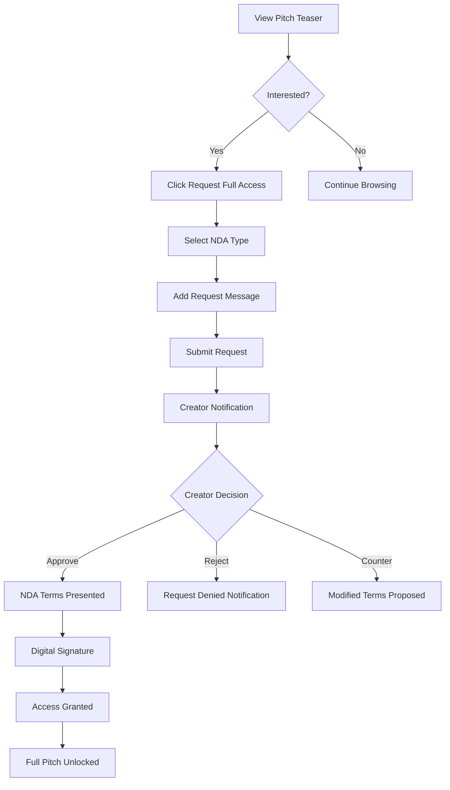

# Pitchey Business Model Documentation

## Table of Contents

1. [Business Model Overview](#1-business-model-overview)
2. [Production Company Workflow Documentation](#2-production-company-workflow-documentation)
3. [Data Flow Architecture](#3-data-flow-architecture)
4. [API Requirements Specification](#4-api-requirements-specification)
5. [Business Rules and Logic](#5-business-rules-and-logic)
6. [Implementation Roadmap](#6-implementation-roadmap)

---

## 1. Business Model Overview

### 1.1 Executive Summary

Pitchey is a B2B marketplace platform that connects creative talent with production companies and investors in the entertainment industry. The platform facilitates secure pitch discovery, evaluation, and deal-making through a sophisticated NDA management system and tiered access control.

### 1.2 Platform Value Proposition

#### Core Value Drivers
- **For Creators**: Direct access to production companies and investors, bypassing traditional gatekeepers
- **For Production Companies**: Streamlined pitch discovery, efficient evaluation pipeline, secure media management
- **For Investors**: Curated deal flow, risk assessment tools, ROI tracking
- **For the Industry**: Reduced time-to-market, democratized access, data-driven decision making

#### Competitive Advantages
1. **NDA-Protected Content Sharing**: Multi-tier access system with legal protections
2. **Verified Company Accounts**: Trust through verification of production companies and investors
3. **Comprehensive Media Management**: Support for scripts, lookbooks, budgets, timelines, and trailers
4. **Data Analytics**: Performance metrics and trend analysis for informed decision-making
5. **Integrated Communication**: In-platform messaging with off-platform request capabilities

### 1.3 Revenue Streams

#### Primary Revenue Sources

1. **Subscription Tiers**
   - **Free Tier**: Basic access, limited uploads (3 pitches)
   - **Creator Tier** ($19/month): Unlimited pitches, basic analytics
   - **Pro Tier** ($49/month): Advanced analytics, priority listing, enhanced media
   - **Investor Tier** ($299/month): Full access, due diligence tools, API access

2. **Transaction-Based Fees**
   - **Pitch Upload Fee**: $5-25 per pitch after free allocation
   - **NDA Processing Fee**: $10 per enhanced NDA
   - **Premium Placement**: $50-200 for featured pitch positioning
   - **Success Fee**: 2-5% of deals closed through platform

3. **Value-Added Services**
   - **Pitch Consulting**: $500-2000 per pitch optimization
   - **Legal Services**: Custom NDA drafting and review
   - **Marketing Campaigns**: $1000-5000 for targeted promotion
   - **White-Label Solutions**: Enterprise licensing for studios

#### Revenue Projections (Year 1-3)
- Year 1: $250K-500K (Focus on user acquisition)
- Year 2: $1M-2.5M (Scale subscriptions and transactions)
- Year 3: $3M-7M (Add success fees and enterprise)

### 1.4 User Segments

#### 1.4.1 Creators (Primary Supply Side)
- **Profile**: Independent filmmakers, writers, directors
- **Needs**: Exposure, funding, production partners
- **Size**: 50,000+ potential users globally
- **Engagement**: High (weekly active)
- **Monetization**: Subscription + upload fees

#### 1.4.2 Production Companies (Primary Demand Side)
- **Profile**: Studios, production houses, streaming platforms
- **Needs**: Quality content pipeline, risk mitigation, efficiency
- **Size**: 5,000+ companies globally
- **Engagement**: Very high (daily active)
- **Monetization**: Premium subscriptions + success fees
- **Verification Requirements**: Business registration, industry credentials

#### 1.4.3 Investors (Secondary Demand Side)
- **Profile**: Film funds, private equity, angel investors
- **Needs**: Deal flow, due diligence, ROI tracking
- **Size**: 2,000+ qualified investors
- **Engagement**: Moderate (2-3x weekly)
- **Monetization**: High-tier subscriptions + transaction fees

#### 1.4.4 Viewers (Future Segment)
- **Profile**: Industry professionals, talent agents, distributors
- **Needs**: Trend spotting, talent discovery
- **Size**: 10,000+ professionals
- **Engagement**: Low-moderate
- **Monetization**: Read-only subscriptions

### 1.5 Key Partnerships

#### Strategic Partners
1. **Legal Partners**
   - Entertainment law firms for NDA templates
   - IP protection services
   - Contract automation platforms

2. **Technology Partners**
   - AWS/Google Cloud for infrastructure
   - Stripe for payments
   - Vimeo/Mux for video hosting
   - DocuSign for digital signatures

3. **Industry Partners**
   - Film festivals for pitch competitions
   - Industry associations (PGA, WGA, DGA)
   - Film schools and programs
   - Trade publications for marketing

4. **Financial Partners**
   - Film financing institutions
   - Completion bond companies
   - Insurance providers

---

## 2. Production Company Workflow Documentation

### 2.1 Complete User Journey

#### Phase 1: Discovery & Signup

1. **Landing & Value Discovery**
   - Production company lands on platform via organic search, referral, or marketing
   - Reviews case studies and testimonials
   - Explores public pitch samples
   - Views pricing and features comparison

2. **Registration Process**
   ```
   Start → Company Info → Verification → Account Setup → Dashboard
   ```
   - **Company Information Required**:
     - Company legal name
     - Business registration number
     - Physical address
     - Website and IMDb profile
     - Previous productions (3 minimum)
     - Team member details
   
3. **Verification Workflow** (24-48 hours)
   - Automated business registry check
   - Domain ownership verification
   - Manual review of production credits
   - Verification badge assignment
   - Email notification of approval

#### Phase 2: Platform Onboarding

4. **Dashboard Orientation**
   - Guided tour of features
   - NDA template upload option
   - Team member invitation
   - Notification preferences setup
   - Search filters configuration

5. **Initial Discovery**
   - Browse trending pitches
   - Set up saved searches
   - Follow specific creators
   - Join genre-specific channels

#### Phase 3: Active Engagement

6. **Pitch Discovery Workflow**
   ```
   Search/Browse → Preview → Request NDA → Review Full → Evaluate → Action
   ```

7. **Evaluation Pipeline**
   - Quick review (30-second pitch)
   - Teaser evaluation (public info)
   - NDA request for promising pitches
   - Full pitch review with team
   - Internal scoring and notes
   - Decision logging

#### Phase 4: Deal Progression

8. **Initial Contact**
   - Send interest signal
   - Request additional materials
   - Schedule pitch meeting
   - Share initial feedback

9. **Negotiation Phase**
   - Terms discussion in-platform
   - Document exchange
   - Off-platform meeting requests
   - Deal memo creation

10. **Deal Closure**
    - Final terms agreement
    - Success fee processing
    - Platform exit for legal completion
    - Post-deal analytics

### 2.2 NDA Request and Management Process

#### 2.2.1 NDA Request Flow



#### 2.2.2 NDA Types and Features

1. **Basic NDA**
   - Standard 2-year confidentiality
   - Platform-provided template
   - Instant approval available
   - Access to: Script excerpts, detailed synopsis

2. **Enhanced NDA**
   - Custom terms negotiable
   - 3-5 year confidentiality
   - Company-specific clauses
   - Access to: Full script, budget, all media

3. **Custom NDA**
   - Company uploads own template
   - Bilateral negotiation
   - Legal review integration
   - Access to: Everything + direct contact

#### 2.2.3 NDA Management Dashboard

**Features**:
- Active NDAs overview with expiration tracking
- Pending requests queue with priority sorting
- Historical NDA archive
- Bulk NDA operations
- Compliance reporting
- Legal document vault

### 2.3 Pitch Discovery and Evaluation Workflow

#### 2.3.1 Discovery Mechanisms

1. **Smart Search**
   ```
   Filters: Genre + Budget + Format + Location + Timeline + Attachments
   ```

2. **AI-Powered Recommendations**
   - Based on viewing history
   - Similar to liked pitches
   - Trending in network
   - Match score algorithm

3. **Curated Collections**
   - Staff picks
   - Festival winners
   - Genre spotlights
   - Emerging creators

#### 2.3.2 Evaluation Tools

1. **Pitch Scoring Matrix**
   | Criterion | Weight | Score (1-10) |
   |-----------|--------|--------------|
   | Concept Originality | 25% | - |
   | Market Potential | 20% | - |
   | Budget Feasibility | 15% | - |
   | Team Experience | 15% | - |
   | Production Readiness | 15% | - |
   | IP Clarity | 10% | - |

2. **Team Collaboration Features**
   - Shared viewing rooms
   - Comment threads
   - Vote/rating system
   - Assignment workflow
   - Decision tracking

### 2.4 Communication and Negotiation Processes

#### 2.4.1 In-Platform Messaging

**Message Types**:
1. **Initial Interest** - Automated templates
2. **Information Request** - Structured forms
3. **Feedback Delivery** - Private notes
4. **Meeting Requests** - Calendar integration
5. **Offer Communication** - Encrypted channel

#### 2.4.2 Off-Platform Request Protocol

```
Request Submitted → Creator Approval → Contact Info Exchange → Audit Log
```

**Compliance Features**:
- All off-platform requests logged
- Mutual consent required
- Contact information watermarked
- Activity tracked for success fees

### 2.5 Media Access and Rights Management

#### 2.5.1 Media Types and Access Levels

| Media Type | Public | NDA Basic | NDA Enhanced | Owner |
|------------|---------|-----------|--------------|--------|
| Title Image | ✓ | ✓ | ✓ | ✓ |
| Logline | ✓ | ✓ | ✓ | ✓ |
| Short Synopsis | ✓ | ✓ | ✓ | ✓ |
| Long Synopsis | - | ✓ | ✓ | ✓ |
| Lookbook | - | Preview | ✓ | ✓ |
| Script | - | Excerpt | ✓ | ✓ |
| Budget | - | Range | ✓ | ✓ |
| Timeline | - | - | ✓ | ✓ |
| Trailer | Teaser | Full | ✓ | ✓ |
| Pitch Deck | - | - | ✓ | ✓ |

#### 2.5.2 Digital Rights Management

**Protection Mechanisms**:
- Watermarked documents with viewer ID
- Download tracking and limits
- Screen recording detection
- Time-limited access windows
- IP-based access control
- Audit trail for all access

---

## 3. Data Flow Architecture

### 3.1 User Verification Process

#### 3.1.1 Creator Verification

```
Registration → Email Verification → Profile Completion → ID Verification (Optional) → Active
```

**Data Points Collected**:
- Email (verified)
- Phone (SMS verification)
- Portfolio links
- Social media profiles
- Previous works
- Industry references

#### 3.1.2 Production Company Verification

```
Registration → Business Verification → Domain Verification → Credit Check → Manual Review → Verified Badge
```

**Verification Requirements**:
- Business registration documents
- Tax ID / EIN
- D&B number (if available)
- Company directors information
- Bank account verification
- Insurance documentation
- Previous production credits (IMDb)

**Verification Statuses**:
1. **Pending** - Awaiting document review (0-48 hours)
2. **Additional Info Required** - Missing documentation
3. **Verified** - Full platform access
4. **Verified Plus** - Premium verification with background check
5. **Suspended** - Violation of terms

### 3.2 Pitch Submission and Approval Workflow

#### 3.2.1 Submission Flow

```
Draft Creation → Content Upload → Media Attachment → Preview → Compliance Check → Publication
```

#### 3.2.2 Content Moderation Pipeline

**Automated Checks**:
1. Plagiarism detection
2. AI-content percentage
3. Copyright violation scan
4. Inappropriate content filter
5. Completeness validation

**Manual Review Triggers**:
- First-time creators
- High-budget projects (>$10M)
- Controversial themes
- Celebrity attachments
- Remake/adaptation claims

#### 3.2.3 Pitch Status Lifecycle

```
Draft → In Review → Approved → Published → Active → Archived
                  ↓
              Rejected → Revision Required → Resubmitted
```

### 3.3 NDA Lifecycle Management

#### 3.3.1 NDA Request Flow

```
Request Initiated → Creator Notified → Review Period (48hr) → Decision → Terms Agreement → Signature → Access Granted
```

#### 3.3.2 NDA Data Model

```json
{
  "nda_id": "nda_123456",
  "pitch_id": "pitch_789",
  "requester": {
    "company_id": "comp_456",
    "user_id": "user_789",
    "verification_status": "verified"
  },
  "type": "enhanced",
  "status": "active",
  "signed_date": "2025-01-20T10:00:00Z",
  "expiry_date": "2027-01-20T10:00:00Z",
  "terms": {
    "confidentiality_period": "2_years",
    "jurisdiction": "California",
    "allowed_shares": 5,
    "download_permitted": false
  },
  "access_log": [
    {
      "timestamp": "2025-01-20T10:15:00Z",
      "action": "viewed_script",
      "ip_address": "192.168.1.1",
      "session_id": "sess_abc123"
    }
  ],
  "signature_data": {
    "method": "digital",
    "timestamp": "2025-01-20T10:00:00Z",
    "ip_address": "192.168.1.1",
    "certificate": "cert_xyz789"
  }
}
```

### 3.4 Analytics and Metrics Tracking

#### 3.4.1 Pitch Analytics

**Real-time Metrics**:
- View count (unique and total)
- View duration average
- Scroll depth percentage
- Engagement score
- Interest signals (likes, saves, shares)
- NDA request rate
- Conversion funnel

**Aggregated Analytics**:
- Demographics breakdown
- Company type distribution
- Geographic heat map
- Peak viewing times
- Referral sources
- Competitor comparison

#### 3.4.2 Platform Analytics

**Key Performance Indicators (KPIs)**:
1. **User Acquisition**
   - Monthly Active Users (MAU)
   - New registrations
   - Verification completion rate
   - Churn rate

2. **Engagement Metrics**
   - Pitches per creator
   - NDAs per pitch
   - Message response rate
   - Platform session duration

3. **Business Metrics**
   - Revenue per user (ARPU)
   - Customer Lifetime Value (CLV)
   - Success fee capture rate
   - Subscription conversion rate

### 3.5 Payment and Transaction Flows

#### 3.5.1 Payment Processing

```
Payment Initiated → Stripe Processing → Webhook Confirmation → Service Activation → Receipt Generation
```

#### 3.5.2 Transaction Types

1. **Subscription Payments**
   - Recurring monthly/annual
   - Auto-renewal with notifications
   - Proration for upgrades
   - Grace period for failures

2. **One-time Fees**
   - Pitch uploads
   - NDA processing
   - Premium placement
   - Additional services

3. **Success Fees**
   - Deal value declaration
   - Percentage calculation
   - Invoice generation
   - Payment terms (NET 30)

---

## 4. API Requirements Specification

### 4.1 Complete List of Required Endpoints

#### 4.1.1 Authentication & Authorization

```typescript
POST   /api/auth/register
POST   /api/auth/login
POST   /api/auth/logout
POST   /api/auth/refresh
POST   /api/auth/forgot-password
POST   /api/auth/reset-password
POST   /api/auth/verify-email
POST   /api/auth/verify-company
GET    /api/auth/session
```

#### 4.1.2 User Management

```typescript
GET    /api/users/profile
PUT    /api/users/profile
DELETE /api/users/profile
POST   /api/users/upload-avatar
GET    /api/users/{id}/public
POST   /api/users/invite-team-member
GET    /api/users/team
PUT    /api/users/settings
GET    /api/users/notifications
PUT    /api/users/notifications/{id}/read
```

#### 4.1.3 Company Management

```typescript
POST   /api/companies/register
GET    /api/companies/{id}
PUT    /api/companies/{id}
POST   /api/companies/verify
GET    /api/companies/verification-status
POST   /api/companies/upload-documents
GET    /api/companies/team-members
POST   /api/companies/invite-member
DELETE /api/companies/remove-member/{id}
PUT    /api/companies/member-role/{id}
```

#### 4.1.4 Pitch Management

```typescript
GET    /api/pitches
POST   /api/pitches
GET    /api/pitches/{id}
PUT    /api/pitches/{id}
DELETE /api/pitches/{id}
POST   /api/pitches/{id}/publish
POST   /api/pitches/{id}/archive
GET    /api/pitches/{id}/analytics
POST   /api/pitches/{id}/like
POST   /api/pitches/{id}/follow
POST   /api/pitches/{id}/report
GET    /api/pitches/trending
GET    /api/pitches/recommended
GET    /api/pitches/search
```

#### 4.1.5 Media Management

```typescript
POST   /api/media/upload
GET    /api/media/{id}
DELETE /api/media/{id}
POST   /api/media/generate-upload-url
GET    /api/media/pitch/{pitchId}
PUT    /api/media/{id}/visibility
GET    /api/media/{id}/download-url
```

#### 4.1.6 NDA Management

```typescript
POST   /api/ndas/request
GET    /api/ndas/incoming
GET    /api/ndas/outgoing
GET    /api/ndas/signed
POST   /api/ndas/{id}/approve
POST   /api/ndas/{id}/reject
POST   /api/ndas/{id}/counter
POST   /api/ndas/{id}/sign
GET    /api/ndas/{id}/document
GET    /api/ndas/{id}/access-log
POST   /api/ndas/templates
GET    /api/ndas/templates
```

#### 4.1.7 Messaging

```typescript
GET    /api/messages
POST   /api/messages
GET    /api/messages/conversations
GET    /api/messages/conversation/{id}
PUT    /api/messages/{id}/read
DELETE /api/messages/{id}
POST   /api/messages/off-platform-request
```

#### 4.1.8 Search & Discovery

```typescript
GET    /api/search
GET    /api/search/filters
POST   /api/search/saved
GET    /api/search/saved
DELETE /api/search/saved/{id}
GET    /api/discover/trending
GET    /api/discover/categories
GET    /api/discover/featured
GET    /api/discover/similar/{pitchId}
```

#### 4.1.9 Analytics

```typescript
GET    /api/analytics/dashboard
GET    /api/analytics/pitch/{id}
GET    /api/analytics/portfolio
GET    /api/analytics/audience
GET    /api/analytics/engagement
GET    /api/analytics/revenue
POST   /api/analytics/export
```

#### 4.1.10 Payments

```typescript
POST   /api/payments/create-subscription
POST   /api/payments/update-subscription
POST   /api/payments/cancel-subscription
GET    /api/payments/invoices
GET    /api/payments/payment-methods
POST   /api/payments/payment-methods
DELETE /api/payments/payment-methods/{id}
POST   /api/payments/process-fee
POST   /api/webhooks/stripe
```

### 4.2 Request/Response Schemas

#### 4.2.1 Standard Response Format

```typescript
interface ApiResponse<T> {
  success: boolean;
  data?: T;
  error?: {
    code: string;
    message: string;
    details?: any;
  };
  metadata?: {
    timestamp: string;
    requestId: string;
    pagination?: {
      page: number;
      limit: number;
      total: number;
      hasMore: boolean;
    };
  };
}
```

#### 4.2.2 Key Entity Schemas

**Pitch Entity**
```typescript
interface Pitch {
  id: string;
  userId: string;
  title: string;
  logline: string;
  genre: Genre;
  format: Format;
  status: PitchStatus;
  synopsis: {
    short: string;
    long?: string;
  };
  budget: {
    bracket: BudgetBracket;
    estimated?: number;
    currency: string;
  };
  media: {
    titleImage?: string;
    lookbook?: MediaFile;
    script?: MediaFile;
    pitchDeck?: MediaFile;
    trailer?: MediaFile;
    budgetBreakdown?: MediaFile;
    productionTimeline?: MediaFile;
    additionalFiles?: MediaFile[];
  };
  visibility: {
    public: VisibilitySettings;
    nda: VisibilitySettings;
  };
  metrics: {
    views: number;
    likes: number;
    follows: number;
    ndaRequests: number;
    messages: number;
  };
  createdAt: string;
  updatedAt: string;
  publishedAt?: string;
}
```

**NDA Entity**
```typescript
interface NDA {
  id: string;
  pitchId: string;
  requesterId: string;
  creatorId: string;
  type: 'basic' | 'enhanced' | 'custom';
  status: 'pending' | 'approved' | 'rejected' | 'signed' | 'expired';
  terms: {
    confidentialityPeriod: string;
    jurisdiction: string;
    customClauses?: string[];
  };
  requestedAt: string;
  signedAt?: string;
  expiresAt?: string;
  accessLog: AccessLogEntry[];
}
```

### 4.3 Authentication and Authorization Requirements

#### 4.3.1 Authentication Methods

1. **JWT Token Authentication**
   - Access token (15 minutes TTL)
   - Refresh token (30 days TTL)
   - Secure HttpOnly cookies for web
   - Bearer token for mobile/API

2. **Multi-Factor Authentication (MFA)**
   - SMS verification
   - Authenticator app (TOTP)
   - Email verification codes
   - Backup codes

#### 4.3.2 Role-Based Access Control (RBAC)

```typescript
enum Role {
  ADMIN = 'admin',
  PRODUCTION_VERIFIED = 'production_verified',
  PRODUCTION = 'production',
  INVESTOR_VERIFIED = 'investor_verified',
  INVESTOR = 'investor',
  CREATOR_PRO = 'creator_pro',
  CREATOR = 'creator',
  VIEWER = 'viewer'
}

interface Permissions {
  pitches: {
    create: boolean;
    edit: boolean;
    delete: boolean;
    publish: boolean;
    viewPrivate: boolean;
  };
  ndas: {
    request: boolean;
    approve: boolean;
    sign: boolean;
    viewTerms: boolean;
  };
  messages: {
    send: boolean;
    requestOffPlatform: boolean;
  };
  analytics: {
    viewOwn: boolean;
    viewAll: boolean;
    export: boolean;
  };
}
```

### 4.4 Rate Limiting and Security Considerations

#### 4.4.1 Rate Limiting Rules

| Endpoint Category | Authenticated | Unauthenticated |
|------------------|---------------|-----------------|
| Auth endpoints | 5/minute | 3/minute |
| Read operations | 100/minute | 10/minute |
| Write operations | 30/minute | - |
| Search | 20/minute | 5/minute |
| Media upload | 10/hour | - |
| Bulk operations | 5/hour | - |

#### 4.4.2 Security Requirements

1. **Data Encryption**
   - TLS 1.3 for all communications
   - AES-256 for data at rest
   - End-to-end encryption for messages
   - Encrypted file storage (S3 SSE)

2. **Input Validation**
   - Schema validation (Zod/Joi)
   - SQL injection prevention
   - XSS protection
   - CSRF tokens
   - File type validation

3. **Audit Logging**
   - All authentication attempts
   - NDA signatures and access
   - Payment transactions
   - Data exports
   - Admin actions
   - Off-platform requests

4. **Compliance**
   - GDPR compliance (EU)
   - CCPA compliance (California)
   - Industry-standard NDA terms
   - IP protection measures
   - Content moderation

---

## 5. Business Rules and Logic

### 5.1 NDA Types and Access Levels

#### 5.1.1 Access Level Matrix

| Content Type | Public View | Basic NDA | Enhanced NDA | Custom NDA | Owner Access |
|--------------|-------------|-----------|--------------|------------|--------------|
| **Basic Info** |
| Title | ✓ | ✓ | ✓ | ✓ | ✓ |
| Logline | ✓ | ✓ | ✓ | ✓ | ✓ |
| Genre/Format | ✓ | ✓ | ✓ | ✓ | ✓ |
| **Synopsis** |
| Short (250 words) | ✓ | ✓ | ✓ | ✓ | ✓ |
| Long (2000 words) | - | ✓ | ✓ | ✓ | ✓ |
| **Characters** |
| Main Characters | Preview | ✓ | ✓ | ✓ | ✓ |
| Full Cast | - | - | ✓ | ✓ | ✓ |
| **Financial** |
| Budget Range | ✓ | ✓ | ✓ | ✓ | ✓ |
| Detailed Budget | - | - | ✓ | ✓ | ✓ |
| ROI Projections | - | - | ✓ | ✓ | ✓ |
| **Media** |
| Poster/Images | ✓ | ✓ | ✓ | ✓ | ✓ |
| Teaser (30s) | ✓ | ✓ | ✓ | ✓ | ✓ |
| Trailer (Full) | - | ✓ | ✓ | ✓ | ✓ |
| Lookbook | - | Preview | ✓ | ✓ | ✓ |
| Script | - | First 10 pages | ✓ | ✓ | ✓ |
| Pitch Deck | - | - | ✓ | ✓ | ✓ |
| **Production** |
| Timeline | - | - | ✓ | ✓ | ✓ |
| Locations | - | - | ✓ | ✓ | ✓ |
| Attached Talent | - | Partial | ✓ | ✓ | ✓ |
| **Contact** |
| Platform Message | - | ✓ | ✓ | ✓ | ✓ |
| Direct Contact | - | - | - | ✓ | ✓ |

#### 5.1.2 NDA Business Rules

1. **Request Limits**
   - Free users: 5 NDA requests/month
   - Creator tier: 20 NDA requests/month
   - Pro tier: 50 NDA requests/month
   - Investor tier: Unlimited

2. **Approval Requirements**
   - Basic NDA: Auto-approve option available
   - Enhanced NDA: Creator approval required
   - Custom NDA: Negotiation required

3. **Expiration Rules**
   - Basic: 2 years from signature
   - Enhanced: 3-5 years negotiable
   - Custom: As per agreement
   - Auto-reminder 30 days before expiry

### 5.2 Pitch Visibility Settings

#### 5.2.1 Visibility Levels

1. **Private** (Draft)
   - Only visible to creator
   - Not indexed or searchable
   - Can invite specific viewers

2. **Unlisted**
   - Accessible via direct link only
   - Not in search results
   - No trending/discovery

3. **Public**
   - Fully searchable
   - Appears in discovery
   - Eligible for trending

4. **Restricted**
   - Geographic restrictions
   - Industry-type restrictions
   - Company-size restrictions

#### 5.2.2 Content Protection Rules

1. **Watermarking**
   - Dynamic watermarks with viewer info
   - IP address and timestamp
   - Traceable to specific session

2. **Download Restrictions**
   - No downloads on Basic NDA
   - Limited downloads on Enhanced
   - Full downloads on Custom (if agreed)

3. **Screenshot Prevention**
   - JavaScript-based deterrent
   - Warning messages
   - Activity logging

### 5.3 User Verification Requirements

#### 5.3.1 Creator Verification Levels

**Level 1: Basic (Email Verified)**
- Email confirmation required
- Limited to 3 pitches
- Basic analytics only

**Level 2: Standard (ID Verified)**
- Government ID verification
- Phone number verification
- Unlimited pitches
- Full analytics access

**Level 3: Professional (Portfolio Verified)**
- Previous work verification
- Industry references
- Priority support
- Verified badge display

#### 5.3.2 Company Verification Requirements

**Required Documents**:
1. Business registration certificate
2. Tax identification number
3. Company directors list
4. Office address proof
5. Bank account verification
6. Website ownership proof
7. Previous production credits (3 minimum)

**Verification Process**:
- Document upload: Day 1
- Automated checks: Day 1-2
- Manual review: Day 2-3
- Additional info request (if needed): Day 3-4
- Final approval: Day 4-5

### 5.4 Content Moderation Guidelines

#### 5.4.1 Prohibited Content

1. **Copyright Violations**
   - Unauthorized adaptations
   - Plagiarized content
   - Trademark infringements

2. **Inappropriate Material**
   - Hate speech or discrimination
   - Excessive violence without context
   - Illegal activities promotion

3. **Misleading Information**
   - False attachment claims
   - Fabricated credentials
   - Misleading budget information

#### 5.4.2 Moderation Process

```
Submission → AI Scan → Risk Score → Manual Review (if flagged) → Decision
```

**AI Scanning Checks**:
- Plagiarism detection (>15% triggers review)
- AI-generated content (>50% requires disclosure)
- Inappropriate content detection
- Copyright matching

### 5.5 Revenue Sharing Models

#### 5.5.1 Platform Fee Structure

**Subscription Revenue**: 100% to platform

**Transaction Fees**:
- Upload fees: 100% to platform
- NDA processing: 100% to platform
- Success fees: 100% to platform

**Premium Services Revenue Split**:
- Pitch consulting: 70% consultant, 30% platform
- Legal services: 80% legal partner, 20% platform
- Marketing campaigns: 60% service, 40% platform

#### 5.5.2 Success Fee Calculation

```
Deal Value | Platform Fee
-----------|-------------
< $100K    | 2%
$100K-$1M  | 3%
$1M-$10M   | 4%
> $10M     | 5%
```

**Fee Triggers**:
- Option agreement signed
- Purchase agreement executed
- Production commitment
- Distribution deal

**Payment Terms**:
- Invoice upon deal confirmation
- NET 30 payment terms
- 2% monthly late fee
- Collection agency after 90 days

---

## 6. Implementation Roadmap

### 6.1 Priority 1: Core Functionality Gaps (Weeks 1-4)

#### Week 1-2: NDA System Enhancement

**Backend Development**:
```typescript
// Required NDA endpoints
POST /api/ndas/request
POST /api/ndas/{id}/approve
POST /api/ndas/{id}/reject
POST /api/ndas/{id}/sign
GET  /api/ndas/{id}/access-log
POST /api/ndas/templates/upload
```

**Database Updates**:
```sql
-- Add NDA request tracking
CREATE TABLE nda_requests (
  id SERIAL PRIMARY KEY,
  pitch_id INTEGER REFERENCES pitches(id),
  requester_id INTEGER REFERENCES users(id),
  creator_id INTEGER REFERENCES users(id),
  type VARCHAR(20),
  status VARCHAR(20),
  message TEXT,
  requested_at TIMESTAMP,
  responded_at TIMESTAMP
);

-- Add NDA templates
CREATE TABLE nda_templates (
  id SERIAL PRIMARY KEY,
  company_id INTEGER REFERENCES users(id),
  name VARCHAR(200),
  template_url TEXT,
  is_default BOOLEAN,
  created_at TIMESTAMP
);
```

**Frontend Components**:
- NDA request modal with message
- NDA approval/rejection interface
- Digital signature component
- NDA management dashboard
- Access log viewer

#### Week 3-4: Company Verification System

**Implementation Tasks**:
1. Document upload interface
2. Verification workflow engine
3. Manual review queue for admins
4. Verification status tracking
5. Email notifications system

**API Endpoints**:
```typescript
POST /api/companies/verify/initiate
POST /api/companies/verify/upload-document
GET  /api/companies/verify/status
POST /api/admin/verify/review
POST /api/admin/verify/approve
POST /api/admin/verify/request-info
```

### 6.2 Priority 2: Enhanced Features (Weeks 5-12)

#### Week 5-6: Advanced Media Management

**Features**:
- Multi-file upload with progress
- Video streaming integration
- Document watermarking service
- Secure download links
- Media analytics tracking

**Technical Requirements**:
- S3 integration with presigned URLs
- CDN setup for media delivery
- FFmpeg for video processing
- PDF watermarking library
- Download tracking system

#### Week 7-8: Analytics Dashboard

**Production Company Analytics**:
- Pitch performance metrics
- Audience demographics
- Engagement funnel
- Competition analysis
- ROI projections

**Creator Analytics**:
- View sources breakdown
- Engagement heatmap
- NDA conversion rate
- Message response rate
- Trending position

#### Week 9-10: Messaging System Enhancement

**Features**:
- Real-time messaging with WebSockets
- Message templates library
- Bulk messaging for announcements
- Off-platform request workflow
- Message encryption

**Implementation**:
```typescript
// WebSocket events
socket.on('message:new', (data) => {})
socket.on('message:read', (data) => {})
socket.on('user:typing', (data) => {})
socket.on('user:online', (data) => {})
```

#### Week 11-12: Payment Integration

**Stripe Integration**:
- Subscription management
- Invoice generation
- Payment method management
- Webhook handlers
- Failed payment recovery

**Success Fee Tracking**:
- Deal registration form
- Invoice generation
- Payment tracking
- Collections workflow

### 6.3 Priority 3: Nice-to-Have Features (Weeks 13-20)

#### Week 13-14: AI-Powered Features

**Implementations**:
1. **Pitch Scoring AI**
   - Concept originality detection
   - Market potential analysis
   - Success probability score

2. **Smart Matching**
   - Creator-Production company matching
   - Similar pitch recommendations
   - Investor preference matching

3. **Content Enhancement**
   - Logline optimization
   - Synopsis improvement suggestions
   - Character development tips

#### Week 15-16: Mobile Applications

**React Native Development**:
- iOS and Android apps
- Push notifications
- Offline pitch viewing
- Mobile-optimized media player
- Biometric authentication

#### Week 17-18: Advanced Collaboration Tools

**Features**:
- Virtual pitch rooms
- Screen sharing capability
- Collaborative note-taking
- Team workspaces
- Project management integration

#### Week 19-20: International Expansion

**Localization**:
- Multi-language support (Spanish, French, German, Mandarin)
- Currency conversion
- Regional compliance (GDPR, etc.)
- Local payment methods
- Regional content preferences

### 6.4 Timeline and Dependencies

#### 6.4.1 Critical Path

```
Week 1-2: NDA System (Blocks all premium features)
    ↓
Week 3-4: Verification (Blocks trust features)
    ↓
Week 5-6: Media Management (Blocks content features)
    ↓
Week 7-8: Analytics (Blocks business intelligence)
    ↓
Week 9-10: Messaging (Blocks communication)
    ↓
Week 11-12: Payments (Blocks monetization)
```

#### 6.4.2 Resource Requirements

**Development Team**:
- 2 Backend Engineers (Node.js/Deno)
- 2 Frontend Engineers (React)
- 1 DevOps Engineer
- 1 UI/UX Designer
- 1 Product Manager
- 1 QA Engineer

**Infrastructure**:
- AWS/GCP cloud services
- PostgreSQL database cluster
- Redis cache cluster
- CDN (CloudFlare/Fastly)
- Email service (SendGrid)
- SMS service (Twilio)

#### 6.4.3 Budget Estimation

**Development Costs** (20 weeks):
- Team salaries: $400,000
- Infrastructure: $20,000
- Third-party services: $10,000
- Legal/Compliance: $30,000
- **Total: $460,000**

**Ongoing Monthly Costs**:
- Infrastructure: $5,000
- Services/APIs: $2,000
- Support staff: $15,000
- Marketing: $10,000
- **Total: $32,000/month**

### 6.5 Success Metrics and KPIs

#### 6.5.1 Launch Metrics (Month 1)

| Metric | Target | Measurement |
|--------|---------|------------|
| User Registrations | 500 | Total signups |
| Company Verifications | 20 | Verified production companies |
| Pitches Uploaded | 100 | Published pitches |
| NDAs Signed | 50 | Completed NDAs |
| Platform Uptime | 99.9% | Monitoring tools |

#### 6.5.2 Growth Metrics (Month 3-6)

| Metric | Month 3 | Month 6 | Measurement |
|--------|---------|----------|------------|
| MAU | 2,500 | 10,000 | Active users |
| Paying Users | 250 | 1,500 | Subscriptions |
| Pitches | 500 | 2,500 | Total published |
| NDAs/Month | 200 | 1,000 | Signed NDAs |
| Revenue | $10K | $50K | MRR |

#### 6.5.3 Success Indicators (Year 1)

**Quantitative Goals**:
- 25,000 registered users
- 5,000 paying subscribers
- 10,000 published pitches
- 100 verified production companies
- 50 verified investors
- $250K ARR
- 5 successful deals closed

**Qualitative Goals**:
- Industry recognition (press coverage)
- Strategic partnerships (3 major studios)
- User satisfaction (NPS > 50)
- Creator success stories (10 documented)
- Platform stability (99.9% uptime)

---

## Conclusion

This comprehensive business model documentation provides a complete blueprint for the Pitchey platform's development and growth. The implementation roadmap prioritizes critical functionality while building toward a robust, scalable marketplace that serves all stakeholders in the entertainment industry.

The success of Pitchey depends on executing the core NDA and verification systems first, followed by enhanced features that differentiate the platform, and finally expanding with nice-to-have features that capture additional market segments.

With proper execution of this roadmap, Pitchey is positioned to become the leading B2B marketplace for entertainment industry pitch discovery and deal-making, generating significant value for creators, production companies, and investors alike.