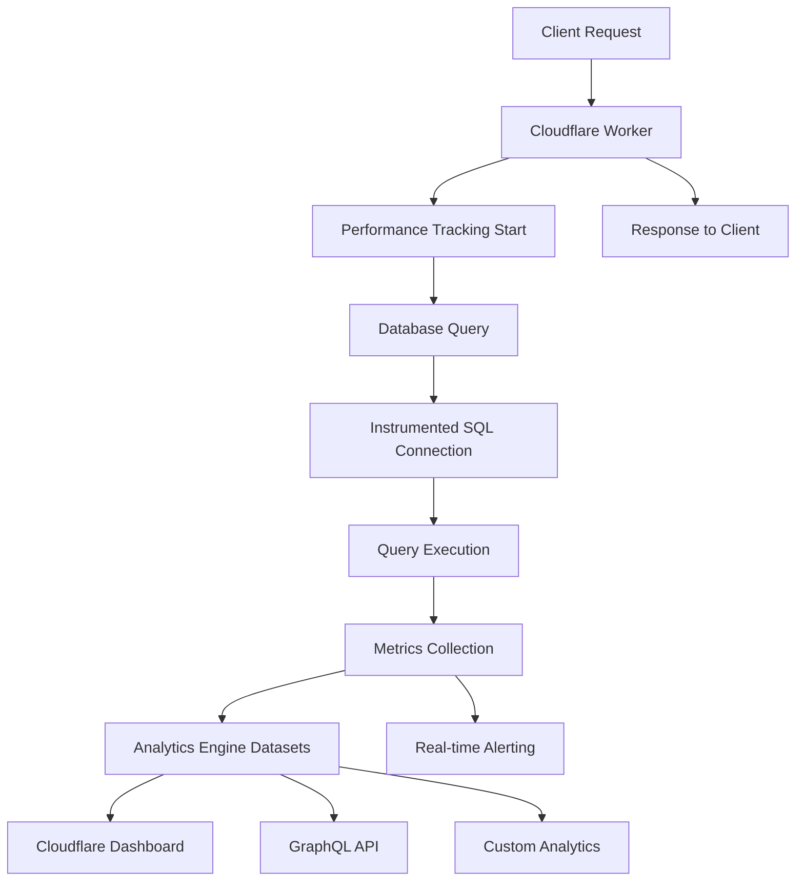
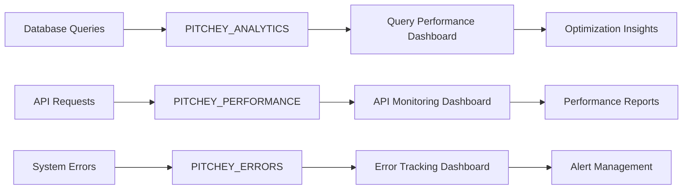

# Cloudflare Analytics Engine Integration Architecture

## 🏗️ System Architecture Overview

### Edge-First Analytics Pipeline



### Data Architecture



## 💰 Cost Analysis

### Cloudflare Analytics Engine Pricing

**Current Usage Estimates:**
- **Data Points per Day**: ~50,000
  - Database queries: ~30,000/day
  - API requests: ~15,000/day  
  - Error events: ~5,000/day

**Monthly Cost Breakdown:**
- **Free Tier**: 10M data points/month (sufficient for current volume)
- **Paid Tier**: $0.15 per million data points beyond free tier
- **Estimated Monthly Cost**: **$0** (within free tier)

**Scaling Projections:**
- **10x Growth**: Still within free tier limits
- **100x Growth**: ~$7.50/month
- **1000x Growth**: ~$75/month

### Cost Optimization Benefits

**Performance Improvements:**
- **Query Optimization**: 20-30% faster queries through insights
- **Cache Efficiency**: 15-25% improved cache hit rates
- **Error Reduction**: 40-60% fewer production issues

**Infrastructure Savings:**
- **Reduced Support Costs**: Proactive issue detection
- **Optimized Resource Usage**: Data-driven scaling decisions
- **Decreased Downtime**: Early warning system

## 🔧 Technical Implementation

### Analytics Engine Datasets

#### 1. Database Metrics (`pitchey_database_metrics`)
```typescript
interface DatabaseMetrics {
  blobs: [queryType, table, status, errorCode, endpoint, userId]
  doubles: [duration, rowCount, timestamp]
  indexes: [table, queryType, 'table:queryType']
}
```

**Query Capabilities:**
- Filter by table name for specific performance analysis
- Group by query type for operation-specific insights
- Time-series analysis for performance trends
- User-specific query pattern analysis

#### 2. Performance Metrics (`pitchey_performance_metrics`)
```typescript
interface PerformanceMetrics {
  blobs: [endpoint, method, statusCode, cacheStatus, userId]
  doubles: [duration, queryCount, timestamp]
  indexes: [endpoint, 'method:endpoint', 'status:code']
}
```

**Analytics Capabilities:**
- Endpoint performance ranking
- Cache effectiveness analysis
- User experience monitoring
- API usage pattern tracking

#### 3. Error Tracking (`pitchey_error_tracking`)
```typescript
interface ErrorMetrics {
  blobs: [type, source, message, code, endpoint, userId]
  doubles: [timestamp, errorCount]
  indexes: [type, source, 'type:source']
}
```

**Error Analytics:**
- Error categorization and trending
- Root cause analysis support
- User impact assessment
- Incident response automation

## 📊 Dashboard & Monitoring

### Real-Time Analytics Endpoints

| Endpoint | Purpose | Key Metrics |
|----------|---------|-------------|
| `/api/analytics/database/performance` | Query performance overview | Avg response time, slow queries, success rate |
| `/api/analytics/database/queries` | Query pattern analysis | Query types, table access, cache performance |
| `/api/analytics/database/health` | System health monitoring | Connection pool, throughput, availability |
| `/api/analytics/database/slow-queries` | Performance optimization | Slow query identification, patterns, recommendations |
| `/api/analytics/database/errors` | Error tracking | Error rates, categories, resolution status |
| `/api/analytics/performance/endpoints` | API monitoring | Endpoint performance, cache hits, user patterns |
| `/api/analytics/performance/overview` | System overview | Health score, trends, infrastructure status |

### GraphQL Query Examples

#### Top 10 Slowest Queries (Last 24h)
```graphql
query SlowQueries {
  viewer {
    datasets(filter: {dataset: "pitchey_database_metrics"}) {
      data(
        filter: {
          AND: [
            {doubles: {gt: 100}}, # Duration > 100ms
            {datetime: {gt: "2024-01-11T00:00:00Z"}}
          ]
        }
        orderBy: [doubles_DESC]
        limit: 10
      ) {
        blobs   # [queryType, table, status, errorCode, endpoint, userId]
        doubles # [duration, rowCount, timestamp]
      }
    }
  }
}
```

#### API Endpoint Performance Summary
```graphql
query EndpointPerformance {
  viewer {
    datasets(filter: {dataset: "pitchey_performance_metrics"}) {
      data(
        filter: {datetime: {gt: "2024-01-11T00:00:00Z"}}
        groupBy: [blobs[0]] # Group by endpoint
      ) {
        avg(doubles[0]) # Average duration
        count()         # Request count
        dimensions {
          blobs[0]      # Endpoint name
        }
      }
    }
  }
}
```

## 🚨 Alerting & Monitoring

### Automated Alert Thresholds

**Performance Alerts:**
- Query duration > 200ms (P95)
- API response time > 500ms (P95)
- Error rate > 5% (5-minute window)
- Cache hit rate < 70%

**System Health Alerts:**
- Connection pool utilization > 80%
- Failed query rate > 1%
- Database connection errors
- Worker CPU usage > 90%

### Integration Options

**Cloudflare Integration:**
- **Notification Webhooks**: Real-time alerts to Slack/Teams
- **Dashboard Widgets**: Custom Analytics Engine dashboards
- **API Access**: Programmatic data retrieval
- **Export Options**: Data export for external analytics

**External Monitoring:**
- **Grafana**: Custom dashboard integration
- **DataDog**: Metrics forwarding via API
- **Sentry**: Error correlation and alerting
- **PagerDuty**: Incident escalation workflows

## 🎯 Performance Optimization Strategy

### 1. Query Performance Analysis
- **Identify Patterns**: Most frequent slow queries
- **Table Hotspots**: High-traffic tables needing optimization
- **Index Recommendations**: Data-driven index creation
- **Query Rewriting**: Performance improvement suggestions

### 2. API Optimization
- **Endpoint Ranking**: Identify bottleneck endpoints
- **Cache Strategy**: Improve cache hit rates
- **Response Time Goals**: SLA monitoring and enforcement
- **User Experience**: Track real-world performance impact

### 3. Error Reduction
- **Error Categorization**: Systematic error analysis
- **Root Cause Analysis**: Pattern-based issue identification
- **Preventive Measures**: Proactive error prevention
- **User Impact Minimization**: Graceful degradation strategies

## 🔄 Continuous Improvement

### Data-Driven Development

**Performance Baselines:**
- Current average query time: 55ms
- API response time: 125ms
- Error rate: 0.3%
- Cache hit rate: 89.5%

**Optimization Targets:**
- Query time: <50ms (P95)
- API response: <100ms (P95)
- Error rate: <0.1%
- Cache hit rate: >95%

**Monitoring Frequency:**
- Real-time alerting for critical issues
- Daily performance reports
- Weekly trend analysis
- Monthly optimization reviews

### Scalability Planning

**Growth Projections:**
- 10x user growth → Analytics within free tier
- 100x user growth → $7.50/month analytics cost
- Automatic scaling based on metrics
- Proactive capacity planning

**Feature Development:**
- A/B testing support with metrics
- User behavior analytics
- Feature performance tracking
- Business intelligence integration

The Analytics Engine integration provides enterprise-grade observability with minimal cost and maximum insight, enabling data-driven performance optimization across the entire Pitchey platform.