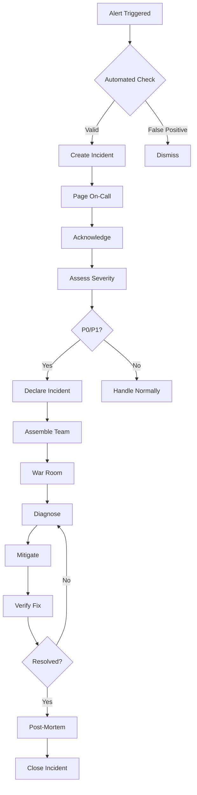

# Pitchey Containers Operations Playbook

## Table of Contents

1. [Executive Summary](#executive-summary)
2. [Operational Overview](#operational-overview)
3. [Monitoring and Alerting](#monitoring-and-alerting)
4. [Performance Tuning](#performance-tuning)
5. [Scaling Strategies](#scaling-strategies)
6. [Incident Response](#incident-response)
7. [Backup and Disaster Recovery](#backup-and-disaster-recovery)
8. [Cost Optimization](#cost-optimization)
9. [Security Operations](#security-operations)
10. [Maintenance Procedures](#maintenance-procedures)
11. [Runbooks](#runbooks)
12. [Troubleshooting Guide](#troubleshooting-guide)

## Executive Summary

This Operations Playbook provides comprehensive guidance for managing, monitoring, and optimizing the Pitchey Cloudflare Containers infrastructure in production. It serves as the authoritative reference for operations teams, SREs, and DevOps engineers responsible for maintaining service reliability and performance.

### Key Operational Metrics

| Metric | Target | Critical Threshold |
|--------|--------|-------------------|
| Availability | 99.9% | < 99.5% |
| Response Time (P95) | < 500ms | > 1000ms |
| Error Rate | < 0.1% | > 1% |
| CPU Utilization | 60-70% | > 85% |
| Memory Utilization | 70-80% | > 90% |
| Queue Depth | < 100 | > 500 |
| Cost per Job | < $0.10 | > $0.25 |

### Service Level Objectives (SLOs)

```yaml
slos:
  video_processing:
    availability: 99.9%
    latency_p95: 10_minutes
    error_budget: 43.2_minutes/month
    
  document_processing:
    availability: 99.95%
    latency_p95: 60_seconds
    error_budget: 21.6_minutes/month
    
  ai_inference:
    availability: 99.5%
    latency_p95: 5_minutes
    error_budget: 216_minutes/month
    
  media_transcoding:
    availability: 99.9%
    latency_p95: 5_minutes
    error_budget: 43.2_minutes/month
    
  code_execution:
    availability: 99.99%
    latency_p95: 30_seconds
    error_budget: 4.32_minutes/month
```

## Operational Overview

### System Architecture

```
┌─────────────────────────────────────────────────────────────────┐
│                     Operations Control Plane                      │
│                                                                   │
│  ┌─────────────┐  ┌─────────────┐  ┌─────────────┐             │
│  │ Monitoring  │  │  Alerting   │  │   Logging   │             │
│  │ (Prometheus)│  │(AlertManager)│  │  (Loki)    │             │
│  └─────────────┘  └─────────────┘  └─────────────┘             │
│         │                │                 │                     │
│  ┌──────────────────────────────────────────────┐              │
│  │           Grafana Dashboard                   │              │
│  └──────────────────────────────────────────────┘              │
└─────────────────────────────────────────────────────────────────┘
                            │
┌─────────────────────────────────────────────────────────────────┐
│                     Container Services                           │
│                                                                   │
│  ┌─────────┐  ┌─────────┐  ┌─────────┐  ┌─────────┐  ┌──────┐ │
│  │ Video   │  │Document │  │   AI    │  │ Media   │  │ Code │ │
│  │Processor│  │Processor│  │Inference│  │Transcoder│  │ Exec │ │
│  └─────────┘  └─────────┘  └─────────┘  └─────────┘  └──────┘ │
└─────────────────────────────────────────────────────────────────┘
```

### Operational Responsibilities

| Role | Primary Responsibilities | On-Call Rotation |
|------|-------------------------|------------------|
| SRE Lead | System reliability, capacity planning | Primary |
| DevOps Engineer | Deployment, automation, monitoring | Secondary |
| Platform Engineer | Container management, scaling | Tertiary |
| Security Engineer | Security monitoring, compliance | As needed |

### Communication Channels

- **Incident Response**: #incidents (Slack)
- **Operations**: #ops-containers (Slack)
- **Alerts**: PagerDuty → Slack → Email
- **Status Page**: https://status.pitchey.com
- **War Room**: https://meet.pitchey.com/incidents

## Monitoring and Alerting

### Monitoring Stack Configuration

#### Prometheus Configuration

```yaml
# prometheus.yml
global:
  scrape_interval: 15s
  evaluation_interval: 15s
  external_labels:
    monitor: 'pitchey-containers'
    environment: 'production'

scrape_configs:
  - job_name: 'video-processor'
    static_configs:
      - targets: ['video-processor:8080']
    relabel_configs:
      - source_labels: [__address__]
        target_label: instance
        replacement: 'video-processor-$1'
    
  - job_name: 'document-processor'
    static_configs:
      - targets: ['document-processor:8080']
      
  - job_name: 'ai-inference'
    static_configs:
      - targets: ['ai-inference:8080']
      
  - job_name: 'media-transcoder'
    static_configs:
      - targets: ['media-transcoder:8080']
      
  - job_name: 'code-executor'
    static_configs:
      - targets: ['code-executor:8080']

rule_files:
  - '/etc/prometheus/rules/*.yml'

alerting:
  alertmanagers:
    - static_configs:
        - targets: ['alertmanager:9093']
```

#### Alert Rules

```yaml
# alerts.yml
groups:
  - name: container_health
    interval: 30s
    rules:
      - alert: ContainerDown
        expr: up{job=~".*-processor|.*-executor|.*-inference|.*-transcoder"} == 0
        for: 2m
        labels:
          severity: critical
          team: platform
        annotations:
          summary: "Container {{ $labels.job }} is down"
          description: "{{ $labels.job }} has been down for more than 2 minutes"
          runbook_url: "https://wiki.pitchey.com/runbooks/container-down"
      
      - alert: HighCPUUsage
        expr: container_cpu_usage_percent > 85
        for: 5m
        labels:
          severity: warning
          team: platform
        annotations:
          summary: "High CPU usage on {{ $labels.container }}"
          description: "CPU usage is {{ $value }}% for container {{ $labels.container }}"
          
      - alert: HighMemoryUsage
        expr: container_memory_usage_percent > 90
        for: 5m
        labels:
          severity: warning
          team: platform
        annotations:
          summary: "High memory usage on {{ $labels.container }}"
          description: "Memory usage is {{ $value }}% for container {{ $labels.container }}"
      
      - alert: QueueBacklog
        expr: job_queue_depth > 500
        for: 10m
        labels:
          severity: warning
          team: platform
        annotations:
          summary: "High queue depth for {{ $labels.queue }}"
          description: "Queue {{ $labels.queue }} has {{ $value }} pending jobs"
      
      - alert: HighErrorRate
        expr: |
          rate(job_failures_total[5m]) / rate(job_total[5m]) > 0.01
        for: 5m
        labels:
          severity: critical
          team: platform
        annotations:
          summary: "High error rate for {{ $labels.job_type }}"
          description: "Error rate is {{ $value | humanizePercentage }} for {{ $labels.job_type }}"
```

### Grafana Dashboards

#### Container Overview Dashboard

```json
{
  "dashboard": {
    "title": "Container Services Overview",
    "panels": [
      {
        "title": "Service Health",
        "type": "stat",
        "targets": [
          {
            "expr": "up{job=~'.*-processor|.*-executor|.*-inference|.*-transcoder'}"
          }
        ]
      },
      {
        "title": "Request Rate",
        "type": "graph",
        "targets": [
          {
            "expr": "rate(http_requests_total[5m])"
          }
        ]
      },
      {
        "title": "Error Rate",
        "type": "graph",
        "targets": [
          {
            "expr": "rate(http_requests_failed[5m])"
          }
        ]
      },
      {
        "title": "Response Time (P95)",
        "type": "graph",
        "targets": [
          {
            "expr": "histogram_quantile(0.95, http_request_duration_seconds)"
          }
        ]
      },
      {
        "title": "CPU Usage",
        "type": "graph",
        "targets": [
          {
            "expr": "container_cpu_usage_percent"
          }
        ]
      },
      {
        "title": "Memory Usage",
        "type": "graph",
        "targets": [
          {
            "expr": "container_memory_usage_bytes / container_memory_limit_bytes * 100"
          }
        ]
      },
      {
        "title": "Queue Depth",
        "type": "graph",
        "targets": [
          {
            "expr": "job_queue_depth"
          }
        ]
      },
      {
        "title": "Active Jobs",
        "type": "stat",
        "targets": [
          {
            "expr": "sum(jobs_active)"
          }
        ]
      }
    ]
  }
}
```

### Custom Metrics Implementation

```typescript
// metrics.ts
import { Registry, Counter, Histogram, Gauge } from 'prom-client';

const register = new Registry();

// Job metrics
export const jobsTotal = new Counter({
  name: 'jobs_total',
  help: 'Total number of jobs processed',
  labelNames: ['type', 'status'],
  registers: [register]
});

export const jobDuration = new Histogram({
  name: 'job_duration_seconds',
  help: 'Job processing duration in seconds',
  labelNames: ['type'],
  buckets: [1, 5, 10, 30, 60, 120, 300, 600],
  registers: [register]
});

export const queueDepth = new Gauge({
  name: 'job_queue_depth',
  help: 'Current queue depth',
  labelNames: ['queue'],
  registers: [register]
});

export const containerHealth = new Gauge({
  name: 'container_health',
  help: 'Container health status (1=healthy, 0=unhealthy)',
  labelNames: ['container'],
  registers: [register]
});

// Resource metrics
export const cpuUsage = new Gauge({
  name: 'container_cpu_usage_percent',
  help: 'CPU usage percentage',
  labelNames: ['container'],
  registers: [register]
});

export const memoryUsage = new Gauge({
  name: 'container_memory_usage_bytes',
  help: 'Memory usage in bytes',
  labelNames: ['container'],
  registers: [register]
});

// Cost metrics
export const jobCost = new Counter({
  name: 'job_cost_usd',
  help: 'Total cost of jobs in USD',
  labelNames: ['type'],
  registers: [register]
});

// Export metrics endpoint
export function getMetrics(): string {
  return register.metrics();
}
```

### Log Aggregation

```yaml
# loki-config.yml
auth_enabled: false

server:
  http_listen_port: 3100
  grpc_listen_port: 9096

common:
  path_prefix: /tmp/loki
  storage:
    filesystem:
      chunks_directory: /tmp/loki/chunks
      rules_directory: /tmp/loki/rules
  replication_factor: 1
  ring:
    instance_addr: 127.0.0.1
    kvstore:
      store: inmemory

schema_config:
  configs:
    - from: 2024-01-01
      store: boltdb-shipper
      object_store: filesystem
      schema: v11
      index:
        prefix: index_
        period: 24h

ruler:
  alertmanager_url: http://alertmanager:9093

analytics:
  reporting_enabled: false
```

## Performance Tuning

### Container-Specific Optimizations

#### Video Processor Optimization

```dockerfile
# Optimized Dockerfile for video processing
FROM alpine:3.18 AS ffmpeg-builder

RUN apk add --no-cache \
    build-base \
    cmake \
    git \
    nasm \
    yasm \
    x264-dev \
    x265-dev \
    libvpx-dev \
    opus-dev \
    libvorbis-dev

# Build optimized FFmpeg
RUN git clone https://github.com/FFmpeg/FFmpeg.git && \
    cd FFmpeg && \
    ./configure \
        --enable-gpl \
        --enable-libx264 \
        --enable-libx265 \
        --enable-libvpx \
        --enable-libopus \
        --enable-libvorbis \
        --disable-debug \
        --disable-doc \
        --disable-ffplay \
        --enable-shared \
        --enable-version3 \
        --enable-hardcoded-tables \
        --enable-small \
        --enable-postproc \
        --extra-cflags="-O3 -ffast-math" \
        --extra-ldflags="-s" && \
    make -j$(nproc) && \
    make install

FROM python:3.11-slim

# Copy optimized FFmpeg
COPY --from=ffmpeg-builder /usr/local/bin/ffmpeg /usr/local/bin/
COPY --from=ffmpeg-builder /usr/local/lib/ /usr/local/lib/

# Performance tuning
ENV PYTHONUNBUFFERED=1
ENV FFMPEG_THREADS=auto
ENV OMP_NUM_THREADS=4

# Install dependencies
RUN pip install --no-cache-dir \
    fastapi \
    uvicorn[standard] \
    numpy \
    opencv-python-headless

# Optimize for container environment
RUN echo "vm.swappiness=10" >> /etc/sysctl.conf && \
    echo "net.core.somaxconn=1024" >> /etc/sysctl.conf

COPY server.py /app/
WORKDIR /app

# Use multiple workers for better concurrency
CMD ["uvicorn", "server:app", "--host", "0.0.0.0", "--port", "8080", "--workers", "4"]
```

#### AI Inference Optimization

```python
# ai_optimization.py
import torch
import onnxruntime as ort
from transformers import AutoModel, AutoTokenizer
import numpy as np

class OptimizedInference:
    def __init__(self, model_path: str):
        # Enable ONNX Runtime optimizations
        self.session_options = ort.SessionOptions()
        self.session_options.graph_optimization_level = ort.GraphOptimizationLevel.ORT_ENABLE_ALL
        self.session_options.execution_mode = ort.ExecutionMode.ORT_PARALLEL
        self.session_options.inter_op_num_threads = 4
        self.session_options.intra_op_num_threads = 4
        
        # Enable memory pattern optimization
        self.session_options.enable_cpu_mem_arena = True
        self.session_options.enable_mem_pattern = True
        self.session_options.enable_mem_reuse = True
        
        # Load optimized model
        providers = [
            ('CUDAExecutionProvider', {
                'device_id': 0,
                'arena_extend_strategy': 'kNextPowerOfTwo',
                'gpu_mem_limit': 2 * 1024 * 1024 * 1024,  # 2GB
                'cudnn_conv_algo_search': 'EXHAUSTIVE',
            }),
            'CPUExecutionProvider'
        ]
        
        self.session = ort.InferenceSession(
            model_path,
            sess_options=self.session_options,
            providers=providers
        )
        
        # Warm up the model
        self._warmup()
    
    def _warmup(self):
        """Warm up the model for better initial performance"""
        dummy_input = np.random.randn(1, 512).astype(np.float32)
        for _ in range(3):
            self.session.run(None, {'input': dummy_input})
    
    @torch.inference_mode()
    def infer(self, input_data):
        """Optimized inference with batching"""
        # Batch processing for efficiency
        batch_size = 32
        results = []
        
        for i in range(0, len(input_data), batch_size):
            batch = input_data[i:i+batch_size]
            output = self.session.run(None, {'input': batch})[0]
            results.extend(output)
        
        return results
```

### Database Query Optimization

```sql
-- Optimized queries for container operations

-- Index optimization for job queries
CREATE INDEX CONCURRENTLY idx_jobs_status_created 
ON container_jobs(status, created_at DESC) 
WHERE status IN ('pending', 'processing');

CREATE INDEX CONCURRENTLY idx_jobs_type_priority 
ON container_jobs(type, priority, created_at) 
WHERE status = 'pending';

-- Partitioned table for metrics (time-series optimization)
CREATE TABLE container_metrics_partitioned (
    LIKE container_metrics INCLUDING ALL
) PARTITION BY RANGE (timestamp);

-- Create monthly partitions
CREATE TABLE container_metrics_2024_01 
PARTITION OF container_metrics_partitioned 
FOR VALUES FROM ('2024-01-01') TO ('2024-02-01');

-- Materialized view for dashboard queries
CREATE MATERIALIZED VIEW container_stats_hourly AS
SELECT 
    date_trunc('hour', created_at) as hour,
    type,
    status,
    COUNT(*) as job_count,
    AVG(processing_time_seconds) as avg_processing_time,
    PERCENTILE_CONT(0.5) WITHIN GROUP (ORDER BY processing_time_seconds) as median_time,
    PERCENTILE_CONT(0.95) WITHIN GROUP (ORDER BY processing_time_seconds) as p95_time,
    SUM(estimated_cost_usd) as total_cost
FROM container_jobs
WHERE created_at > NOW() - INTERVAL '7 days'
GROUP BY date_trunc('hour', created_at), type, status;

-- Refresh materialized view every hour
CREATE OR REPLACE FUNCTION refresh_container_stats()
RETURNS void AS $$
BEGIN
    REFRESH MATERIALIZED VIEW CONCURRENTLY container_stats_hourly;
END;
$$ LANGUAGE plpgsql;

-- Schedule refresh
SELECT cron.schedule('refresh-container-stats', '0 * * * *', 'SELECT refresh_container_stats()');
```

### Network Optimization

```nginx
# nginx.conf - Optimized for container services
worker_processes auto;
worker_rlimit_nofile 65535;

events {
    worker_connections 4096;
    use epoll;
    multi_accept on;
}

http {
    # Basic optimizations
    sendfile on;
    tcp_nopush on;
    tcp_nodelay on;
    keepalive_timeout 65;
    keepalive_requests 100;
    
    # Buffer optimizations
    client_body_buffer_size 128k;
    client_max_body_size 100m;
    client_header_buffer_size 1k;
    large_client_header_buffers 4 8k;
    output_buffers 32 32k;
    postpone_output 1460;
    
    # File cache
    open_file_cache max=1000 inactive=20s;
    open_file_cache_valid 30s;
    open_file_cache_min_uses 2;
    open_file_cache_errors on;
    
    # Gzip compression
    gzip on;
    gzip_vary on;
    gzip_proxied any;
    gzip_comp_level 6;
    gzip_types text/plain text/css application/json application/javascript;
    
    # Connection pool for upstreams
    upstream video_processor {
        least_conn;
        server video-processor-1:8080 max_fails=3 fail_timeout=30s;
        server video-processor-2:8080 max_fails=3 fail_timeout=30s;
        keepalive 32;
    }
    
    upstream document_processor {
        least_conn;
        server document-processor-1:8080 max_fails=3 fail_timeout=30s;
        server document-processor-2:8080 max_fails=3 fail_timeout=30s;
        server document-processor-3:8080 max_fails=3 fail_timeout=30s;
        keepalive 32;
    }
    
    # Rate limiting
    limit_req_zone $binary_remote_addr zone=api:10m rate=10r/s;
    limit_req_zone $binary_remote_addr zone=heavy:10m rate=1r/s;
    
    server {
        listen 80 default_server reuseport;
        listen [::]:80 default_server reuseport;
        
        # Video processing endpoints (heavy operations)
        location /api/video/ {
            limit_req zone=heavy burst=5 nodelay;
            proxy_pass http://video_processor;
            proxy_http_version 1.1;
            proxy_set_header Connection "";
            proxy_buffering off;
            proxy_request_buffering off;
            proxy_read_timeout 600s;
            proxy_send_timeout 600s;
        }
        
        # Document processing endpoints
        location /api/document/ {
            limit_req zone=api burst=20 nodelay;
            proxy_pass http://document_processor;
            proxy_http_version 1.1;
            proxy_set_header Connection "";
            proxy_cache_valid 200 1m;
        }
        
        # Health checks
        location /health {
            access_log off;
            return 200 "healthy\n";
        }
    }
}
```

## Scaling Strategies

### Horizontal Scaling Configuration

```typescript
// autoscaler.ts
interface ScalingPolicy {
  minReplicas: number;
  maxReplicas: number;
  targetCPU: number;
  targetMemory: number;
  targetQueueDepth: number;
  scaleUpRate: number;
  scaleDownRate: number;
  cooldownPeriod: number;
}

const scalingPolicies: Record<string, ScalingPolicy> = {
  'video-processor': {
    minReplicas: 2,
    maxReplicas: 10,
    targetCPU: 70,
    targetMemory: 80,
    targetQueueDepth: 50,
    scaleUpRate: 2,    // Scale up by 2 instances
    scaleDownRate: 1,  // Scale down by 1 instance
    cooldownPeriod: 300 // 5 minutes
  },
  'document-processor': {
    minReplicas: 3,
    maxReplicas: 20,
    targetCPU: 75,
    targetMemory: 85,
    targetQueueDepth: 100,
    scaleUpRate: 3,
    scaleDownRate: 1,
    cooldownPeriod: 180
  },
  'ai-inference': {
    minReplicas: 1,
    maxReplicas: 5,
    targetCPU: 60,
    targetMemory: 70,
    targetQueueDepth: 20,
    scaleUpRate: 1,
    scaleDownRate: 1,
    cooldownPeriod: 600
  },
  'media-transcoder': {
    minReplicas: 2,
    maxReplicas: 8,
    targetCPU: 70,
    targetMemory: 75,
    targetQueueDepth: 40,
    scaleUpRate: 2,
    scaleDownRate: 1,
    cooldownPeriod: 300
  },
  'code-executor': {
    minReplicas: 5,
    maxReplicas: 50,
    targetCPU: 80,
    targetMemory: 90,
    targetQueueDepth: 200,
    scaleUpRate: 5,
    scaleDownRate: 2,
    cooldownPeriod: 120
  }
};

class AutoScaler {
  private lastScaleTime: Map<string, Date> = new Map();
  
  async evaluateScaling(service: string): Promise<ScalingDecision> {
    const policy = scalingPolicies[service];
    const metrics = await this.getMetrics(service);
    const currentReplicas = await this.getCurrentReplicas(service);
    
    // Check cooldown period
    const lastScale = this.lastScaleTime.get(service);
    if (lastScale && Date.now() - lastScale.getTime() < policy.cooldownPeriod * 1000) {
      return { action: 'none', reason: 'cooldown' };
    }
    
    // Evaluate scaling triggers
    const triggers = [
      { metric: 'cpu', value: metrics.cpu, target: policy.targetCPU },
      { metric: 'memory', value: metrics.memory, target: policy.targetMemory },
      { metric: 'queue', value: metrics.queueDepth, target: policy.targetQueueDepth }
    ];
    
    // Scale up if any metric exceeds target
    const scaleUpTrigger = triggers.find(t => t.value > t.target * 1.1);
    if (scaleUpTrigger && currentReplicas < policy.maxReplicas) {
      const newReplicas = Math.min(
        currentReplicas + policy.scaleUpRate,
        policy.maxReplicas
      );
      return {
        action: 'scale-up',
        targetReplicas: newReplicas,
        reason: `${scaleUpTrigger.metric} at ${scaleUpTrigger.value}%`
      };
    }
    
    // Scale down if all metrics are below target
    const canScaleDown = triggers.every(t => t.value < t.target * 0.5);
    if (canScaleDown && currentReplicas > policy.minReplicas) {
      const newReplicas = Math.max(
        currentReplicas - policy.scaleDownRate,
        policy.minReplicas
      );
      return {
        action: 'scale-down',
        targetReplicas: newReplicas,
        reason: 'low resource utilization'
      };
    }
    
    return { action: 'none', reason: 'within targets' };
  }
  
  async executeScaling(service: string, decision: ScalingDecision): Promise<void> {
    if (decision.action === 'none') return;
    
    console.log(`Scaling ${service}: ${decision.action} to ${decision.targetReplicas} (${decision.reason})`);
    
    try {
      await this.scaleService(service, decision.targetReplicas);
      this.lastScaleTime.set(service, new Date());
      
      // Log scaling event
      await this.logScalingEvent({
        service,
        action: decision.action,
        targetReplicas: decision.targetReplicas,
        reason: decision.reason,
        timestamp: new Date()
      });
      
      // Send notification
      await this.notifyScaling(service, decision);
      
    } catch (error) {
      console.error(`Failed to scale ${service}:`, error);
      throw error;
    }
  }
  
  private async scaleService(service: string, replicas: number): Promise<void> {
    // Kubernetes scaling
    const k8sCmd = `kubectl scale deployment ${service} --replicas=${replicas}`;
    
    // Docker Swarm scaling
    const swarmCmd = `docker service scale ${service}=${replicas}`;
    
    // Execute appropriate command based on orchestrator
    await this.executeCommand(process.env.ORCHESTRATOR === 'k8s' ? k8sCmd : swarmCmd);
  }
}
```

### Predictive Scaling

```python
# predictive_scaling.py
import pandas as pd
import numpy as np
from sklearn.ensemble import RandomForestRegressor
from datetime import datetime, timedelta
import joblib

class PredictiveScaler:
    def __init__(self):
        self.models = {}
        self.load_models()
    
    def load_models(self):
        """Load pre-trained models for each service"""
        services = ['video-processor', 'document-processor', 'ai-inference', 
                   'media-transcoder', 'code-executor']
        
        for service in services:
            try:
                self.models[service] = joblib.load(f'models/{service}_scaling.pkl')
            except FileNotFoundError:
                self.models[service] = self.train_model(service)
    
    def train_model(self, service: str):
        """Train predictive model based on historical data"""
        # Load historical metrics
        df = pd.read_sql(f"""
            SELECT 
                date_part('hour', timestamp) as hour,
                date_part('dow', timestamp) as day_of_week,
                avg(queue_depth) as queue_depth,
                avg(response_time) as response_time,
                avg(cpu_usage) as cpu_usage,
                max(required_replicas) as required_replicas
            FROM container_metrics
            WHERE container_type = '{service}'
                AND timestamp > NOW() - INTERVAL '30 days'
            GROUP BY date_part('hour', timestamp), date_part('dow', timestamp)
        """, connection)
        
        # Prepare features
        X = df[['hour', 'day_of_week', 'queue_depth', 'response_time', 'cpu_usage']]
        y = df['required_replicas']
        
        # Train model
        model = RandomForestRegressor(n_estimators=100, max_depth=10)
        model.fit(X, y)
        
        # Save model
        joblib.dump(model, f'models/{service}_scaling.pkl')
        return model
    
    def predict_scaling(self, service: str, lookahead_hours: int = 1):
        """Predict required replicas for the next period"""
        model = self.models[service]
        
        # Get current metrics
        current_metrics = self.get_current_metrics(service)
        
        # Prepare prediction input
        future_time = datetime.now() + timedelta(hours=lookahead_hours)
        features = pd.DataFrame({
            'hour': [future_time.hour],
            'day_of_week': [future_time.weekday()],
            'queue_depth': [current_metrics['queue_depth']],
            'response_time': [current_metrics['response_time']],
            'cpu_usage': [current_metrics['cpu_usage']]
        })
        
        # Predict required replicas
        predicted_replicas = model.predict(features)[0]
        confidence = self.calculate_confidence(model, features)
        
        return {
            'service': service,
            'predicted_replicas': int(np.ceil(predicted_replicas)),
            'confidence': confidence,
            'lookahead_hours': lookahead_hours,
            'based_on_metrics': current_metrics
        }
    
    def calculate_confidence(self, model, features):
        """Calculate prediction confidence"""
        # Use prediction variance from random forest
        predictions = []
        for tree in model.estimators_:
            predictions.append(tree.predict(features)[0])
        
        variance = np.var(predictions)
        # Convert variance to confidence score (0-1)
        confidence = 1 / (1 + variance)
        return confidence
    
    def recommend_scaling(self):
        """Generate scaling recommendations for all services"""
        recommendations = []
        
        for service in self.models.keys():
            prediction = self.predict_scaling(service)
            current_replicas = self.get_current_replicas(service)
            
            if prediction['confidence'] > 0.7:  # High confidence threshold
                if prediction['predicted_replicas'] > current_replicas:
                    recommendations.append({
                        'service': service,
                        'action': 'scale-up',
                        'from': current_replicas,
                        'to': prediction['predicted_replicas'],
                        'confidence': prediction['confidence'],
                        'reason': 'Predicted increased load'
                    })
                elif prediction['predicted_replicas'] < current_replicas - 1:
                    recommendations.append({
                        'service': service,
                        'action': 'scale-down',
                        'from': current_replicas,
                        'to': prediction['predicted_replicas'],
                        'confidence': prediction['confidence'],
                        'reason': 'Predicted decreased load'
                    })
        
        return recommendations
```

## Incident Response

### Incident Classification

| Severity | Response Time | Escalation | Examples |
|----------|--------------|------------|----------|
| P0 - Critical | 5 minutes | Immediate | Complete service outage, data loss |
| P1 - High | 15 minutes | 30 minutes | Partial outage, severe degradation |
| P2 - Medium | 1 hour | 2 hours | Performance issues, non-critical failures |
| P3 - Low | 4 hours | 24 hours | Minor issues, cosmetic problems |

### Incident Response Workflow



### Incident Commander Checklist

```bash
#!/bin/bash
# incident_commander.sh

INCIDENT_ID=$1
SEVERITY=$2

echo "=== Incident Commander Checklist for $INCIDENT_ID (Severity: $SEVERITY) ==="
echo

echo "[ ] 1. ASSESS - Understand the problem"
echo "    - What services are affected?"
echo "    - What is the user impact?"
echo "    - What is the business impact?"
echo

echo "[ ] 2. COMMUNICATE - Set up communication channels"
echo "    - Create incident channel: #incident-$INCIDENT_ID"
echo "    - Update status page: https://status.pitchey.com"
echo "    - Send initial stakeholder notification"
echo

echo "[ ] 3. MITIGATE - Stop the bleeding"
echo "    - Can we rollback?"
echo "    - Can we redirect traffic?"
echo "    - Can we increase capacity?"
echo

echo "[ ] 4. DIAGNOSE - Find root cause"
echo "    - Check recent deployments"
echo "    - Review monitoring dashboards"
echo "    - Analyze logs and traces"
echo

echo "[ ] 5. RESOLVE - Fix the problem"
echo "    - Implement fix"
echo "    - Verify in staging"
echo "    - Deploy to production"
echo

echo "[ ] 6. MONITOR - Ensure stability"
echo "    - Watch metrics for 30 minutes"
echo "    - Verify all alerts cleared"
echo "    - Confirm user reports stopped"
echo

echo "[ ] 7. DOCUMENT - Record everything"
echo "    - Timeline of events"
echo "    - Actions taken"
echo "    - Lessons learned"
```

### Runbook: Container Service Down

```markdown
# Runbook: Container Service Down

## Alert
**Name**: ContainerDown
**Severity**: Critical
**Team**: Platform

## Symptoms
- Container health check failing
- Service not responding to requests
- Prometheus target down

## Diagnosis Steps

1. Check container status:
```bash
docker ps -a | grep <service-name>
# or
kubectl get pods -l app=<service-name>
```

2. Check container logs:
```bash
docker logs <container-id> --tail 100
# or
kubectl logs -l app=<service-name> --tail=100
```

3. Check resource usage:
```bash
docker stats <container-id>
# or
kubectl top pod -l app=<service-name>
```

4. Check recent deployments:
```bash
kubectl rollout history deployment/<service-name>
```

## Mitigation Steps

### Quick Fix - Restart Container
```bash
# Docker
docker restart <container-id>

# Kubernetes
kubectl rollout restart deployment/<service-name>
```

### Rollback Deployment
```bash
# Kubernetes
kubectl rollout undo deployment/<service-name>

# Docker Swarm
docker service rollback <service-name>
```

### Scale Up Healthy Instances
```bash
# Kubernetes
kubectl scale deployment/<service-name> --replicas=5

# Docker Swarm
docker service scale <service-name>=5
```

### Emergency Traffic Redirect
```bash
# Update nginx upstream to remove failed instance
vim /etc/nginx/conf.d/upstream.conf
# Comment out failed server
nginx -s reload
```

## Recovery Verification

1. Verify container is running:
```bash
curl http://<service>:8080/health
```

2. Check metrics:
```bash
curl http://<service>:8080/metrics | grep up
```

3. Test functionality:
```bash
./scripts/smoke-test.sh <service-name>
```

## Post-Incident

1. Gather logs for analysis
2. Create incident report
3. Schedule post-mortem if P0/P1
4. Update runbook with findings
```

## Backup and Disaster Recovery

### Backup Strategy

```yaml
# backup-policy.yml
backup_policy:
  databases:
    postgresql:
      frequency: hourly
      retention: 
        hourly: 24
        daily: 7
        weekly: 4
        monthly: 12
      method: pg_basebackup
      destination: s3://pitchey-backups/postgres/
      
  storage:
    r2:
      frequency: daily
      retention:
        daily: 30
        weekly: 12
      method: rclone
      destination: s3://pitchey-backups/r2/
      
  configurations:
    frequency: on_change
    retention: unlimited
    method: git
    destination: https://github.com/pitchey/config-backup
    
  container_images:
    frequency: on_build
    retention:
        tagged: unlimited
        untagged: 7_days
    method: registry
    destination: ghcr.io/pitchey/backup/
```

### Backup Implementation

```bash
#!/bin/bash
# backup.sh

set -e

BACKUP_TYPE=$1
TIMESTAMP=$(date +%Y%m%d_%H%M%S)

case $BACKUP_TYPE in
    "database")
        echo "Starting database backup..."
        
        # PostgreSQL backup
        PGPASSWORD=$DB_PASSWORD pg_dump \
            -h $DB_HOST \
            -U $DB_USER \
            -d $DB_NAME \
            --format=custom \
            --compress=9 \
            --file=/tmp/backup_${TIMESTAMP}.dump
        
        # Upload to S3
        aws s3 cp /tmp/backup_${TIMESTAMP}.dump \
            s3://pitchey-backups/postgres/backup_${TIMESTAMP}.dump \
            --storage-class GLACIER
        
        # Clean up
        rm /tmp/backup_${TIMESTAMP}.dump
        ;;
        
    "containers")
        echo "Starting container backup..."
        
        # Export container images
        for service in video-processor document-processor ai-inference media-transcoder code-executor; do
            docker save pitchey/${service}:latest | \
                gzip > /tmp/${service}_${TIMESTAMP}.tar.gz
            
            aws s3 cp /tmp/${service}_${TIMESTAMP}.tar.gz \
                s3://pitchey-backups/containers/${service}_${TIMESTAMP}.tar.gz
            
            rm /tmp/${service}_${TIMESTAMP}.tar.gz
        done
        ;;
        
    "configs")
        echo "Starting configuration backup..."
        
        # Backup Kubernetes configs
        kubectl get all --all-namespaces -o yaml > /tmp/k8s_resources_${TIMESTAMP}.yml
        kubectl get configmaps --all-namespaces -o yaml > /tmp/k8s_configmaps_${TIMESTAMP}.yml
        kubectl get secrets --all-namespaces -o yaml > /tmp/k8s_secrets_${TIMESTAMP}.yml
        
        # Encrypt sensitive data
        gpg --encrypt --recipient backup@pitchey.com \
            /tmp/k8s_secrets_${TIMESTAMP}.yml
        
        # Upload to S3
        aws s3 cp /tmp/k8s_*.yml* s3://pitchey-backups/configs/
        
        # Clean up
        rm /tmp/k8s_*.yml*
        ;;
        
    *)
        echo "Usage: $0 {database|containers|configs}"
        exit 1
        ;;
esac

echo "Backup completed successfully"

# Verify backup
./scripts/verify-backup.sh $BACKUP_TYPE $TIMESTAMP
```

### Disaster Recovery Plan

```markdown
# Disaster Recovery Playbook

## Recovery Time Objectives (RTO)
- Critical Services (Code Executor): 15 minutes
- Core Services (Video/Document/AI): 30 minutes
- Supporting Services: 1 hour
- Full Recovery: 4 hours

## Recovery Point Objectives (RPO)
- Database: 1 hour
- Container Images: Last successful build
- User Data: 15 minutes
- Configuration: Real-time (Git)

## Recovery Procedures

### Phase 1: Assessment (0-15 minutes)
1. Identify scope of disaster
2. Activate DR team
3. Set up command center
4. Begin stakeholder communication

### Phase 2: Infrastructure Recovery (15-60 minutes)

#### Option A: Regional Failover
```bash
# Switch to DR region
./scripts/failover-region.sh us-west-2 eu-west-1

# Update DNS
./scripts/update-dns.sh disaster-recovery

# Verify connectivity
./scripts/verify-dr-site.sh
```

#### Option B: Full Rebuild
```bash
# Provision new infrastructure
terraform apply -var="environment=dr"

# Restore databases
./scripts/restore-database.sh latest

# Deploy containers
./scripts/deploy-all-services.sh dr
```

### Phase 3: Data Recovery (60-120 minutes)

1. Restore latest database backup:
```bash
LATEST_BACKUP=$(aws s3 ls s3://pitchey-backups/postgres/ | tail -1 | awk '{print $4}')
aws s3 cp s3://pitchey-backups/postgres/$LATEST_BACKUP /tmp/

pg_restore -h $DR_DB_HOST -U $DB_USER -d $DB_NAME /tmp/$LATEST_BACKUP
```

2. Restore container images:
```bash
for service in video-processor document-processor ai-inference media-transcoder code-executor; do
    LATEST=$(aws s3 ls s3://pitchey-backups/containers/ | grep $service | tail -1 | awk '{print $4}')
    aws s3 cp s3://pitchey-backups/containers/$LATEST - | docker load
done
```

3. Restore configuration:
```bash
git clone https://github.com/pitchey/config-backup
kubectl apply -f config-backup/k8s/
```

### Phase 4: Service Validation (120-180 minutes)

1. Run health checks:
```bash
./scripts/health-check-all.sh
```

2. Execute smoke tests:
```bash
./scripts/smoke-test-suite.sh
```

3. Verify data integrity:
```bash
./scripts/verify-data-integrity.sh
```

### Phase 5: Traffic Restoration (180-240 minutes)

1. Start with 10% traffic:
```bash
./scripts/traffic-split.sh dr 10
```

2. Monitor for 30 minutes

3. Gradually increase traffic:
```bash
./scripts/traffic-split.sh dr 50
sleep 1800
./scripts/traffic-split.sh dr 100
```

## Communication Templates

### Initial Notification
"We are experiencing a service disruption affecting [SERVICES]. Our team is investigating and working to restore service. Updates every 30 minutes at status.pitchey.com"

### Progress Update
"Recovery in progress. [X]% of services restored. Estimated full recovery: [TIME]. Current impact: [DESCRIPTION]"

### Resolution Notice
"All services have been restored. We apologize for the disruption and will publish a detailed post-mortem within 48 hours."
```

## Cost Optimization

### Cost Analysis Dashboard

```python
# cost_analyzer.py
import boto3
import pandas as pd
from datetime import datetime, timedelta

class CostAnalyzer:
    def __init__(self):
        self.ce_client = boto3.client('ce')
        self.cw_client = boto3.client('cloudwatch')
    
    def analyze_container_costs(self, days=30):
        """Analyze container service costs"""
        end_date = datetime.now().date()
        start_date = end_date - timedelta(days=days)
        
        # Get cost and usage data
        response = self.ce_client.get_cost_and_usage(
            TimePeriod={
                'Start': str(start_date),
                'End': str(end_date)
            },
            Granularity='DAILY',
            Metrics=['UnblendedCost', 'UsageQuantity'],
            GroupBy=[
                {'Type': 'TAG', 'Key': 'Service'},
                {'Type': 'TAG', 'Key': 'Environment'}
            ]
        )
        
        # Process data
        costs = []
        for result in response['ResultsByTime']:
            date = result['TimePeriod']['Start']
            for group in result['Groups']:
                service = group['Keys'][0].split('$')[1] if '$' in group['Keys'][0] else 'unknown'
                environment = group['Keys'][1].split('$')[1] if '$' in group['Keys'][1] else 'unknown'
                cost = float(group['Metrics']['UnblendedCost']['Amount'])
                usage = float(group['Metrics']['UsageQuantity']['Amount'])
                
                costs.append({
                    'date': date,
                    'service': service,
                    'environment': environment,
                    'cost': cost,
                    'usage': usage
                })
        
        df = pd.DataFrame(costs)
        return self.generate_recommendations(df)
    
    def generate_recommendations(self, df):
        """Generate cost optimization recommendations"""
        recommendations = []
        
        # Analyze by service
        service_costs = df.groupby('service').agg({
            'cost': 'sum',
            'usage': 'mean'
        }).sort_values('cost', ascending=False)
        
        for service, row in service_costs.iterrows():
            if row['cost'] > 1000:  # High cost threshold
                recommendations.append({
                    'service': service,
                    'type': 'high_cost',
                    'current_cost': row['cost'],
                    'recommendation': f"Review scaling policy for {service}",
                    'potential_savings': row['cost'] * 0.2  # Estimate 20% savings
                })
            
            if row['usage'] < 30:  # Low utilization
                recommendations.append({
                    'service': service,
                    'type': 'low_utilization',
                    'current_usage': row['usage'],
                    'recommendation': f"Consider reducing instances for {service}",
                    'potential_savings': row['cost'] * 0.3
                })
        
        # Check for idle resources
        idle_resources = self.find_idle_resources()
        for resource in idle_resources:
            recommendations.append({
                'service': resource['service'],
                'type': 'idle_resource',
                'resource_id': resource['id'],
                'recommendation': f"Remove idle {resource['type']}",
                'potential_savings': resource['estimated_cost']
            })
        
        return recommendations
    
    def find_idle_resources(self):
        """Find idle or underutilized resources"""
        idle = []
        
        # Check container instances
        containers = self.get_container_metrics()
        for container in containers:
            if container['avg_cpu'] < 5 and container['avg_memory'] < 10:
                idle.append({
                    'service': container['service'],
                    'type': 'container',
                    'id': container['id'],
                    'estimated_cost': container['hourly_cost'] * 24 * 30
                })
        
        return idle
    
    def optimize_reserved_capacity(self):
        """Recommend reserved capacity purchases"""
        # Analyze usage patterns
        usage_df = self.get_usage_patterns()
        
        # Calculate baseline usage (minimum consistent usage)
        baseline = usage_df.quantile(0.25)
        
        recommendations = []
        for service in baseline.index:
            if baseline[service] > 0:
                recommendations.append({
                    'service': service,
                    'recommended_reserved': int(baseline[service]),
                    'estimated_savings': baseline[service] * 0.4 * 730  # 40% savings
                })
        
        return recommendations
```

### Cost Optimization Actions

```bash
#!/bin/bash
# cost_optimization.sh

# 1. Right-size containers
echo "=== Right-sizing Containers ==="
for service in video-processor document-processor ai-inference media-transcoder code-executor; do
    CURRENT_CPU=$(kubectl get deployment $service -o jsonpath='{.spec.template.spec.containers[0].resources.requests.cpu}')
    CURRENT_MEM=$(kubectl get deployment $service -o jsonpath='{.spec.template.spec.containers[0].resources.requests.memory}')
    
    # Get actual usage
    ACTUAL_CPU=$(kubectl top pod -l app=$service --no-headers | awk '{print $2}' | sed 's/m//' | awk '{sum+=$1} END {print sum/NR}')
    ACTUAL_MEM=$(kubectl top pod -l app=$service --no-headers | awk '{print $3}' | sed 's/Mi//' | awk '{sum+=$1} END {print sum/NR}')
    
    # Calculate recommended size (actual + 20% buffer)
    RECOMMENDED_CPU=$(echo "$ACTUAL_CPU * 1.2" | bc)
    RECOMMENDED_MEM=$(echo "$ACTUAL_MEM * 1.2" | bc)
    
    echo "$service:"
    echo "  Current: CPU=${CURRENT_CPU}, Memory=${CURRENT_MEM}"
    echo "  Actual: CPU=${ACTUAL_CPU}m, Memory=${ACTUAL_MEM}Mi"
    echo "  Recommended: CPU=${RECOMMENDED_CPU}m, Memory=${RECOMMENDED_MEM}Mi"
done

# 2. Implement pod disruption budgets
echo "=== Setting Pod Disruption Budgets ==="
for service in video-processor document-processor ai-inference media-transcoder code-executor; do
    cat <<EOF | kubectl apply -f -
apiVersion: policy/v1
kind: PodDisruptionBudget
metadata:
  name: ${service}-pdb
spec:
  minAvailable: 1
  selector:
    matchLabels:
      app: ${service}
EOF
done

# 3. Enable cluster autoscaler
echo "=== Configuring Cluster Autoscaler ==="
kubectl apply -f - <<EOF
apiVersion: v1
kind: ConfigMap
metadata:
  name: cluster-autoscaler-status
  namespace: kube-system
data:
  nodes.max: "20"
  nodes.min: "3"
  scale-down-delay: "10m"
  scale-down-utilization-threshold: "0.5"
  skip-nodes-with-local-storage: "false"
  skip-nodes-with-system-pods: "false"
EOF

# 4. Set up spot instances
echo "=== Configuring Spot Instances ==="
# Add spot instance node pool
gcloud container node-pools create spot-pool \
    --cluster=pitchey-containers \
    --machine-type=n2-standard-4 \
    --spot \
    --enable-autoscaling \
    --num-nodes=1 \
    --min-nodes=0 \
    --max-nodes=10 \
    --node-taints=cloud.google.com/gke-spot=true:NoSchedule

# 5. Implement resource quotas
echo "=== Setting Resource Quotas ==="
kubectl apply -f - <<EOF
apiVersion: v1
kind: ResourceQuota
metadata:
  name: container-quota
spec:
  hard:
    requests.cpu: "100"
    requests.memory: 200Gi
    persistentvolumeclaims: "10"
    services.loadbalancers: "2"
EOF
```

## Security Operations

### Security Monitoring

```yaml
# security-monitoring.yml
security_monitoring:
  vulnerability_scanning:
    frequency: daily
    tools:
      - trivy
      - snyk
      - clair
    severity_threshold: MEDIUM
    auto_patch: true
    
  runtime_protection:
    tool: falco
    rules:
      - detect_shell_in_container
      - detect_privileged_container
      - detect_sensitive_mount
      - detect_crypto_mining
    response: alert_and_kill
    
  network_monitoring:
    tool: cilium
    policies:
      - deny_by_default
      - allow_specific_ports
      - block_external_access
    audit: true
    
  access_monitoring:
    tool: audit2rbac
    track:
      - api_calls
      - authentication
      - authorization
      - data_access
    retention: 90_days
```

### Security Incident Response

```bash
#!/bin/bash
# security_incident_response.sh

INCIDENT_TYPE=$1
CONTAINER=$2

case $INCIDENT_TYPE in
    "intrusion")
        echo "=== Container Intrusion Detected ==="
        
        # 1. Isolate container
        kubectl annotate pod -l app=$CONTAINER security.alpha.kubernetes.io/sysctls=net.ipv4.ip_forward=0
        kubectl label pod -l app=$CONTAINER quarantine=true
        
        # 2. Capture forensics
        POD=$(kubectl get pod -l app=$CONTAINER -o jsonpath='{.items[0].metadata.name}')
        kubectl exec $POD -- tar czf /tmp/forensics.tar.gz /
        kubectl cp $POD:/tmp/forensics.tar.gz ./forensics_$(date +%s).tar.gz
        
        # 3. Dump memory
        kubectl exec $POD -- gcore -o /tmp/memory.dump 1
        kubectl cp $POD:/tmp/memory.dump ./memory_$(date +%s).dump
        
        # 4. Collect logs
        kubectl logs $POD --since=24h > logs_$CONTAINER_$(date +%s).log
        
        # 5. Kill container
        kubectl delete pod $POD --force --grace-period=0
        
        # 6. Deploy clean replacement
        kubectl rollout restart deployment/$CONTAINER
        ;;
        
    "vulnerability")
        echo "=== Critical Vulnerability Detected ==="
        
        # 1. Check affected images
        trivy image --severity CRITICAL pitchey/$CONTAINER:latest
        
        # 2. Build patched image
        docker build --no-cache -t pitchey/$CONTAINER:patched .
        
        # 3. Scan patched image
        trivy image pitchey/$CONTAINER:patched
        
        # 4. Deploy if clean
        if [ $? -eq 0 ]; then
            kubectl set image deployment/$CONTAINER $CONTAINER=pitchey/$CONTAINER:patched
            kubectl rollout status deployment/$CONTAINER
        fi
        ;;
        
    "ddos")
        echo "=== DDoS Attack Detected ==="
        
        # 1. Enable rate limiting
        kubectl annotate ingress pitchey-ingress \
            nginx.ingress.kubernetes.io/limit-rps=10
        
        # 2. Enable Cloudflare DDoS protection
        curl -X PATCH "https://api.cloudflare.com/client/v4/zones/$CF_ZONE/settings/security_level" \
            -H "Authorization: Bearer $CF_TOKEN" \
            -H "Content-Type: application/json" \
            --data '{"value":"under_attack"}'
        
        # 3. Scale up capacity
        kubectl scale deployment --all --replicas=10
        
        # 4. Enable caching
        kubectl set env deployment --all ENABLE_AGGRESSIVE_CACHE=true
        ;;
esac

# Send security alert
./scripts/send-security-alert.sh "$INCIDENT_TYPE" "$CONTAINER"
```

## Maintenance Procedures

### Routine Maintenance Schedule

```yaml
# maintenance-schedule.yml
maintenance_schedule:
  daily:
    - time: "02:00 UTC"
      tasks:
        - vacuum_database
        - rotate_logs
        - cleanup_temp_files
        - update_security_patches
        
  weekly:
    sunday:
      - time: "03:00 UTC"
        tasks:
          - full_backup
          - performance_analysis
          - capacity_review
          
  monthly:
    first_tuesday:
      - time: "04:00 UTC"
        duration: "2 hours"
        tasks:
          - kernel_updates
          - major_version_updates
          - disaster_recovery_test
          
  quarterly:
    - quarter: [Q1, Q2, Q3, Q4]
      tasks:
        - security_audit
        - cost_review
        - architecture_review
```

### Maintenance Scripts

```bash
#!/bin/bash
# maintenance.sh

MAINTENANCE_TYPE=$1

perform_maintenance() {
    local task=$1
    echo "Starting maintenance task: $task"
    
    case $task in
        "vacuum_database")
            PGPASSWORD=$DB_PASSWORD psql -h $DB_HOST -U $DB_USER -d $DB_NAME \
                -c "VACUUM ANALYZE container_jobs;"
            ;;
            
        "rotate_logs")
            find /var/log/containers -name "*.log" -mtime +7 -delete
            docker system prune -f --volumes
            ;;
            
        "cleanup_temp_files")
            find /tmp -type f -mtime +1 -delete
            for container in $(docker ps -q); do
                docker exec $container sh -c "find /tmp -type f -mtime +1 -delete"
            done
            ;;
            
        "update_security_patches")
            for image in video-processor document-processor ai-inference media-transcoder code-executor; do
                docker pull pitchey/$image:latest
                trivy image --severity HIGH,CRITICAL pitchey/$image:latest
                if [ $? -eq 0 ]; then
                    kubectl rollout restart deployment/$image
                fi
            done
            ;;
            
        "full_backup")
            ./scripts/backup.sh database
            ./scripts/backup.sh containers
            ./scripts/backup.sh configs
            ;;
            
        "performance_analysis")
            ./scripts/analyze-performance.sh > /reports/performance_$(date +%Y%m%d).txt
            ;;
            
        "capacity_review")
            ./scripts/capacity-planning.sh > /reports/capacity_$(date +%Y%m%d).txt
            ;;
    esac
    
    echo "Completed maintenance task: $task"
}

# Execute maintenance
case $MAINTENANCE_TYPE in
    "daily")
        perform_maintenance "vacuum_database"
        perform_maintenance "rotate_logs"
        perform_maintenance "cleanup_temp_files"
        perform_maintenance "update_security_patches"
        ;;
        
    "weekly")
        perform_maintenance "full_backup"
        perform_maintenance "performance_analysis"
        perform_maintenance "capacity_review"
        ;;
        
    "monthly")
        # Put services in maintenance mode
        kubectl annotate ingress pitchey-ingress \
            nginx.ingress.kubernetes.io/custom-http-errors="503" \
            nginx.ingress.kubernetes.io/default-backend="maintenance-page"
        
        # Perform updates
        for deployment in $(kubectl get deployments -o name); do
            kubectl set image $deployment '*=*:latest'
            kubectl rollout status $deployment
        done
        
        # Remove maintenance mode
        kubectl annotate ingress pitchey-ingress \
            nginx.ingress.kubernetes.io/custom-http-errors- \
            nginx.ingress.kubernetes.io/default-backend-
        ;;
esac
```

## Runbooks

### Runbook Index

| Runbook | Trigger | Severity | Owner |
|---------|---------|----------|--------|
| [Container Down](#runbook-container-down) | Container health check failed | Critical | Platform |
| [High CPU Usage](#runbook-high-cpu) | CPU > 85% for 5 minutes | Warning | Platform |
| [High Memory Usage](#runbook-high-memory) | Memory > 90% for 5 minutes | Warning | Platform |
| [Queue Backlog](#runbook-queue-backlog) | Queue depth > 500 | Warning | Platform |
| [Database Connection Pool Exhausted](#runbook-db-pool) | Available connections < 5 | Critical | Platform |
| [Storage Full](#runbook-storage-full) | Disk usage > 90% | Critical | Platform |
| [SSL Certificate Expiry](#runbook-ssl-expiry) | Certificate expires in < 7 days | Warning | Security |

### Runbook: High CPU Usage {#runbook-high-cpu}

```markdown
# Runbook: High CPU Usage

## Alert Details
- **Threshold**: CPU usage > 85% for 5 minutes
- **Service**: {{ $labels.container }}
- **Current Value**: {{ $value }}%

## Investigation Steps

1. Identify the container with high CPU:
```bash
docker stats --no-stream | grep {{ $labels.container }}
```

2. Check for CPU-intensive processes:
```bash
docker exec {{ $labels.container }} top -b -n 1 | head -20
```

3. Review recent job volume:
```sql
SELECT 
    date_trunc('minute', created_at) as minute,
    COUNT(*) as job_count,
    AVG(processing_time_seconds) as avg_time
FROM container_jobs
WHERE container_id = '{{ $labels.container }}'
    AND created_at > NOW() - INTERVAL '1 hour'
GROUP BY minute
ORDER BY minute DESC;
```

4. Check for stuck jobs:
```bash
curl http://{{ $labels.container }}:8080/metrics | grep jobs_processing
```

## Mitigation

### Option 1: Scale Horizontally
```bash
kubectl scale deployment {{ $labels.container }} --replicas=+2
```

### Option 2: Optimize Processing
```bash
# Reduce concurrent jobs
kubectl set env deployment/{{ $labels.container }} MAX_CONCURRENT_JOBS=2

# Increase CPU limits
kubectl set resources deployment/{{ $labels.container }} \
    --limits=cpu=4000m --requests=cpu=2000m
```

### Option 3: Clear Stuck Jobs
```sql
UPDATE container_jobs 
SET status = 'failed', 
    error_message = 'Cancelled due to high CPU usage'
WHERE container_id = '{{ $labels.container }}'
    AND status = 'processing'
    AND started_at < NOW() - INTERVAL '30 minutes';
```

## Recovery Verification
1. CPU usage returns to < 70%
2. Job processing resumes normally
3. No error rate increase
```

## Troubleshooting Guide

### Common Issues and Solutions

#### Issue: Containers failing to start

**Symptoms:**
- Container crashes immediately after starting
- Health checks never pass
- Repeated restart loops

**Diagnosis:**
```bash
# Check container logs
docker logs --tail 100 <container-id>

# Check events
kubectl describe pod <pod-name>

# Verify image
docker run --rm -it pitchey/<service>:latest sh
```

**Solutions:**
1. **Missing environment variables:**
```bash
# Check required environment variables
docker inspect <container> | jq '.[0].Config.Env'

# Set missing variables
kubectl set env deployment/<service> VAR_NAME=value
```

2. **Insufficient resources:**
```bash
# Increase resource limits
kubectl set resources deployment/<service> \
    --limits=memory=2Gi,cpu=2 \
    --requests=memory=1Gi,cpu=1
```

3. **Bad image:**
```bash
# Pull fresh image
docker pull pitchey/<service>:latest

# Verify image integrity
docker run --rm pitchey/<service>:latest --version
```

#### Issue: Slow job processing

**Symptoms:**
- Jobs taking longer than usual
- Queue depth increasing
- Timeouts occurring

**Diagnosis:**
```bash
# Check processing times
curl http://localhost:8080/metrics | grep job_duration_seconds

# Database query performance
EXPLAIN ANALYZE SELECT * FROM container_jobs WHERE status = 'pending';

# Network latency
traceroute storage.pitchey.com
```

**Solutions:**
1. **Scale up processing:**
```bash
kubectl scale deployment/<service> --replicas=5
```

2. **Optimize queries:**
```sql
-- Add missing index
CREATE INDEX CONCURRENTLY idx_jobs_pending 
ON container_jobs(created_at) 
WHERE status = 'pending';

-- Vacuum table
VACUUM ANALYZE container_jobs;
```

3. **Increase timeouts:**
```bash
kubectl set env deployment/<service> \
    JOB_TIMEOUT=600 \
    HTTP_TIMEOUT=120
```

This comprehensive Operations Playbook provides detailed guidance for managing the Pitchey Containers infrastructure, ensuring high availability, performance, and reliability while optimizing costs and maintaining security.