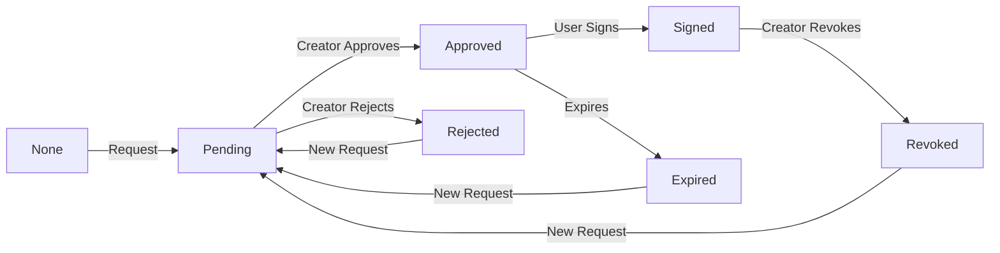

# Marketplace NDA Workflow Documentation

## 🎬 Overview

The Pitchey marketplace implements a comprehensive NDA (Non-Disclosure Agreement) workflow that protects creators' intellectual property while enabling investors and production companies to access detailed pitch information. This document outlines the complete NDA workflow as implemented on **pitchey-main.pages.dev** and **pitchey-5o8.pages.dev**.

## 🔐 NDA Workflow Architecture

### Core Components

```
┌─────────────────┐     ┌──────────────────┐     ┌─────────────────┐
│   Marketplace   │────▶│  Public Pitch    │────▶│  NDA Request    │
│   Browse View   │     │     View         │     │     Modal       │
└─────────────────┘     └──────────────────┘     └─────────────────┘
         │                       │                         │
         ▼                       ▼                         ▼
┌─────────────────┐     ┌──────────────────┐     ┌─────────────────┐
│  Pitch Cards    │     │  NDA Status      │     │  NDA Signing    │
│  (Limited Info) │     │    Check         │     │    Process      │
└─────────────────┘     └──────────────────┘     └─────────────────┘
                                 │                         │
                                 ▼                         ▼
                        ┌──────────────────┐     ┌─────────────────┐
                        │ Protected Content│     │  Full Access    │
                        │   (Locked)       │     │   (Unlocked)    │
                        └──────────────────┘     └─────────────────┘
```

## 📋 NDA Business Rules

### 1. Who Can Request NDAs

✅ **Eligible User Types:**
- **Investors**: Full NDA request capabilities
- **Production Companies**: Full NDA request capabilities
- **Creators**: Cannot request NDAs (they create them)

### 2. NDA Request Validation

The system validates NDA requests based on:

```typescript
// NDA Access Validation Logic
function validateNDAAccess(pitch: Pitch, user: User): ValidationResult {
  // Rule 1: User must be logged in
  if (!user) {
    return { canRequest: false, reason: 'Authentication required' };
  }

  // Rule 2: Creator cannot request NDA for own pitch
  if (pitch.creator.id === user.id) {
    return { canRequest: false, reason: 'Cannot request NDA for own pitch' };
  }

  // Rule 3: Only investors and production companies can request
  if (user.userType !== 'investor' && user.userType !== 'production') {
    return { canRequest: false, reason: 'Only investors and production companies can request NDAs' };
  }

  // Rule 4: Check if NDA already exists
  if (hasExistingNDA(pitch.id, user.id)) {
    return { canRequest: false, reason: 'NDA already exists' };
  }

  return { canRequest: true };
}
```

### 3. NDA Status Lifecycle



## 🛠️ Implementation Details

### Frontend Components

#### 1. **MarketplaceEnhanced.tsx** (`/marketplace`)
- Displays pitch cards with limited information
- Shows NDA badges for protected pitches
- Filters for NDA-protected content
- Handles navigation to pitch details

#### 2. **PublicPitchView.tsx** (`/pitch/:id`)
- Checks user authentication status
- Validates NDA eligibility
- Displays NDA request button for eligible users
- Shows protected content for signed NDAs
- Handles NDA request modal

#### 3. **NDARequestModal Component**
```typescript
interface NDARequestModalProps {
  pitch: Pitch;
  onClose: () => void;
  onSubmit: (data: NDARequestData) => Promise<void>;
}

const NDARequestModal: React.FC<NDARequestModalProps> = ({ 
  pitch, 
  onClose, 
  onSubmit 
}) => {
  // Modal content with:
  // - Pitch title and creator info
  // - Purpose of NDA request (dropdown)
  // - Message to creator (optional)
  // - Terms acceptance checkbox
  // - Submit/Cancel buttons
};
```

### Backend API Endpoints

#### NDA Request Endpoints

| Endpoint | Method | Description | Auth Required |
|----------|--------|-------------|---------------|
| `/api/nda/request` | POST | Submit new NDA request | Yes |
| `/api/nda/status/:pitchId` | GET | Check NDA status for pitch | Yes |
| `/api/nda/list` | GET | List user's NDAs | Yes |
| `/api/nda/sign/:ndaId` | POST | Sign approved NDA | Yes |
| `/api/nda/approve/:ndaId` | POST | Creator approves NDA | Yes |
| `/api/nda/reject/:ndaId` | POST | Creator rejects NDA | Yes |
| `/api/nda/revoke/:ndaId` | POST | Creator revokes NDA | Yes |

#### Request/Response Format

**Request NDA:**
```json
POST /api/nda/request
{
  "pitchId": 123,
  "purpose": "investment_evaluation",
  "message": "Interested in investing in this project",
  "company": "Stellar Productions",
  "intendedUse": "evaluation"
}
```

**Response:**
```json
{
  "success": true,
  "data": {
    "id": 456,
    "status": "pending",
    "requestedAt": "2024-12-31T10:00:00Z",
    "pitchId": 123,
    "userId": 789
  }
}
```

### Database Schema

```sql
-- NDA Requests Table
CREATE TABLE nda_requests (
  id SERIAL PRIMARY KEY,
  pitch_id INTEGER REFERENCES pitches(id),
  user_id INTEGER REFERENCES users(id),
  status VARCHAR(50) DEFAULT 'pending',
  purpose VARCHAR(100),
  message TEXT,
  company_name VARCHAR(255),
  intended_use VARCHAR(100),
  requested_at TIMESTAMP DEFAULT CURRENT_TIMESTAMP,
  approved_at TIMESTAMP,
  signed_at TIMESTAMP,
  rejected_at TIMESTAMP,
  revoked_at TIMESTAMP,
  expires_at TIMESTAMP,
  creator_notes TEXT,
  
  UNIQUE(pitch_id, user_id)
);

-- NDA Documents Table
CREATE TABLE nda_documents (
  id SERIAL PRIMARY KEY,
  nda_request_id INTEGER REFERENCES nda_requests(id),
  document_url TEXT,
  document_type VARCHAR(50),
  signed_document_url TEXT,
  created_at TIMESTAMP DEFAULT CURRENT_TIMESTAMP
);
```

## 🔄 User Flow

### For Investors/Production Companies

1. **Browse Marketplace**
   - View pitch cards with basic info
   - See NDA badges on protected pitches

2. **View Pitch Details**
   - Click on pitch to view public information
   - See locked sections requiring NDA

3. **Request NDA**
   - Click "Request NDA Access" button
   - Fill out request form with purpose
   - Submit request to creator

4. **Wait for Approval**
   - Receive notification when approved/rejected
   - Check status in dashboard

5. **Sign NDA**
   - Review NDA terms
   - Digitally sign the agreement
   - Gain access to protected content

6. **Access Protected Content**
   - View full synopsis
   - Access pitch deck
   - See financial projections
   - Download scripts/materials

### For Creators

1. **Set NDA Requirements**
   - Toggle NDA protection on pitch
   - Upload custom NDA document (optional)
   - Set protected sections

2. **Receive NDA Requests**
   - Get notifications of new requests
   - Review requester profiles
   - See request purpose/message

3. **Review & Approve/Reject**
   - Evaluate each request
   - Approve legitimate requests
   - Reject unsuitable requests
   - Add notes for record

4. **Manage Active NDAs**
   - View all signed NDAs
   - Revoke access if needed
   - Track NDA expiration dates
   - Download signed documents

## 🎨 UI/UX Features

### Visual Indicators

```typescript
// NDA Status Badges
const NDAStatusBadge = ({ status }) => {
  const badges = {
    none: null,
    pending: { color: 'yellow', icon: Clock, text: 'NDA Pending' },
    approved: { color: 'blue', icon: Check, text: 'NDA Approved' },
    signed: { color: 'green', icon: Shield, text: 'NDA Signed' },
    rejected: { color: 'red', icon: X, text: 'NDA Rejected' },
    expired: { color: 'gray', icon: AlertCircle, text: 'NDA Expired' },
    revoked: { color: 'orange', icon: Ban, text: 'NDA Revoked' }
  };
  
  return badges[status] ? (
    <Badge color={badges[status].color}>
      <Icon component={badges[status].icon} />
      {badges[status].text}
    </Badge>
  ) : null;
};
```

### Protected Content Display

```typescript
// Protected Content Component
const ProtectedContent = ({ hasNDA, content, onRequestNDA }) => {
  if (hasNDA) {
    return <div className="content">{content}</div>;
  }
  
  return (
    <div className="protected-content-container">
      <div className="blurred-preview">{content.substring(0, 100)}...</div>
      <div className="lock-overlay">
        <Lock className="lock-icon" />
        <p>This content is protected by NDA</p>
        <button onClick={onRequestNDA}>
          Request NDA Access
        </button>
      </div>
    </div>
  );
};
```

## 🔒 Security Considerations

### 1. Access Control
- Server-side validation of all NDA requests
- JWT/Session verification for authenticated endpoints
- Role-based access control (RBAC)
- IP-based rate limiting

### 2. Data Protection
- Encrypted storage of NDA documents
- Secure document URLs with expiring tokens
- Audit logging of all NDA actions
- GDPR-compliant data handling

### 3. Legal Compliance
- Digital signature verification
- Timestamp verification
- Document versioning
- Retention policies

## 📊 Analytics & Tracking

### NDA Metrics Tracked

```typescript
interface NDAMetrics {
  totalRequests: number;
  approvalRate: number;
  averageApprovalTime: number;
  signatureRate: number;
  activeNDAs: number;
  expiredNDAs: number;
  revokedNDAs: number;
  topRequesters: User[];
  topCreators: User[];
}
```

### Dashboard Views

**Creator Dashboard:**
- Pending NDA requests
- Active NDAs by pitch
- NDA conversion metrics
- Protected content views

**Investor/Production Dashboard:**
- Requested NDAs status
- Signed NDAs library
- Accessible protected content
- NDA expiration alerts

## 🚀 Deployment Configuration

### Environment Variables

```env
# NDA Configuration
NDA_ENABLED=true
NDA_DEFAULT_EXPIRY_DAYS=365
NDA_AUTO_APPROVE_DEMO=true
NDA_REQUIRE_SIGNATURE=true
NDA_DOCUMENT_STORAGE=r2

# Document Storage (Cloudflare R2)
R2_BUCKET_NAME=pitchey-ndas
R2_ACCESS_KEY_ID=your_access_key
R2_SECRET_ACCESS_KEY=your_secret_key
R2_ENDPOINT=https://your-account.r2.cloudflarestorage.com
```

### Feature Flags

```typescript
const ndaFeatures = {
  enableCustomNDA: true,        // Allow custom NDA documents
  enableBulkApproval: false,     // Bulk approve/reject NDAs
  enableAutoExpiry: true,        // Auto-expire NDAs
  enableRevocation: true,        // Allow NDA revocation
  enableAnalytics: true,         // Track NDA analytics
  enableNotifications: true,     // Send NDA notifications
  enableDocumentUpload: true,    // Upload signed documents
  enableDigitalSignature: true   // Digital signature support
};
```

## 🧪 Testing

### Test Scenarios

1. **NDA Request Flow**
   ```bash
   # Test as investor
   ./test-nda-workflow.sh investor
   
   # Test as production company
   ./test-nda-workflow.sh production
   
   # Test as creator (should fail)
   ./test-nda-workflow.sh creator
   ```

2. **NDA Status Checks**
   ```javascript
   // Test NDA status transitions
   describe('NDA Status Workflow', () => {
     it('should transition from pending to approved');
     it('should transition from approved to signed');
     it('should handle rejection correctly');
     it('should handle expiration');
     it('should handle revocation');
   });
   ```

## 📱 Mobile Responsiveness

The NDA workflow is fully responsive:

- **Mobile**: Single column layout with bottom sheet modals
- **Tablet**: Two column layout with side panel for NDA details
- **Desktop**: Full layout with inline NDA request forms

## 🎯 Success Metrics

- **Request Success Rate**: >90% of eligible users can request NDAs
- **Approval Time**: <24 hours average approval time
- **Signature Rate**: >80% of approved NDAs get signed
- **User Satisfaction**: >4.5/5 rating for NDA process

## 🐛 Common Issues & Solutions

### Issue: "Cannot request NDA" error
**Solution**: Check user type is investor/production, not creator

### Issue: NDA request button not showing
**Solution**: Ensure user is authenticated and eligible

### Issue: Protected content still locked after signing
**Solution**: Refresh page or clear cache to update NDA status

### Issue: NDA document not downloading
**Solution**: Check R2 storage configuration and CORS settings

## 📚 Related Documentation

- [Authentication Flow](./BETTER_AUTH_THREE_PORTAL_IMPLEMENTATION.md)
- [API Reference](./API_REFERENCE.md)
- [Database Schema](./DATABASE_SCHEMA.md)
- [Security Guidelines](./SECURITY_GUIDELINES.md)

---

*Last Updated: December 31, 2024*
*Version: 1.0.0*
*Status: Production Ready on pitchey-main.pages.dev and pitchey-5o8.pages.dev*