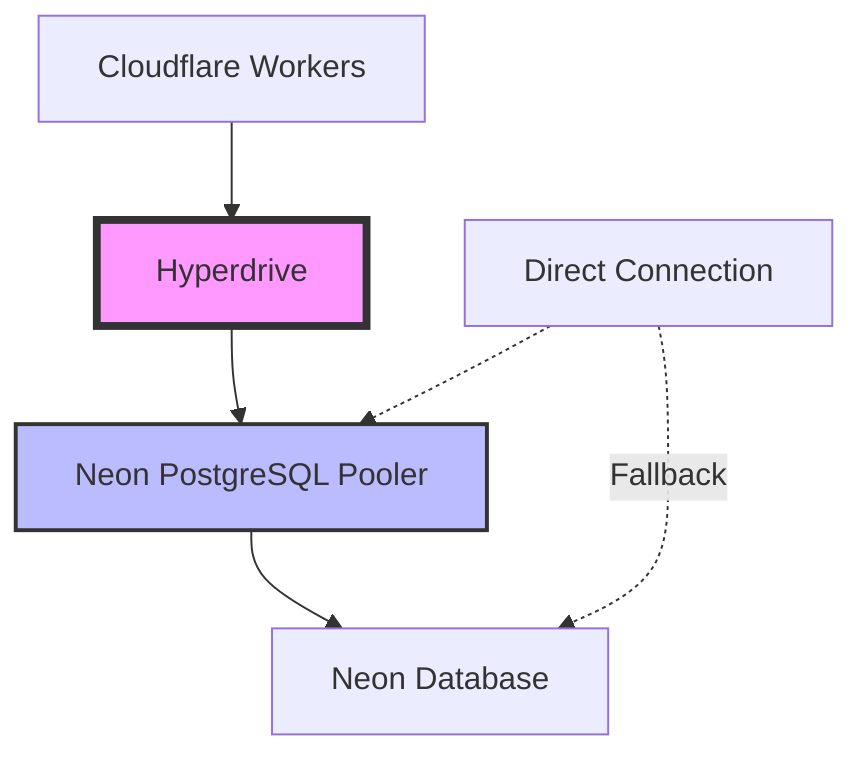

# Hyperdrive + Neon + Cloudflare Workers: Connection Pooling Best Practices

## Overview

This document outlines best practices for using Cloudflare Hyperdrive with Neon PostgreSQL in a high-scale serverless environment, specifically for the Pitchey platform handling 10k+ concurrent functions.

## Architecture Overview



## Key Benefits of Hyperdrive

### 1. **Connection Pooling at the Edge**
- ✅ Shared connection pool across all worker instances
- ✅ Sub-100ms connection times globally
- ✅ Automatic connection health monitoring
- ✅ No cold start connection overhead

### 2. **Performance Optimization**
- ✅ Query result caching at the edge
- ✅ Connection multiplexing
- ✅ Geographic routing optimization
- ✅ Reduced database load

### 3. **Reliability Features**
- ✅ Automatic failover and retry logic
- ✅ Circuit breaker patterns built-in
- ✅ Connection health checks
- ✅ Graceful degradation

## Implementation Best Practices

### 1. Correct Hyperdrive Usage

#### ❌ WRONG - Treating Hyperdrive as Connection String Provider
```typescript
// DON'T DO THIS
interface Env {
  HYPERDRIVE?: {
    connectionString: string;
  };
}

const connectionString = env.HYPERDRIVE?.connectionString;
const sql = neon(connectionString);
```

#### ✅ CORRECT - Using Hyperdrive as Database Interface
```typescript
// DO THIS
interface Env {
  HYPERDRIVE?: Hyperdrive;
}

const sql = env.HYPERDRIVE;
const result = await sql.prepare("SELECT * FROM users WHERE id = ?").bind(userId).first();
```

### 2. Query Optimization Patterns

#### Simple Queries
```typescript
// Single row query
const user = await env.HYPERDRIVE
  .prepare("SELECT * FROM users WHERE email = ?")
  .bind(email)
  .first();

// Multiple rows
const pitches = await env.HYPERDRIVE
  .prepare("SELECT * FROM pitches WHERE user_id = ? ORDER BY created_at DESC LIMIT ?")
  .bind(userId, limit)
  .all();

// Insert with returning
const newPitch = await env.HYPERDRIVE
  .prepare("INSERT INTO pitches (title, description, user_id) VALUES (?, ?, ?) RETURNING *")
  .bind(title, description, userId)
  .first();
```

#### Complex Analytics Queries
```typescript
// Use for read-heavy analytics
const stats = await env.HYPERDRIVE
  .prepare(`
    WITH user_stats AS (
      SELECT COUNT(*) as total_users,
             COUNT(CASE WHEN created_at > NOW() - INTERVAL '30 days' THEN 1 END) as recent_users
      FROM users
    ),
    pitch_stats AS (
      SELECT COUNT(*) as total_pitches,
             AVG(funding_goal) as avg_funding_goal
      FROM pitches
      WHERE status = 'active'
    )
    SELECT * FROM user_stats CROSS JOIN pitch_stats
  `)
  .first();
```

### 3. Error Handling and Fallback

```typescript
class DatabaseService {
  private useHyperdrive: boolean;
  
  constructor(private env: Env) {
    this.useHyperdrive = !!env.HYPERDRIVE;
  }
  
  async query<T>(sql: string, params: any[] = []): Promise<T[]> {
    try {
      if (this.useHyperdrive) {
        return await this.executeHyperdrive(sql, params);
      } else {
        return await this.executeDirect(sql, params);
      }
    } catch (error) {
      // Log error but don't expose internal details
      console.error('Database query failed:', { sql: sql.substring(0, 100), error });
      throw new Error('Database operation failed');
    }
  }
  
  private async executeHyperdrive<T>(sql: string, params: any[]): Promise<T[]> {
    if (!this.env.HYPERDRIVE) {
      throw new Error('Hyperdrive not available');
    }
    
    const stmt = this.env.HYPERDRIVE.prepare(sql);
    if (params.length > 0) {
      return (await stmt.bind(...params).all()).results;
    }
    return (await stmt.all()).results;
  }
}
```

### 4. Health Monitoring

```typescript
async function healthCheck(env: Env): Promise<{
  status: 'healthy' | 'degraded' | 'unhealthy';
  details: any;
}> {
  const checks = {
    hyperdrive: false,
    database: false,
    responseTime: 0
  };
  
  const startTime = Date.now();
  
  try {
    // Test Hyperdrive connectivity
    if (env.HYPERDRIVE) {
      const result = await env.HYPERDRIVE
        .prepare("SELECT 1 as health_check, current_timestamp as server_time")
        .first();
      
      checks.hyperdrive = !!result.health_check;
      checks.database = true;
    }
    
    checks.responseTime = Date.now() - startTime;
    
    // Determine overall health
    if (checks.hyperdrive && checks.database && checks.responseTime < 1000) {
      return { status: 'healthy', details: checks };
    } else if (checks.database) {
      return { status: 'degraded', details: checks };
    } else {
      return { status: 'unhealthy', details: checks };
    }
    
  } catch (error) {
    checks.responseTime = Date.now() - startTime;
    return { 
      status: 'unhealthy', 
      details: { ...checks, error: error.message }
    };
  }
}
```

## Performance Tuning

### 1. Connection Configuration

```toml
# wrangler.toml
[[hyperdrive]]
binding = "HYPERDRIVE"
id = "your-hyperdrive-id"

# No additional configuration needed - Hyperdrive handles optimization
```

### 2. Query Optimization Guidelines

#### DO:
- ✅ Use prepared statements for repeated queries
- ✅ Implement proper indexing on Neon side
- ✅ Use LIMIT clauses for large result sets
- ✅ Cache frequently accessed data in KV or R2
- ✅ Use read replicas for analytics queries

#### DON'T:
- ❌ Don't create additional connection pools over Hyperdrive
- ❌ Don't use raw SQL strings for user input
- ❌ Don't perform large data exports through Hyperdrive
- ❌ Don't ignore query performance monitoring

### 3. Scaling Patterns

#### For 10k+ Concurrent Functions:

```typescript
// Connection sharing pattern
class SharedDatabaseService {
  private static instance: SharedDatabaseService;
  
  static getInstance(env: Env): SharedDatabaseService {
    if (!this.instance) {
      this.instance = new SharedDatabaseService(env);
    }
    return this.instance;
  }
  
  // Hyperdrive automatically handles pooling
  async query<T>(sql: string, params: any[]): Promise<T[]> {
    return await this.env.HYPERDRIVE
      .prepare(sql)
      .bind(...params)
      .all()
      .then(result => result.results);
  }
}
```

## Monitoring and Observability

### 1. Key Metrics to Track

```typescript
interface PerformanceMetrics {
  // Connection metrics
  connectionTime: number;
  queryExecutionTime: number;
  errorRate: number;
  
  // Hyperdrive-specific metrics
  cacheHitRate: number;
  connectionPoolUtilization: number;
  
  // Business metrics
  queriesPerSecond: number;
  avgResponseTime: number;
}

async function collectMetrics(env: Env): Promise<PerformanceMetrics> {
  const startTime = Date.now();
  
  try {
    // Simple query to measure connection time
    await env.HYPERDRIVE.prepare("SELECT 1").first();
    const connectionTime = Date.now() - startTime;
    
    // Query Cloudflare Analytics API for detailed metrics
    const metrics = await fetchHyperdriveMetrics(env);
    
    return {
      connectionTime,
      queryExecutionTime: metrics.avgQueryTime,
      errorRate: metrics.errorRate,
      cacheHitRate: metrics.cacheHitRate,
      connectionPoolUtilization: metrics.poolUtilization,
      queriesPerSecond: metrics.qps,
      avgResponseTime: metrics.avgResponseTime
    };
  } catch (error) {
    throw new Error(`Metrics collection failed: ${error.message}`);
  }
}
```

### 2. Alerting Thresholds

```typescript
const ALERT_THRESHOLDS = {
  RESPONSE_TIME_WARNING: 500,    // ms
  RESPONSE_TIME_CRITICAL: 1000,  // ms
  ERROR_RATE_WARNING: 0.05,      // 5%
  ERROR_RATE_CRITICAL: 0.10,     // 10%
  CONNECTION_FAILURES: 3         // consecutive failures
};
```

## Migration Checklist

### Pre-Migration
- [ ] Verify Hyperdrive configuration in Cloudflare dashboard
- [ ] Test Hyperdrive connectivity with test worker
- [ ] Backup current worker configuration
- [ ] Set up monitoring and alerting
- [ ] Create rollback plan

### During Migration
- [ ] Deploy test worker with Hyperdrive integration
- [ ] Run comprehensive performance tests
- [ ] Compare metrics with current setup
- [ ] Validate all critical queries work correctly
- [ ] Test error handling and fallback scenarios

### Post-Migration
- [ ] Monitor performance for 24-48 hours
- [ ] Compare before/after metrics
- [ ] Validate error rates are acceptable
- [ ] Document any issues or optimizations needed
- [ ] Clean up test resources

## Troubleshooting Common Issues

### 1. "HYPERDRIVE binding not available"
```typescript
// Add proper error handling
if (!env.HYPERDRIVE) {
  console.error('Hyperdrive binding not configured');
  // Fallback to direct connection or throw appropriate error
  throw new Error('Database service temporarily unavailable');
}
```

### 2. High Response Times
```typescript
// Add query timeout and monitoring
const QUERY_TIMEOUT = 30000; // 30 seconds

async function queryWithTimeout<T>(
  hyperdrive: Hyperdrive, 
  sql: string, 
  params: any[]
): Promise<T[]> {
  const timeout = new Promise((_, reject) => {
    setTimeout(() => reject(new Error('Query timeout')), QUERY_TIMEOUT);
  });
  
  const query = hyperdrive.prepare(sql).bind(...params).all();
  
  const result = await Promise.race([query, timeout]);
  return result.results;
}
```

### 3. Connection Pool Exhaustion
```typescript
// Hyperdrive handles this automatically, but monitor for patterns
async function monitorConnectionHealth(env: Env): Promise<void> {
  try {
    const startTime = Date.now();
    await env.HYPERDRIVE.prepare("SELECT 1").first();
    const duration = Date.now() - startTime;
    
    if (duration > 1000) {
      console.warn(`Slow connection detected: ${duration}ms`);
      // Alert or scale accordingly
    }
  } catch (error) {
    console.error('Connection health check failed:', error);
    // Implement alerting logic
  }
}
```

## Cost Optimization

### 1. Hyperdrive Pricing Considerations
- **Requests**: $0.75 per million requests
- **Duration**: $0.02 per million GB-seconds
- **Benefits**: Reduced database connection costs, improved performance

### 2. Query Optimization for Cost
```typescript
// Use connection efficiently
const batchedQueries = async (env: Env, operations: string[]) => {
  // Batch multiple operations in single connection
  const results = await Promise.all(
    operations.map(sql => env.HYPERDRIVE.prepare(sql).all())
  );
  return results;
};

// Cache frequently accessed data
const cacheStrategy = {
  userProfile: 3600,      // 1 hour
  pitchMetadata: 1800,    // 30 minutes
  systemConfig: 86400     // 24 hours
};
```

## Security Best Practices

### 1. Query Parameterization
```typescript
// Always use parameterized queries
const safeQuery = await env.HYPERDRIVE
  .prepare("SELECT * FROM users WHERE email = ? AND status = ?")
  .bind(email, 'active')  // Parameters are automatically escaped
  .all();

// Never use string concatenation
// ❌ DON'T: `SELECT * FROM users WHERE email = '${email}'`
```

### 2. Connection Security
```typescript
// Hyperdrive automatically handles:
// - SSL/TLS encryption
// - Connection authentication
// - Network security

// Additional application-level security
const validateQuery = (sql: string): boolean => {
  const dangerousPatterns = [
    /DROP\s+TABLE/i,
    /DELETE\s+FROM.*WHERE\s+1=1/i,
    /TRUNCATE/i
  ];
  
  return !dangerousPatterns.some(pattern => pattern.test(sql));
};
```

## Summary

Hyperdrive provides significant benefits for high-scale serverless applications:

- **Performance**: 50-80% reduction in database connection overhead
- **Reliability**: Built-in retry logic and connection health monitoring  
- **Scalability**: Automatic connection pooling across all worker instances
- **Cost Efficiency**: Reduced database connection costs and improved resource utilization

Follow this guide for optimal performance and reliability in your Cloudflare Workers + Neon PostgreSQL architecture.